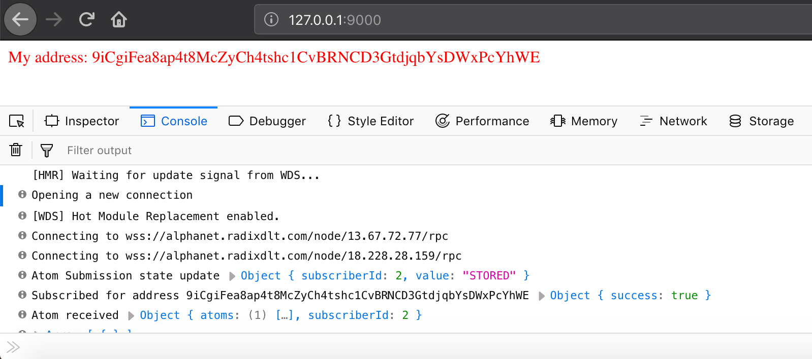

# Get started

## Introduction <a id="introduction"></a>

During this tutorial, we will build a small distributed App \(dApp\). The techniques you’ll learn in this guide are fundamental to create any dApp on [Radix](http://www.radixdlt.com/), and mastering it will give you a better understanding of the Radix distributed ledger.

This guide is divided into several sections:

* **​**[**Basic Setup**](quick-start.md#basic-setup) will give you a starting point to follow the tutorial.
* **​**[**Overview**](quick-start.md#overview) will teach you the fundamentals of Radix's architecture.
* **​**[**Getting some Radix tokens**](quick-start.md#getting-some-radix-test-tokens) will show you how to build your first basic dApp.
* **​**[**Beyond the basics**](quick-start.md#beyond-the-basics) will give you additional examples to gain a deeper insight into the strengths of Radix JS library.

### About our example dApp <a id="about-our-example-dapp"></a>

Our example dApp for this guide will basically get some free test money from Radix, and once it has enough money, our dApp will send some to a different address.   
With our small dApp, you'll learn how to interact with accounts, send transactions across the network, and handle test tokens, in a simple way.

Don't worry if you're new to Radix's concepts, as we will review the basic building blocks along the way.

## Basic setup <a id="basic-setup"></a>

Our next step is to set you up so that you can start building your first dApp with Radix.

### Prepare your environment <a id="prepare-your-environment"></a>

Before we can begin, make sure you have a recent version of [Node.js](https://nodejs.org/) installed in your system. We'll also need a minimalistic Node.js boilerplate project so we can properly build and run our dApp. If you're experienced building your own Node.js applications, feel free to skip our next step and continue with the library [installation](quick-start.md#installation).

#### Setting up a simple Node.js project <a id="setting-up-a-simple-node-js-project"></a>

To prepare the environment, let's now set up a minimalistic Node.js project, by cloning an open source [Webpack ES6 boilerplate](https://www.npmjs.com/package/webpack-es6-boilerplate):

```bash
git clone https://github.com/jluccisano/webpack-es6-boilerplate.git
```

Once we have cloned the boilerplate project, we can go ahead and install the required libraries for it:

```bash
cd webpack-es6-boilerplate/
npm install
```

As an optional step, you can start the server using `npm start` and open [http://localhost:9000](http://localhost:9000/) on your browser to see if everything was set up correctly.

### Installation <a id="installation"></a>

You can install the _**`radixdlt`**_ library in your Node.js project using your preferred package manager:

#### Npm <a id="npm"></a>

```bash
npm install radixdlt --save
```

#### Yarn <a id="yarn"></a>

```bash
yarn add radixdlt
```


**Note:** the library provides full TypeScript support


### Recommendations <a id="recommendations"></a>

For this guide, we will assume that you have some familiarity with JavaScript, but you should be able to follow along even if you’re coming from a different programming language.


If you need to review JavaScript, we recommend reading [this guide](https://developer.mozilla.org/en-US/docs/Web/JavaScript/A_re-introduction_to_JavaScript).


We’ll also assume that you’re familiar with programming concepts like functions, objects, arrays, and classes. Additionally, we recommend having an understanding of Reactive programming, RxJS, and observable patterns for better insight.


If you need a quick review of Reactive programming, we recommend reading [our blog post](https://www.radixdlt.com/post/reactive-programming-and-rxjs).


## Overview <a id="overview"></a>

Now that you’re set up, let’s dig a bit on the concepts that make Radix a unique distributed ledger technology, so we can share a common language.

### Universe <a id="universe"></a>

A **Universe** represents the Radix network. It maintains connections to **Nodes**, and you can ask it to give you a connection to a node that serves a specific **Shard**.


Because Radix is built to be sharded from the ground up, it is not enough to have a single connection to the network - depending on what addresses you’re trying to work with, you might need a number of connections.


### Shards <a id="shards"></a>

A **Shard** is simply a segment of a Universe. A public Radix network \(Universe\) is segmented into a very large shard space \(currently 2^64 shards\). The shard number of an address is deterministically calculated, so it's trivial for anyone to correctly calculate the shard a public key lives on.

### Nodes <a id="nodes"></a>

A **Node** provides general computing and networking resources to the network. Nodes are responsible for validating events and transactions, relaying messages, resolving conflicts and executing scripts on the network. They also maintain a subset of the shard space and get fees in proportion to their work.

### Atoms <a id="atoms"></a>

An **Atom** is the fundamental unit of storage on Radix's distributed ledger. Its structure defines one or more actions which update the ledger's state as an atomic transaction, that is, all-or-nothing.

### Account <a id="account"></a>

An **Account** represents all the data stored for a user on the ledger. This includes tokens, but also arbitrary data, as well as more advanced types of transactions in the future such as multi-sig and Scrypto smart contracts.

### Address <a id="address"></a>

An **Address** lives in a **Shard** and is the start and end point for any **Atom** in the Radix Universe. It's also a reference to an **Account** and allows a user to receive tokens and/or data from other users. A Radix address is generated from a public key and a **Universe** checksum.


Keep in mind, the defined **Universe** affects the generated **Address**.


### Account Systems <a id="account-systems"></a>

When an **Account** is connected to the network, it will take any incoming **Atoms** and pass them through the account systems. The default systems are:

* **Transfer System**, which keeps a list of transactions involving this account as well as the account balance for all the different tokens in the account
* **Radix Messaging System**, which manages the different Radix messaging chats this account is involved in
* **Data System** used for custom data stored on the ledger


You can create your own custom **Account Systems** if you want access to the raw **Atoms**.


### Identity <a id="identity"></a>

An **Identity** represents a private key which can sign **Atoms** and read encrypted data. This private key can be stored in the application, or in the future, it might live elsewhere such as the user's wallet application or hardware wallet.


The only type of **Identity** currently available is the _**Simple Identity,**_ and it has a private key stored in memory.


### Transaction Builder <a id="transaction-builder"></a>

The **Transaction Builder** handles creating and submitting to the network any kind of **Atoms** that the Radix ledger can accept.   
Right now this means _token transfer_ atoms, _data payload_ atoms and _Radix messaging_ atoms \(which are just a particular case of the data payload atoms\). In the future, the atom model will be a lot more powerful.

### Faucet Service <a id="faucet-service"></a>

The **Faucet** service is a simple development service running on the Radix network that sends free test tokens back to any account that sends a message to it.


In the **ALPHANET** Universe, the **Faucet** service address is `9ey8A461d9hLUVXh7CgbYhfmqFzjzSBKHvPC8SMjccRDbkTs2aM`


## Getting some Radix test tokens <a id="getting-some-radix-test-tokens"></a>

Now that we have done a brief overview of the concepts behind Radix and we share a common language, we are ready to begin building our example dApp and get some _**Radix test tokens**_ along the way.

### Initializing the Universe <a id="initializing-the-universe"></a>

The first step, before we can interact with the ledger, is to choose which [Universe](quick-start.md#universe) we want to connect to.   
We will use the **ALPHANET** universe configuration since it's our main testing environment, and the other development universes are used for testing unstable features.

Now, to initialize the universe, we have to import the `radixUniverse` singleton from the library, and call the bootstrap function with the _ALPHANET_ universe configuration:

```javascript
import {radixUniverse, RadixUniverse} from 'radixdlt'

radixUniverse.bootstrap(RadixUniverse.ALPHANET)
```

### Creating our own Identity <a id="creating-our-own-identity"></a>

As we want to interact with the ledger and be able to sign and decrypt atoms, we'll need to have our own [Identity](quick-start.md#identity). To create a new random identity, we use the `RadixIdentityManager`:

```javascript
const identityManager = new RadixIdentityManager()
```

Now we create a new random identity using the Identity Manager's _generateSimpleIdentity\(\)_ method:

```javascript
const myIdentity = identityManager.generateSimpleIdentity()
```

With it, we can easily get our own **Account** using the _account_ reference:

```javascript
const myAccount = myIdentity.account

console.log('My account address: ', myAccount.getAddress())
```


Each **Identity** automatically comes with a corresponding **Account**.


### Opening the connection <a id="opening-the-connection"></a>

Now that we have our account, the next step is to connect it to the network. We do it by calling the _openNodeConnection\(\)_ method:

```javascript
myAccount.openNodeConnection()
```

This call opens a connection to a **Node** from the _ALPHANET_ universe which serves the shard where our account lives on and asks the node for all the atoms in the address. It will also maintain a connection to the network until we destroy the account.


**Tip:** if a connection to a node dies, a new one will be found automatically.


### Getting the Faucet's account <a id="getting-the-faucets-account"></a>

To get the Faucet's account, we resolve the address using the _fromAddress\(...\)_ method:

```javascript
const faucetAddress = '9ey8A461d9hLUVXh7CgbYhfmqFzjzSBKHvPC8SMjccRDbkTs2aM'

const faucetAccount = RadixAccount.fromAddress(faucetAddress, true)
```

Regarding the second `boolean` parameter, we set it to `true`, so the method doesn't create the default Account systems along the way.


For accounts that won't be connected to the network, since you won't need any accounting system, set the parameter to _true_.



**Note:** the library will throw an error if you accidentally try to use an address from a different **Universe**.


### Sending a message to the Faucet <a id="sending-a-message-to-the-faucet"></a>

Now that we have the Faucet's account and our own account connected to the network, we are ready to send a message and request some free tokens to the Faucet service.   
We send the message using RadixTransactionBuilder's _createRadixMessageAtom\(...\)_ method, and signing the resulting **Atom** with our **Identity**:

```javascript
const message = 'Dear Faucet, may I please have some money? (◕ᴥ◕)'

RadixTransactionBuilder
  .createRadixMessageAtom(myAccount, faucetAccount, message)
  .signAndSubmit(myIdentity)
```

### Subscribing to balance updates <a id="subscribing-to-balance-updates"></a>

After we send the message, we have to subscribe to the Balance subject from the Transfer system to know when we receive the free test tokens sent by the Faucet service:

```javascript
myAccount.transferSystem.balanceSubject.subscribe(balance => {
  // there's a balance update
  console.log(balance);
  // ...
})
```


The `balance` includes the type of token, and the amount of tokens in subunits.


### Handling tokens in Radix <a id="handling-tokens-in-radix"></a>

As the balance can have different types of tokens, let's see now how we handle tokens in Radix using the _RadixTokenManager_.   
Since we are working with the free test tokens, first we get the specific RadixToken by calling the _getTokenbyISO\(...\)_ method from RadixTokenManager:

```javascript
const radixToken = radixTokenManager.getTokenByISO('TEST')
```

We also noted that the balance is stored as token subunits \(integer values\), but we want to work with the balance as a regular floating point number, so we convert it using the _toTokenUnits\(...\)_ method from RadixToken:

```javascript
// Convert balance from subunits to decimal point value
const floatingPointBalance = radixToken.toTokenUnits(balance[radixToken.id.toString()])
```


 **Note:** we convert token subunits to floating point on-demand to avoid inaccurate floating point calculations.


### Sending Radix tokens <a id="sending-radix-tokens"></a>

Our last step is to send some of the free test tokens that we've got from the Faucet to another address on the network. To do it, first we get the account from the destination address, just as we did before for the Faucet service:

```javascript
// Put your friends' address here
const toAddress = '9i9hgAyBQuKvkw7Tg5FEbML59gDmtiwbJwAjBgq5mAU4iaA1ykM'
const toAccount = RadixAccount.fromAddress(toAddress, true)
```

We now have the destination account and our own account connected to the network, and we are ready to send a few test tokens to our friend's account.   
We send the tokens using RadixTransactionBuilder's _createTransferAtom\(...\)_ method, and signing the resulting **Atom** with our **Identity**:

```javascript
// Send 5 tokens to the address
RadixTransactionBuilder
  .createTransferAtom(myAccount, toAccount, radixToken, 5)
  .signAndSubmit(myIdentity)
```

### The complete dApp <a id="the-complete-dapp"></a>

At this point, we have all the basic building blocks for our simple "Get Radix test tokens" dApp. Now, to have a real complete and functional dApp, we need to put the pieces together:

```javascript
import {radixUniverse, RadixUniverse} from 'radixdlt'
import {RadixIdentityManager, RadixAccount} from 'radixdlt'
import {RadixTransactionBuilder, radixTokenManager} from 'radixdlt'

radixUniverse.bootstrap(RadixUniverse.ALPHANET)

const identityManager = new RadixIdentityManager()
const myIdentity = identityManager.generateSimpleIdentity()
const myAccount = myIdentity.account

myAccount.openNodeConnection()

const faucetAddress = '9ey8A461d9hLUVXh7CgbYhfmqFzjzSBKHvPC8SMjccRDbkTs2aM'
const faucetAccount = RadixAccount.fromAddress(faucetAddress, true)
const message = 'Dear Faucet, may I please have some money? (◕ᴥ◕)'

RadixTransactionBuilder
  .createRadixMessageAtom(myAccount, faucetAccount, message)
  .signAndSubmit(myIdentity)

const radixToken = radixTokenManager.getTokenByISO('TEST')  
myAccount.transferSystem.balanceSubject.subscribe(balance => {
  // Convert balance from subunits to decimal point value
  const floatingPointBalance = radixToken.toTokenUnits(balance[radixToken.id.toString()])
  // do we have at least 5 tokens?
  if (floatingPointBalance > 5) {
    // Put your friends' address here
    const toAddress = '9i9hgAyBQuKvkw7Tg5FEbML59gDmtiwbJwAjBgq5mAU4iaA1ykM'
    const toAccount = RadixAccount.fromAddress(toAddress, true)
    
    // Send 5 tokens to the address
    RadixTransactionBuilder
      .createTransferAtom(myAccount, toAccount, radixToken, 5)
      .signAndSubmit(myIdentity)
  }
})
```

Finally, to see this code running, we have to include it in our Node.js project.   
If you're using the [minimalistic boilerplate](https://www.npmjs.com/package/webpack-es6-boilerplate) project that we [set up previously](quick-start.md#setting-up-a-simple-node-js-project), you only have to copy the dApp code shown above to the `./src/index.js` file. You can also add the following line at the end of the file to get your Radix address in the web browser window:

```javascript
document.getElementById('root').innerHTML = 'My address: '+ myAccount.getAddress();
```

To run the dApp, use `npm start`, and point your browser to [http://127.0.0.1:9000](http://127.0.0.1:9000/). You should see your address on the main window, and if you open the developer console you will see the messages and atoms flowing through the network:



## Beyond the basics <a id="beyond-the-basics"></a>

As we reach the end of our dApp example, we want to share some extra code snippets for those who want to go beyond the basics and showcase a few additional things that you can do with our library.

### Example applications

* [Front-end example using Vue.js](https://github.com/radixdlt/radixdlt-js-skeleton)
* [Express.js server example](https://github.com/radixdlt/radixdlt-js-server-example)

### Code examples

* **Manage atoms**​
  * ​[Reading atoms from a public address](code-examples.md#reading-atoms-from-a-public-address)​
  * ​[Reading and decrypting atoms from an owned address](code-examples.md#reading-and-decrypting-atoms-from-an-owned-address)​
  * ​[Caching atoms](code-examples.md#caching-atoms)​
* **​Manage accounts​**
  * ​[Creating a custom account system](code-examples.md#creating-a-custom-account-system)​
* ​**Manage transactions**​
  * ​[Sending a transaction](code-examples.md#sending-a-transaction)​
  * ​[Sending a message](code-examples.md#sending-a-message)​
  * ​[Storing an application payload](code-examples.md#storing-an-application-payload)​
* ​**Manage private keys**​
  * ​[Storing private keys](code-examples.md#storing-private-keys)​
  * ​[Loading private keys](code-examples.md#loading-private-keys)​

## Join the Radix Community

* [Telegram](https://t.me/radix_dlt) for general chat
* ​[Discord](https://discord.gg/7Q7HSZZ) for developer chat
* ​[Reddit](https://reddit.com/r/radix) for general discussion
* ​[Twitter](https://twitter.com/radixdlt) for announcements
* [Email newsletter](https://radixdlt.typeform.com/to/nyKvMV) for weekly updates

