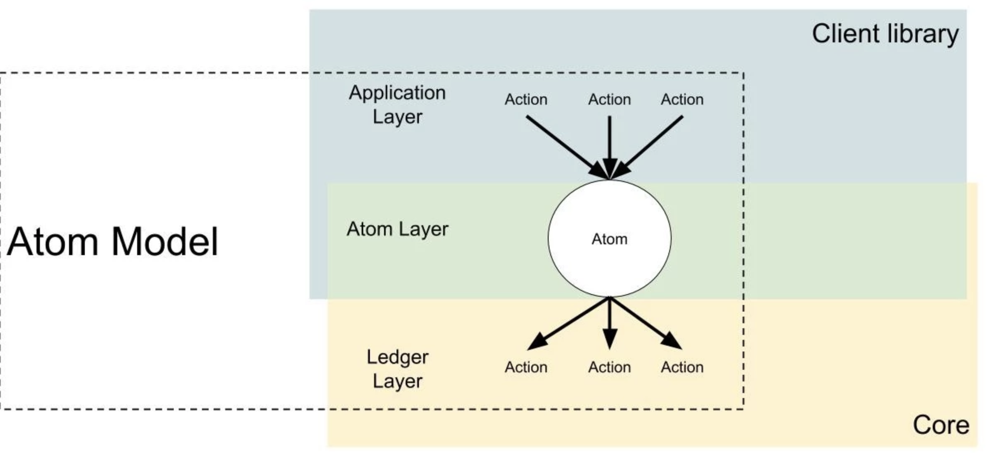

# Alpha Network

## Introduction

The current Radix Alpha Network helps you to

* store wealth, 
* facilitate monetary transactions or transfer value, and
* record immutable data like messages, hashes or meta-data.  

Each node in the Radix network exposes a [JSON-RPC](https://www.radixdlt.com/post/json-rpc-vs-rest) interface to interact with the application layer using client libraries. Radix has open sourced these client libraries to easily build decentralized applications in your preferred programming language, starting with [Java](https://docs.radixdlt.com/radixdlt-java/), [Kotlin](../kotlin-client-library/) and [JavaScript](https://docs.radixdlt.com/radixdlt-js/).

## Technical Architecture

### Abstractions by Layer

### Codebases by Layer

### Atom Model

If this is your first time building decentralized applications on the Radix Alpha Network you can get started with our client libraries:

* [Java library](https://docs.radixdlt.com/radixdlt-java/)
* [Kotlin library](../kotlin-client-library/)
* [JavaScript library](https://docs.radixdlt.com/radixdlt-js/) 

