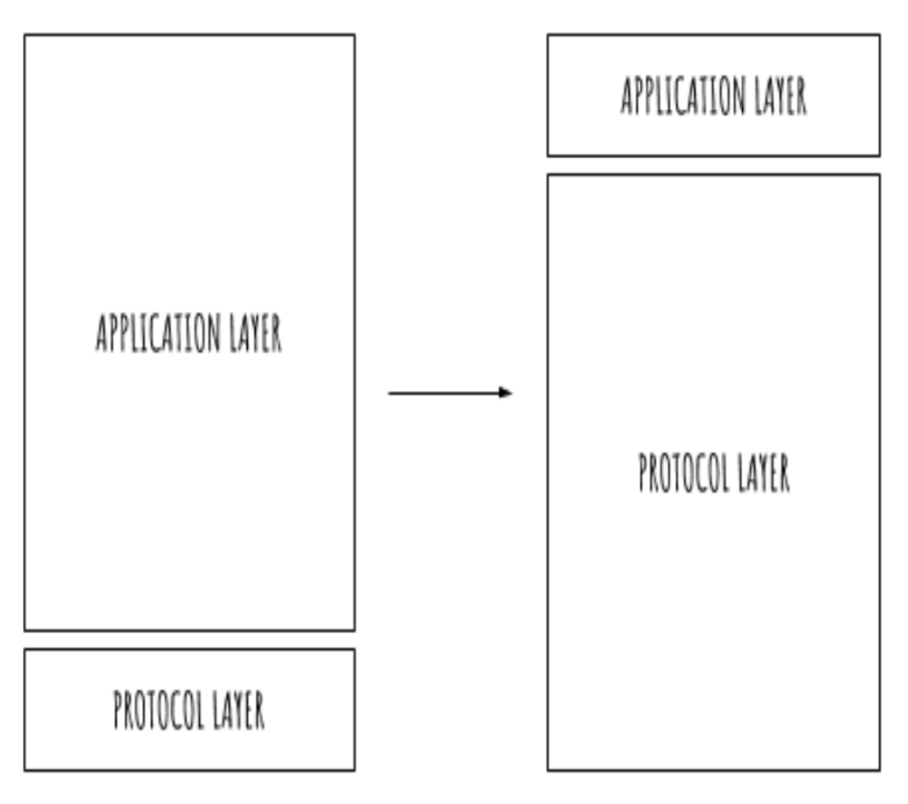
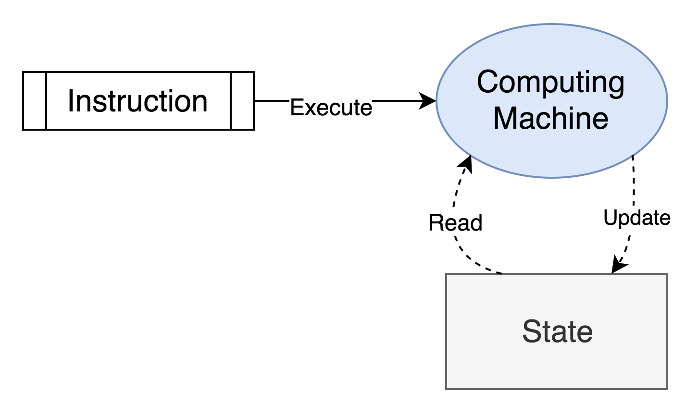
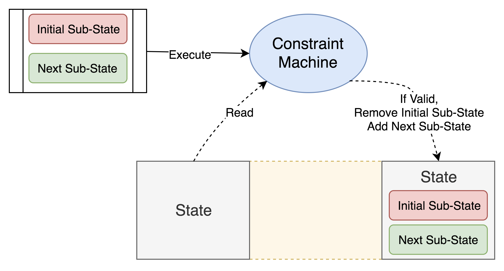

# Atom Model

## Building on Radix

Radix is a decentralized ledger protocol designed to achieve three core objectives:

1. Scalability - making it possible for the world to use without bottlenecks
2. Low volatility - ensuring the cost of using the platform is constrained and predictable
3. Buildability - making it as easy as possible to build and deploy applications on

Creating a scalable yet decentralized protocol is detailed within the [Tempo](../learn/whitepapers/tempo.md) white paper, while the Economics white paper covers how XRD \(the ‘Rad’ token\) aims to avoid volatility. 

The following article explains how Radix has been designed to be a platform for developers that is both easy and safe to build on.

The platform buildability is achieved through the use of "_constraints_" and "_building blocks_." This combination allows developers to provide essentially the same functionality as smart contracts, but with minimal complexity, no error-prone user code and reduced network burden. The buildability also contributes to a more scalable protocol, as popular Decentralized Applications \(DApps\) will not impact on other network activities. These building blocks are layered upon Radix’s [Atom Model](), which will also be explained in this article.

We begin this article by providing an introduction on why we need to deliver buildability in our platform. We'll focus on how DApps have been built until now, and the three types of DApps \([protocol level](), [client-side]() and [smart contracts]()\) commonly used.

## What are DApps?

Decentralized Applications are, as the name suggests, applications that are built to operate without a single point of failure and can \(once launched\) run without a centralized infrastructure. This stands in contrast to the traditional centralized systems that have been used for all types of enterprise applications, which require the use of servers and a centralized entity for payment processing.

Combining decentralized and distributed networks with the benefits of a decentralized financial system, as initially created by Bitcoin, gives the ability to circumvent centralized entities that may:

* Charge excessive fees \(e.g., cross border money transfers\)
* Prevent reaching a global audience \(e.g., an organization’s banking partner only accepts payment in selected countries\)
* Shut down operations \(e.g., laws and regulations; although it should be noted there are other means by which DApps can be forced to comply with local laws\)

However, not all DApps are created equal. Their properties change heavily depending on their architecture, with three main recognizable categories:

* Protocol-level DApps
* Client-side DApps 
* Smart Contract based DApps

### Protocol level DApps

Protocol-level DApps work by building a set of constraints at the protocol level. Any DLT protocol can define a set of rules that will be enforced to every participant. These rules can then be used to build applications at a fraction of their traditional development cost.

Bitcoin’s protocol, for example, provides several constraints:

1. There will never be more than 21M BTC 
2. Entries on the ledger are immutable 
3. Only the owner\(s\) of a private key can sign transactions for a particular public key 
4. Every transaction requires a fee 
5. One can’t spend the same bitcoins twice 
6. One can’t send more bitcoins than owned 
7. An N of M Multi-signature account can only transact if at least N of the co-signatories sign the transaction

For example, if Alice sends 1 BTC to Bob, then the state of the ledger updates to reflect this transaction \(a "state change"\). To make this state change, Alice must comply with the protocol's constraints: 

* "Does she have 1 BTC or more in her account?" 
* "Has she already spent that 1 BTC?" 
* "Has she signed with her private key?"

As such, a person can manage one address with a small balance or millions of addresses with large balances, because the system of permissions and controls scales up and down according to what I can prove to control rather than granting permission to use by a central authority.

Some of these constraints seem evident. However, it is essential to understand that on a traditional database it is extremely expensive to enforce any of them all the time \(and can never be fully attained\).

Because of this, organizations can apply some of those benefits to their systems, such as:

* Storage of value on a distributed ledger 
* Immutable data storage 
* User management \(with private keys used as passwords\) 
* Notarization and timestamping of events 
* Simple and safe permission management

### Client-side DApps

Thanks to the ledger being trustless and immutable, there is a lot that can be done by decentralizing client side rather than server side.

This approach is not common considering it's not as versatile as Smart Contracts. However, it is a necessary approach to understand how to make the most out of DLT development.

The main reason is that since the ledger is storing a single truth, all good actors will understand the data in the same way. Every device that wants to use an application must know how to interpret \(read\) and how to interact \(write\) with the data structure in a uniform manner.

As constraints are enforced by the client logic that is stored and executed in the same way on each user’s device, this approach is entirely decentralized. In some cases, there is no need for a server since the data can be stored entirely on the ledger.

Although cheaper than implementing smart contracts, it still requires application developers to implement constraints by themselves. Additionally, data structures have to be defined very carefully as well to avoid migration issues in later releases.

### Smart Contract based DApps

Unlike the more simple protocol level DApps, smart contract based DApps offer the promise of unlimited scope. The excitement generated by smart contract protocols such as Ethereum lay in the vision of Web 3.0; a decentralized platform driven by combining the immutability of Bitcoin with smart contracts. Smart contracts allow the developer to build their own rules. This makes it versatile and enables the creation of new application protocols on top of the base protocol.

Smart contracts work slightly different from ‘paper’ contracts. Essentially, a smart contract works by defining a series of actions. Once initiated, these actions unfold. In practice this could look like:

1. A smart contract is initiated either manually \(e.g., a user clicks "`accept`" to start an action on a DApp\) or by pre-set conditions \(e.g., a flight delay insurance DApp begins if a flight is delayed more than 30 minutes\) 
2. The specified conditions of the smart contract unfold \(e.g., if a user clicks to bet 1 ETH on Event X, 1 ETH is sent from user’s account to an escrow. If the bet is successful, then 1 ETH is returned to the user along with their winnings\) 
3. The smart contract is written to a block on the network \(e.g., the state change records the ETH being reassigned from the user’s address to the escrow address, then in a subsequent block for the original ETH as well as winnings to be ascribed back to the original user’s address\) 
4. All nodes on the network update their ledgers to mirror this state change

Smart contracts open up a wide range of opportunities for developers to build DApps and can automate a wide range of otherwise hard to enforce actions. This process works in conjunction with DLT. In this case, smart contract protocols allow developers to store business logic on the ledger and ensures that the code is executed by all the nodes in a network in a deterministic manner, producing the same output by every single node.

However, it also introduces a new layer of complexity for developers and users. This means that Smart Contracts can:

* Be difficult to create and secure 
* Slow down the network 
* Be unconducive to users 
* Have a range of implementations

#### Difficult to create and secure

Although live DApps are operating to great effect, poorly written smart contracts have been at the heart of some of the most high profile DLT losses, and hundreds of millions of dollars have been lost or frozen due to coding errors.

This included the freezing of over 500,000 ETH \($300m+ at the time of the incident\) owing to an error in the Parity multi-signature contract. This contract was coded by a team with over 50 developers and included a Co-Founder of Ethereum and the creator of Ethereum’s programming language, Solidity, as well as the Ethereum Foundation’s original Chief of Security.

For the same reason that it's hard to write contracts securely, audits are also tricky and can’t be wholly relied upon. For example, [the DAO](https://www.coindesk.com/understanding-dao-hack-journalists) had an external security audit – but as Christoph Jentzsch \(Founder and CEO of Slock.it and a Lead Tester of Ethereum since 2014\) explained “we believe more security audits or more tests would have made no difference. The main problem was that reviewers did not know what to look for.” More recently, [$13.5m was stolen](https://twitter.com/Bancor/status/1016420621666963457) from the Bancor smart contract despite a prior security audit.

A typical application would be able to fix any bugs once discovered; an immutable smart contract does not have such luxury. Because of the fusion of service and tokens, errors simply cannot be allowed.

This complexity means that building a DApp with smart contracts is time-consuming and requires significant expert knowledge. Given the infancy of the space, this is both expensive and in short supply.

#### Slow down the network 

Smart contracts must be processed on-chain so that the output is recorded. All nodes must execute the smart contract and update the chain with both the outcome and the transaction, slowing down the network, increasing fees and impairing regular transactional activity. The impact of this was fully exemplified when the popular DApp CryptoKitties brought the Ethereum network to a halt.

#### Frustrate users

The most basic transactions are usually simple. A given input \(e.g., an order to move X number of coins to address X\) results in the appropriate output.

Complex smart contracts work differently, as they involve several other parameters. As such, they are intended to provide a step by step ‘if this then that’ process. However, this can result in unexpected outcomes.

This can be avoided by using [declarative smart contracts](https://www.tokendaily.co/blog/declarative-smart-contracts). Actions that are not possible given the current state change are not available. These are known as ‘constraints’.

## How does Radix handle DApps?

When the protocol used is versatile enough and offers adequate constraints natively, a combined architecture of protocol-level and client-side DApps can effectively remove most of the issues that DApps have. This is the Radix approach.

### Constraints: a powerful tool

The constraints ultimately run against the ‘if this then that’ process explained previously. They enable a more straightforward way to understand a contract, through which users can be better informed about what state change they can make and what the resolution of it will be. This allows the functionality of smart contracts to be created in a less technical and arguably more human-friendly manner, ultimately enabling a wide range of tasks to be solved without the need to resort to smart contracts.

Instead of a large application layer built on top of a thin protocol layer, Radix provides a large protocol layer upon which DApps can be easily and quickly deployed.

By building and enforcing constraints at the protocol level, Radix allows developers to use these constraints as they would use frameworks and libraries.

Note that the term ‘constraints’ doesn't imply restrictions from a capability standpoint. Constraints are a powerful tool able to create most of the functionality available in smart contracts. Certainly, smart contracts provide constraints too - what Radix aims to achieve is to reduce or remove the need for developers to create these constraints themselves, and instead, offer built-in and readily available constraints that developers actually want to use.

Furthermore, using constraints \(rather than smart contracts\) provides several benefits:

* Empowers developers to create quicker and cheaper products
* Removes duplicate code for common functionality 
* Improves scalability and enables a faster ledger 
* Enables declarative programming which is less error-prone and more readable 
* Provides a simple overview of what can be done with the ledger

#### Quicker and cheaper product development

By pushing risks into the protocol layer, Radix provides developers with less scope for making grievous errors, because much of the core functionality is built-in at the protocol level. For example, creating a token on Radix requires one line of code – an API call to mint a Token with the necessary parameters.

By removing the need of duplicate code for common functionality, we reduce the chances of introducing new errors and bugs. By giving developers direct API access to a specialized set of audited, tested and secure on-chain features we improve the security. This reduces development time and allows teams to get to market quicker at a reduced cost.

#### Scalability improvements

Constraints also improve scalability, by eliminating the impact of on-chain smart contracts being executed by all nodes on the network.

As opposed to the comprehensive range of options allowed by smart contracts, constraints boil down choices to ‘Valid’ or ‘Non-Valid’, which provides state sharding as before/after states are explicit. A state is divided into smaller pieces that can be validated without requiring all other states, since these changes are explicit. Yet, constraints mean that all that needs to be recorded is the state change \(i.e., the transaction\) because options were previously reduced to either valid or non-valid – so if there is a transaction, we know it was valid.

Furthermore, constraints provide for lighter code size and ultimately a faster ledger.

#### Declarative programming

With declarative programming, developers can program valid state transitions rather than state management. This limits state change possibilities by valid options and prevents unknown or unexpected state changes.

Radix aims to launch with these protocol level constraints so developers can use them to achieve much of the same functionality they currently have to implement themselves through smart contracts. These constraints will be initially hard-coded by the Radix team, with more and more added before moving to a state where anyone will be able to define their own constraints.

## Atom Model

To explain how these concepts work in practice, we introduce the Atom Model, which enables our constraint system to work. This model allows to structure transactions and provides the mechanism by which the ledger state can be divided into smaller sub-states to facilitate sharding and scalability.

To achieve this, state changes have to be both explicit and able to be accepted or rejected in batches. Particles act as these state changes and can be thought of as the sub-actions that make up an action \(the Particle Group\). These Particle Groups are then placed inside an Atom. The way this is structured is exemplified below:

\[ pending image \]

### Atoms

Atoms are submitted as one cohesive, atomic unit. Everything that goes on the ledger must be placed inside an Atom because Atoms contain additional information such as signatures, shards, and metadata without which Particles would be useless. A submitted Atom is only accepted and stored if none of its Particles are rejected.

It is this atomic property, along with the ability to combine, create and extend arbitrary Particles, that give the Atom Model its flexibility.

### Particle Groups

Working with Atoms containing many particles is made easier by putting the Particles into Particle Groups. Each Particle Group represents one application-level action \(for example sending a message\) as defined by the underlying Particles. As every Particle Group is uniquely identifiable and independent from other Particle Groups, it is easy to reference and query only aspects of an Atom.

### Particles

Particles express individual state changes and can be combined with other Particles to form complex actions. In short, Particles are the means by which changes to the ledger are made, and they make up the entire state of the ledger.

There are many types of ready-to-use Particles, and the extensible design makes the addition of new Particles easy and safe. Each kind of Particle defines the rules and constraints any Particle of that type must adhere to.

### A flexible system

The Atom Model has been designed to be easy to upgrade and extend. It provides a flexible, composable system of constraints which is simple to use for developers and limits the ability to make mistakes. In short, it allows:

Developers to build DApps with flexible and powerful building objects State changes to be known before execution, removing the issue of unknown state changes with smart contracts State to be divided into smaller pieces \(sub-states\) that can be validated without requiring all other states, aiding with scalability and sharding The provision of the bulk of functionality brought about by smart contracts while avoiding their pitfalls

This model operates on top of [Tempo](https://papers.radixdlt.com/tempo/latest/), Radix’s distributed database architecture and consensus algorithm. Tempo provides conflict resolution, ordering of events \(important for many types of DApps such as gaming, gambling, and fintech\) and fast finality, and it also provides a foundation of a decentralized network which can scale linearly without network bottlenecks. The Atom Model provides the structure on which to create, while Tempo provides the mechanism for that structure to work. Together they allow developers to create secure, scalable DApps.

## Building blocks for developers

Constraints are used to create building blocks which developers can utilize. DApps are built on top of these blocks, so developers don't have to make the underlying functionality themselves.

Examples of these building blocks include:

### Transaction timestamping

The Radix Time Protocol provides each Atom with a submission timestamp agreed by all nodes. This is different from most blockchains where timestamp blocks and transactions are sorted by the fee they paid, not the time of their submission. Timestamping is crucial because it means the network can be used to keep an auditable record of transactions. This is useful for cases like supply chains and file verification systems, where knowing the time an action was taken and the order of events that occurred can be crucial.

### Accounts

Accounts are the aggregation of all transactions to an address; a virtual space that stores assets and records in the form of Atoms. At their most basic level, accounts enable users to keep Atoms with tokens and other information such as messages and data. However, they can be used to produce a wide range of use cases, including representing a database index \(Index Account\) or a ledger of events \(Log Account\).

### Tokens

Various types of tokens can be created out-of-the-box with configurable parameters. As DLTs have continued to evolve, new token types have emerged. Radix aims to provide the same functionality as these token standards but to add the constraints to all tokens, from which the token creator can choose which restrictions to enforce.

For example, tokens can be single-issuance \(one time fixed supply generation\) or multi-issuance \(can be minted on an ongoing basis\). They can be transferable or non-transferable \(to allow use cases such as loyalty cards\). With the rise of Security Token Offerings \(STOs\), some DApps now use smart contracts to restrict the transfer of specific tokens only to previously authorized accounts that have undergone KYC. With Radix, tokens can be permissioned in this fashion when creating supply, without any further development.

### Messaging

Messaging and other non-transactional information can be stored by DApps through the use of Atoms and message Particles which can be sent to addresses. This allows messages to be transmitted from one account to another or enables a non-user account to be set up which lets users send and receive messages from the generated messaging group.

This can be combined with the use of private keys to allow encrypted end-to-end peer-to-peer communications.

## Structured for building

Illustrating how these building blocks can be used to create functional DApps, we could build an alias system with just account types. An Index Account could be used to store simple and namespace aliases \(e.g., @Radix, Radix@Radix\) which point towards user accounts and their addresses. This could then be used to build a simple multi-individual sign-off system, with documents given individual accounts requiring multi-signature permissions for sign off and being automatically sent to @Alice, @Bob and @Radix for approval.

At launch, Radix will provide the ability to:

* Generate basic user accounts \(public key addresses and hash addresses\) 
* Create fiat and crypto backed tokens \(single & multi-issuance fungible tokens\) 
* Read & write data 
* Encrypted messaging

Relevant business use cases have been built on Radix with what is currently available, for example:

* [File notarization ](use-cases/file-notarization.md)
* [Alias System ](use-cases/alias-system.md)
* [Peer-to-Peer transactions ](javascript-client-library-guide/quick-start.md)
* [Secure messaging](javascript-client-library-guide/quick-start.md)

Our roadmap detailing progress on further functionality can be viewed [here](https://www.radixdlt.com/roadmap). Those looking to get started building on Radix can find our developer section [here](live-platform-overview.md).

.

