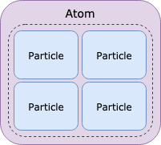
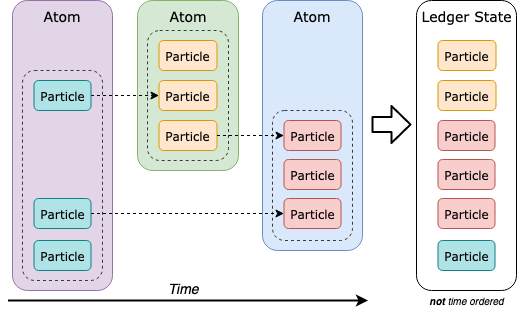
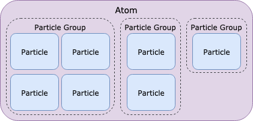
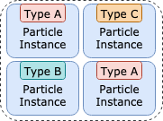
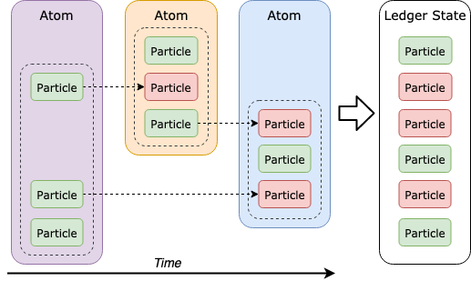
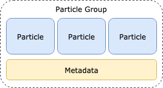
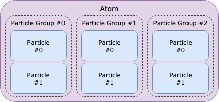
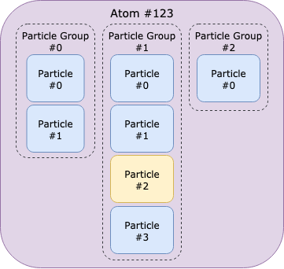
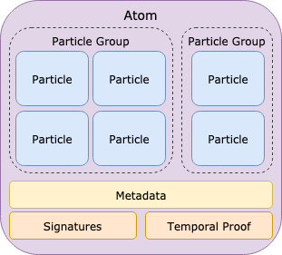
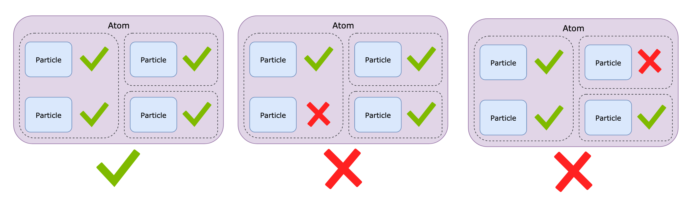

# Atom structure

## Introduction <a id="docs-internal-guid-56228459-7fff-5555-6d11-e1cc63d3c66c"></a>

[Tempo](../whitepapers/tempo.md) \(the Radix consensus algorithm\) provides one fundamental constraint: eventual consistency of state. To meaningfully build on top of this constraint, we need high-level, application-oriented constraints and structures. The Atom Model was designed to empower decentralised applications by enabling extensible implementations of financial systems \(creating, minting, transferring and burning of tokens\), data storage and transfer \(messaging\) and more.

## Specification

In distributed data storage, all participants must agree on a set of rules that govern how a state can be changed. As not every node can store all states, a state must be divided into smaller pieces of state that can be validated without requiring all other states. For this to work, state changes have to be explicit and need to support a mechanism that accepts or rejects a batch of state changes as a unit. In Radix, these state changes are [Particles](atom-structure.md#particles) and this atomic batch of Particles is an [Atom](atom-structure.md#atoms). The Atom Model describes its structure, rules and interface with [Tempo](../whitepapers/tempo.md).

### Hierarchy overview

The state of the ledger is the sum of small state changes. These individual state changes of the ledger are called [Particles](atom-structure.md#particles). To submit Particles \(i.e. state changes\) to the ledger, they must be placed inside an Atom.



Particles in later Atoms may update Particles that were stored as part of earlier Atoms \(e.g. to store that certain tokens have been spent\). The current state of the ledger is therefore composed of all the latest Particles \(i.e. state changes\), whose ordering relative to each other is ensured by Tempo.



When many such state changes are to be submitted at once, it's hard to discern which belong together. This is troublesome for validation \(i.e. accept / reject changes\) as well as for end-users \("which Particles represent what?"\). To provide a clear mechanism for Particle relationships, related [Particles](atom-structure.md#particles) are grouped into [Particle Groups](atom-structure.md#particle-groups).



Note that any Particle must be submitted as part of a [Particle Group](atom-structure.md#particle-groups), Particles can't go inside an Atom directly. This explicit grouping mechanism makes developing libraries, wallets and of course Radix node implementations simpler as managing relations between Particles is natively supported.

[Atoms](atom-structure.md#atoms), [Particle Groups](atom-structure.md#particle-groups) and [Particles](atom-structure.md#particles) are the core structural elements of the Atom Model. The following sections define them in detail.

### Particles

Particles are the core component that power the Atom Model, as they can be mixed and matched with other Particles in an Atom to form arbitrarily complex actions. There are many different types of Particles for different purposes which are [explained here](particle-types.md). Therefore, when talking about Particles it is important to differentiate between [Particle types](particle-types.md), which describe a type of Particle, and Particle instances, which describe instances of a certain Particle type. Particle instances form the state of the ledger, while particle types define the particle instance's state guarantees and rules.



Particle instances of different Particle types can be mixed within an Atom and within a Particle Group as permitted by the Particle type. What a Particle type can permit and disallow about the state of its instances is further explained in the article [Particle Types](particle-types.md).

#### Particles are Finite State Machines

As established, Particle instances can be updated in later Atoms. Updating refers to changing the lifecycle state of a Particle to another state - e.g. from "non-existent" into "valid", or from "valid" to "invalid", or even from "valid" to "valid". Invalidation - marking Particle instances as invalid - is useful for all Particle types that can be consumed in a way \(e.g. Tokens\).  


Updating a Particle does not change its content, but its state. In fact, the content of a Particle being equal is used to identify that a later Particle with equal content is meant to be an update. "non-existent", "valid" and "invalid" are the three possible lifecycle states of any Particle instance, and the Particle type dictates which states are permitted in which order. That is, the finite number of lifecycle states a Particle instance can assume is controlled by the lifecycle finite state machine that the [Particle type](particle-types.md) describes. With Particle lifecycle states in mind, consider an example of how Particles may be updated over time:  




Note that each arrow marks a transition from one lifecycle state \(in this example green, i.e. "valid"\) to another lifecycle state \(in this example red, i.e. "invalid"\). The transitions from non-existence into a valid existence have been omitted for clarity as they are implicit.

### Particle Groups

A Particle Group is a grouping of related particles with metadata in an [Atom](atom-structure.md#atoms) that represent one application-level action. An action could be issuing a transfer involving multiple particles, paying a fee, sending a message, or any logical action that a user or developer wishes to group.



#### Metadata

Similar to Atoms, Particle Groups contain a string-based key-value store of metadata. This metadata is not validated or otherwise constrained in any way \(besides size restrictions of an Atom\) and can be freely used. Note that since all Particle Groups contain metadata and it does not influence other aspects of the Atom Model in any way, it will be omitted unless explicitly discussed for the rest of this article.

#### Particle and Particle Group Indices

To uniquely identify Particle Groups within an Atom, they are indexed in the order they are added to their Atom. To uniquely identify a Particle within a Particle Group, [Particles](atom-structure.md#particles) are indexed in the order they are added to their Particle Group. Note that both indices are zero-based.  




Using the index of the Particle Group a Particle resides in, and the Particle's index within that group, a Particle can be easily referenced within an Atom following the[ JSON pointer standard](https://tools.ietf.org/html/rfc6901) as follows:

```text
<atomId>/groups/<groupIndex>/particles/<particleIndex>
```

Note that 'atomId' is computed using the hash of the Atom. See [Formal Definition](atom-structure.md#formal-definition) for further explanation. For example, the Particle identifier

```text
123/groups/1/particles/2
```

refers to the Particle with index 2 in the Particle Group with index 1, as illustrated here:  




This is helpful for debugging when an [Atom](atom-structure.md#atoms) is rejected by a node, since it can point to a specific Particle in a human-readable way.

#### Dependencies within an Atom

It is often desirable to submit an atomic state change that is composed of multiple changes that are dependent on each other. Particle Groups in an atom can depend on the output of Particle Groups that come before it, ordered by index.

### Atoms

An Atom is an atomic container of state changes on the ledger. When an Atom is submitted to the network, either all its Particles \(i.e. state changes\) are accepted and stored or none are.  




Besides state changes in the form of [Particles](atom-structure.md#particles), grouped into [particle Groups](atom-structure.md#particle-groups), an Atom also contains metadata, signatures and a temporal proof. Signatures are vital to ensure legitimacy of the state changes submitted in an Atom, while the temporal proof is crucial in achieving consensus on a common state of the ledger. Note that the temporal proof is not attached by the client but by the nodes. As signatures and temporal proofs are not relevant to the Atom Model directly, they will be omitted for the remainder of this article.

#### Metadata

Atoms also contain a string-based key-value store of metadata. This metadata is not validated or otherwise constrained in any way \(besides size restrictions of an Atom, see [Formal Definition](atom-structure.md#formal-definition)\) and can be freely used. Note that since all Atoms contain metadata and it does not influence other aspects of the Atom Model in any way, metadata will be omitted for the rest of this document.

#### Atomicity

The atomicity of an Atom is useful for constructing complex actions where either all state changes are accepted or rejected a cohesive unit.



An Atom is only accepted when none of its Particles are rejected, regardless of their position in the Atom.

## Formal Definition

### Formal Structure

The formal structural definitions of the Atom Model are a high-level overview. For the purpose of this definition, \[item\]+ shall denote that item must be included at least once, \[item\]\* shall denote that item can be included an arbitrary number of times and item shall denote that item must be included exactly once.

#### General Metadata

General metadata is arbitrary data about an item \(e.g. Atom or Particle Group\) in a string-based key-value store. The strings are UTF-8, their keys and values are arbitrary. The only restriction is size, which is indirectly imposed by the overall Atom size restriction. General metadata is defined as

```text
Key = <utf8>
Value = <utf8>
Metadata =
    [Key=Value]*
```

#### Particle

The structure of [Particles](atom-structure.md#particles) is defined in the [Particle document](particle-types.md). As Particles do not share any required structure, there is no common base structure.

#### Particle Group

A [Particle Group](atom-structure.md#particle-groups) contains a non-empty indexed list of Particles with General metadata. A Particle Group's structure is

Formal Particle Group Structure

```text
Particle Group =
    General Metadata
    [Particle]+
```

#### Atom

An Atom contains a non-empty indexed list of [Particle Groups](atom-structure.md#particle-groups) with Atom metadata. Atom metadata is similar to General metadata, except that it has special values that must be present and  have value constraints:

<table>
  <thead>
    <tr>
      <th style="text-align:left">Required Metadata key</th>
      <th style="text-align:left">Purpose</th>
      <th style="text-align:left">Value constraints</th>
    </tr>
  </thead>
  <tbody>
    <tr>
      <td style="text-align:left">timestamp</td>
      <td style="text-align:left">Timestamp when the Atom was submitted</td>
      <td style="text-align:left">
        <p>positive integer</p>
        <p>must be after Universe was created</p>
      </td>
    </tr>
  </tbody>
</table>An Atom's structure is defined as

```text
Atom =
    Atom Metadata
    [Particle Group]+
```

**Atom Size Restrictions**

The maximum number of bytes a compact serialised Atom may have is 65536.

### Formal Schema

The formal schema is a JSON schema that the JSON serialised version of an object must follow.

#### Particle

The schema of Particles is defined in the [Particle document](particle-types.md). As Particles do not share any required structure, there is no common base schema.

#### Particle Group

The formal JSON schema of a Particle Group is [available here](https://docs.radixdlt.com/node-api/).

#### Atom

The formal JSON schema of an Atom is [available here](https://docs.radixdlt.com/node-api/).

## Implementation

The Atom Model is currently implemented in Java on the development branch of the Radix Core \(the primary implementation of a Radix node\) and the Radix Client libraries.

### Radix Core \(Java\)

The Radix Core implementation is currently only accessible to Radix Core developers.

### Client libraries

| Language | Status | Library |
| :--- | :--- | :--- |
| [Java](../../develop/java-client-library/) | Available | [radixdlt-java](https://github.com/radixdlt/radixdlt-java) |
| [JavaScript](../../develop/javascript-client-library/) | Available | [radixdlt-js](https://github.com/radixdlt/radixdlt-js) |
| [Kotlin](../../develop/kotlin-client-library/) | Available | [radixdlt-kotlin](https://github.com/radixdlt/radixdlt-kotlin) |
| Swift | Available | [radixdlt-swift](https://github.com/radixdlt/radixdlt-swift/) |

