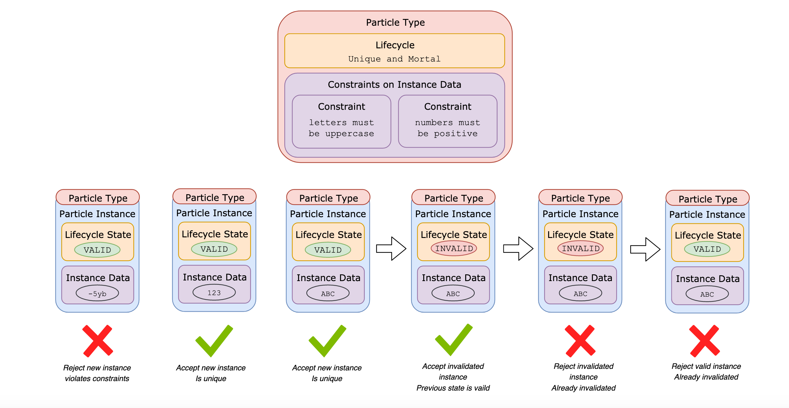

# Particle types

## Introduction

Particle types describe the qualitative aspects of a [Particle](atom-structure.md#particles)'s [state machine](constraint-machine.md#state-machines), which are a combination of the content structure of an instance and the lifecycle and content state transitions that are permitted. The Particle type further defines the data its Particle instances must contain and what constraints they must abide to be accepted and stored. Particle types often share common properties that require their constraints to work a certain way, such as the property that a Particle instance of a type can be uniquely identified. These distinct, common properties of Particles are called Quarks.

In summary, the two defining qualitative aspects of a Particle type are:

1. Quarks: distinct properties this Particle type implements
2. Constraints: the constraints that are applied to Particle instances to be accepted

## Quarks

The fundamental, distinct properties a Particle can have are called Quarks. They are the foundation for all Particles and the interface to the underlying Tempo engine. Particle types can implement these Quarks and thereby take on the constraints offered by them.

<table>
  <thead>
    <tr>
      <th style="text-align:left">Quark name</th>
      <th style="text-align:left">Meaning</th>
      <th style="text-align:left">Constraints</th>
    </tr>
  </thead>
  <tbody>
    <tr>
      <td style="text-align:left">Identifiable</td>
      <td style="text-align:left">Particle instances are uniquely identifiable</td>
      <td style="text-align:left">
        <p>Can only be one Particle instance with the provided identifier</p>
        <p>Has to be a valid Radix Resource Identifier</p>
      </td>
    </tr>
    <tr>
      <td style="text-align:left">Fungible</td>
      <td style="text-align:left">Particle instances are fungible and mutually interchangeable</td>
      <td style="text-align:left">Transactions involving Particle instances have to add up</td>
    </tr>
    <tr>
      <td style="text-align:left">Accountable</td>
      <td style="text-align:left">Particle instances can reside in a Radix account</td>
      <td style="text-align:left">Particle instances must be stored in a Radix account</td>
    </tr>
    <tr>
      <td style="text-align:left">Ownable</td>
      <td style="text-align:left">Particle instances can be owned by a Radix account</td>
      <td style="text-align:left">Only owner of Particle instance can invalidate (i.e. consume) it</td>
    </tr>
  </tbody>
</table>## Constraints

In addition to the fundamental constraints provided by Quarks, Particle types can implement their own constraints. These constraints are implemented using the Constraint Scrypt Language. Constraint Scrypts are Scripts that register constraints for a certain Particle type.

### Constraint Structure

A constraint is a requirement placed on a Particle type that all Particle instances of that type have to meet to be accepted and stored alongside an Atom. The constraint is validated against a single particle instance and can be based on

* just the Particle instance with "require",
* all Particle instances with the identifier of the Particle instance \(for Indexables\) with "requireIndexed",
* all Particle instances with the same content with "require.

The structure of a Constraint is defined as:

```text
on(<Particle Type>)
    require | requireIndexed | require <requirement>
```

where `requirement` is the requirement that the constraint imposes on `<Particle Type>`. The output \(i.e. return value\) of the requirement must be of type Result, which is an enum of

* success \(no message\)
* error \(with message\).

Although a return value is required, the final success statement can be omitted for brevity as it is an implicit default.

### Example

Consider an example Constraint Scrypt that enforces that MyParticle's symbol must

1. exist and be non-empty
2. all uppercase
3. between a certain range in length \(`MIN_SYMBOL_LENGTH` and `MAX_SYMBOL_LENGTH`\)

As this Constraint Scrypt only requires the Particle instance in question, it is implemented as a stateless requirement with require\(\).

```text
on(MyParticle)
    require(myParticle -> {
        String symbol = myParticle.symbol
        if !symbol
          error "Symbol: no or empty provided."
 
        if symbol.chars().anyMatch(isIllegalSymbolChar)
          error "Symbol: must be all uppercase."
 
        if !symbol.length in MIN_SYMBOL_LENGTH..MAX_SYMBOL_LENGTH
          error "Symbol: invalid length, must be between + MIN_SYMBOL_LENGTH + " and " + MAX_SYMBOL_LENGTH  + " but is " + symbol.length()
 
        success // can be omitted
    })
```

## Particle Instance

Particle instances describe the quantitative aspects of a Particle state machine, i.e. the actual instance state. They are an instance of a certain Particle type and must therefore abide by its Particle types constraints and lifecycle state machine to be accepted. The Particle instance stores all quantitative state \(i.e. instance state\) required by its Particle type and can transition into any state - lifecycle state and data state - permitted by the Particle type. A Particle instance does not carry any qualitative information with it - the qualitative aspects defined by the Particle type are "stored" in the Atom Model. Consider the following example of a Particle type defining the Particle Finite State Machine \(FSM\) and two instances of that FSM:



In this example, a Particle type with the lifecycle Unique and Mortal and two toy constraints is defined. Remembering that the Particle lifecycle Unique and Mortal enforces unique, invalidatable Particle instances, it can be observed that instances violating the lifecycle state machine are rejected. Similarly, Particle instances violating the toy constraints  for instance data \(instance data is all uppercase if it's letters, positive if it's a number\) are rejected. Particle instances without violations are accepted.

## User-Defined Particle Types

Currently Particles are hardcoded in the Radix Core and libraries, that is, no new Particle types can be added without modifying the source code. The building-block-like design of the Atom Model will enable us to support user-defined Particle types, and even Particle types defined as Particle instances on the Radix ledger. This will require all relevant pieces of a Particle type to be adapted into a data-driven format, including the definition of the Constraint Scrypt Language. As such, this expansion necessitates significant work in planning, design, implementation and testing and is therefore a long-term feature.

