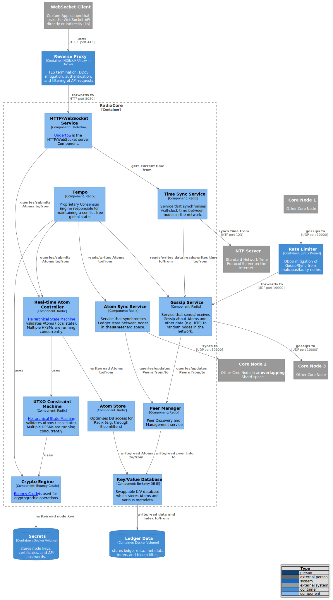

# Component Diagrams

## Level 3: Radix Core Container Components

This page implement the third "C" in the [C4Model](https://c4model.com/#coreDiagrams): the **C**omponent Model.

It recommended that you understand the [Context Model](c4_context.md) \(first "C"\) and [Container Model](c4_container.md) \(second "C"\) before moving on to this page.

## The Components of the RadixCore Container

## TODO: What needs more details ?

