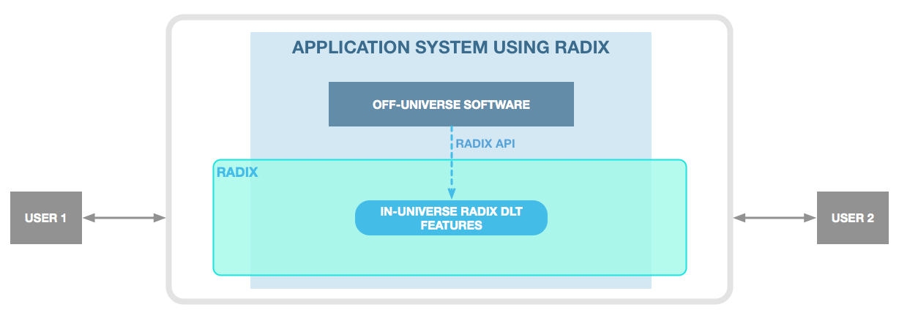
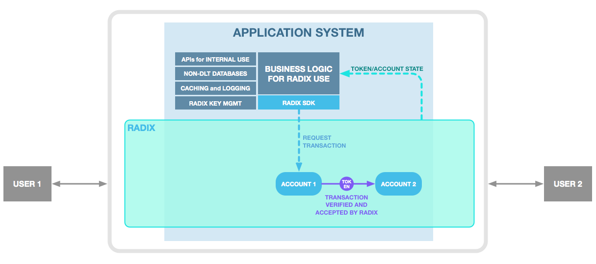
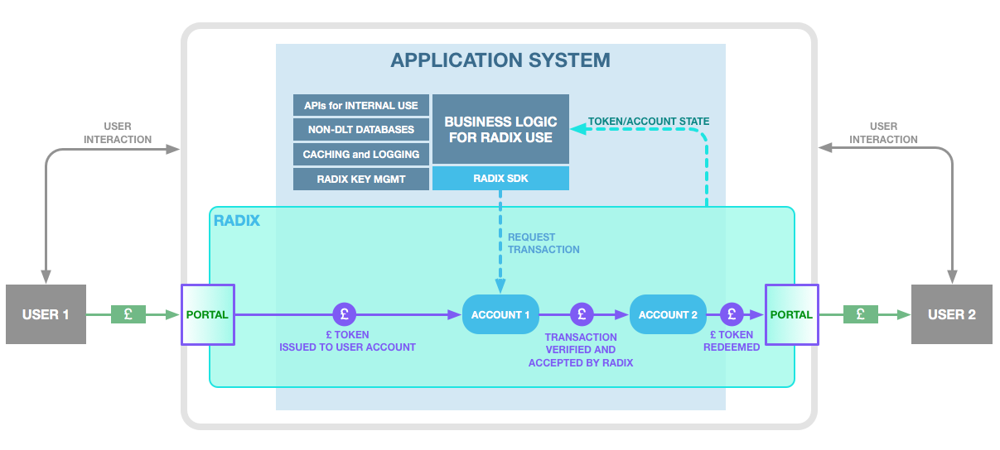

# Developer Responsibilities for Financial Applications

## **Basics of Radix Development**

Radix Portals and Fiat Tokens solve many problems for financial applications, but does not remove all the development responsibility. Fortunately Radix’ development model provides direct API access to first-class features needed to create useful DLT applications – such as tokens, application-specific constraints, multi-sig accounts, and more – without being forced to write specialised “smart contract” code. A developer may build the complex part of their application outside the DLT in whatever language they are familiar with, making use of these “in-Universe” Radix DLT features where appropriate.  

In order to create a complete, robust application solution using Radix, there are some critical capabilities that are the responsibility of the application developer to build. These may include:

* Integration of Radix SDK \(or direct development against API\) within application
* Configuration \(initial and ongoing\) of in-Universe accounts/tokens to correctly model business constraints
* Private key management and user account recovery logic
* Coordinated operation of databases for private information storage, and transaction data caching and logging
* Coordinated private/public Universe usage
* Coordinated use of third party systems – trusts, exchanges, messaging, etc.
* Provision of internal interfaces to the business’ apps or traditional systems with secure access management

Many of these capabilities may already be familiar to developers and companies with knowledge of enterprise development patterns or cross-application coordination using multiple software suppliers. However, we also appreciate that certain components, such as correct private key management and recovery and DLT usage patterns, are still relatively niche. To help developers building on the Radix platform we will continue to share best practice in these areas, as well as support standards bodies as this industry matures.

## **Integration of Radix Portals**

Adding Portals into the development completes the picture for Accessible Fintech applications. In parallel to the user interactions that a developer handles directly, Portals provide the financial interface into the Radix-based application system.  

The most seamless user experience for Portal functionality is by directly integrating a Portal’s SDK into your application. These SDKs should be relatively straightforward, allowing the Portal to gather necessary user information for legal compliance, and allowing Fiat Tokens to be smoothly issued/redeemed to/from Accounts within your Application as needed. Correct accounting of funds is provided automatically by the Portal and the Fiat Token.

