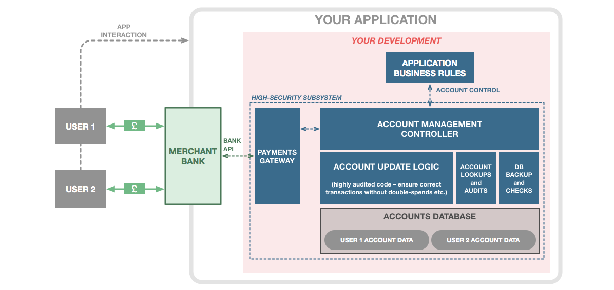
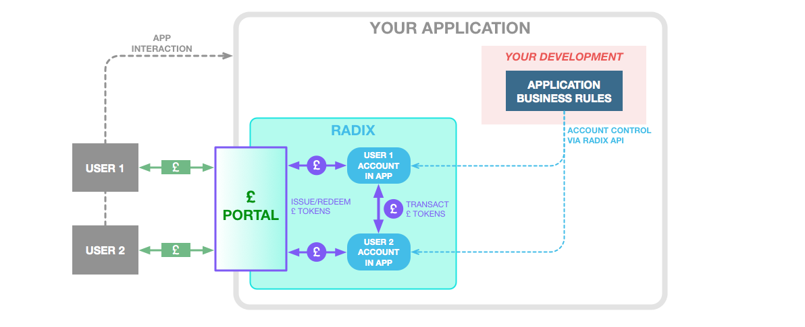
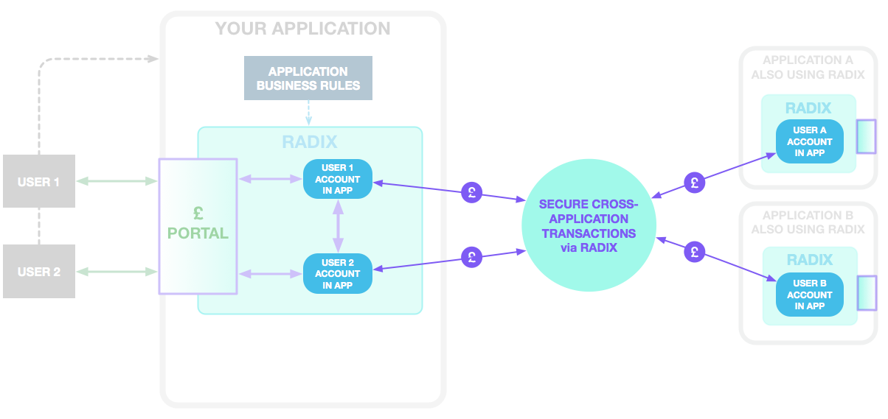
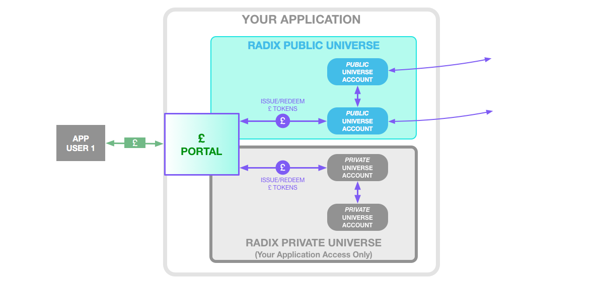

# Traditional vs Radix Development Approach

## **The Challenge of Traditional Fintech Development**

Today, developing an application with a financial component creates an imposing set of development and infrastructure hurdles beyond just the development of the application itself. Typically the solution requires the use of a Merchant Bank and a custom accounting sub-system sitting behind the application. The Merchant Bank account is generally just one big bucket of money, with a single beneficiary: your company. Your users can send and receive funds from this bucket through the application. As a developer, you must now build a system that turns that single pot of money into the actual balances of all your users and the methods to control those balances through your application’s business rules.

Building an application with a fintech component the traditional non-Radix way bears significant development responsibility in order to ensure secure, reliable transactions between users and interactions with a traditional merchant bank managing funds.

The developer must build a solution that typically takes the form of a complex multi-layer fintech software sub-system with a range of functions: The developer must establish a relationship with a Merchant Bank that offers an API, and build a custom Payments Gateway to ensure synchronisation of bank funds with private accounting. The developer must build an Account Management Controller to coordinate between the application’s Business Rules, the Payments Gateway, and a databasing solution for accounts. And most critically of all, the developer must build a databasing solution with highly sensitive and robust Account Update Logic that absolutely ensures that funds are never “double-spent”, lost, or otherwise incorrectly accounted for. There often must be systems to provide cached lookups, audits, backups, and consistency checks on the database itself.

Any errors in this system are costly, and so the development and support costs to build a system that can truly be relied on are also high – the more complex the application requirements, the higher. For anything beyond the simplest of applications, these systems are usually only in the reach of large enterprises.

## **A Better Way Using Radix and Portals**

Radix and Portals greatly simplify development of fintech functionality for applications.

The Currency Gateway functionality provided by Portals eliminates the need for a Merchant Bank account or custom Payments Gateway. Once a developer integrates a Portal into their application, funds received by a Portal become Fiat Tokens that are issued to an associated Radix account for the application. No additional gateway software needs to be written, and there are never any issues with syncing of funds with a Merchant Bank; each Fiat Token is a reliable guarantee for the corresponding Dollar, Euro, or Pound.

The Currency Infrastructure functionality of Portals means that once Fiat Tokens are used to represent money within the application, development of financial features becomes much simpler. Rather than build and support a complex sub-system to coordinate, protect, and manage the correctness of an accounts database, Radix itself inherently handles the heavy-lifting of conducting transactions, managing accounts, and ensuring correctness of results. The development focus is now on applying the necessary business rules in the Radix system. This lowers the bar tremendously to provide enterprise-grade reliability of transactions without an enterprise development and support team.

To take a simple example, an application can effect a financial transaction between two users by simply moving Fiat Tokens, via API, between two Radix Accounts representing those users.

Building an “Accessible Fintech” application using Radix Portals and Fiat Tokens, significantly reducing development burden to provide secure, reliable financial transactions.

A Radix Account can be constructed over API, is trivial and free to create, but is as secure as the cryptography that banks use for creating separate bank accounts. Radix ensures that transactions of tokens between accounts are always correct. Fiat Tokens and Accounts provide the basic building blocks for limitless application functionality. Highly complex fintech systems that would otherwise be impractical for all but the largest of enterprises become possible for any application developer with Radix.

Once an application is “plumbed for Radix” and is using Fiat Tokens, an application can even move beyond what is possible with a traditional merchant bank system. In the Radix Universe value may move between applications securely and directly without complex intermediary banking systems. Much like the world wide web created a universal communication layer between users and applications on the internet, the public Radix Universe creates a universal financial layer. Using Radix, an application may easily conduct instant global cross-application payments at virtually no cost using Fiat Tokens.

Transacting value between users and businesses with a Radix-enabled universal payments ecosystem.

For applications where privacy is a primary concern, business can also create their own Private Universes using Radix technology. Connecting a Portal to a company’s Private Universe allows it to manage funds as Fiat Tokens with the ease, security, and power of Radix’ development tools – but without exposing those transactions on the public internet. Portals allow those same Fiat Tokens to move seamlessly to/from the Public Universe where they may be freely sent, spent, or saved by anyone.

Radix allows the application developer to use Radix in both public and private fashion, as dictated by the business need, using a Portal to move funds seamlessly between these Universes.  

