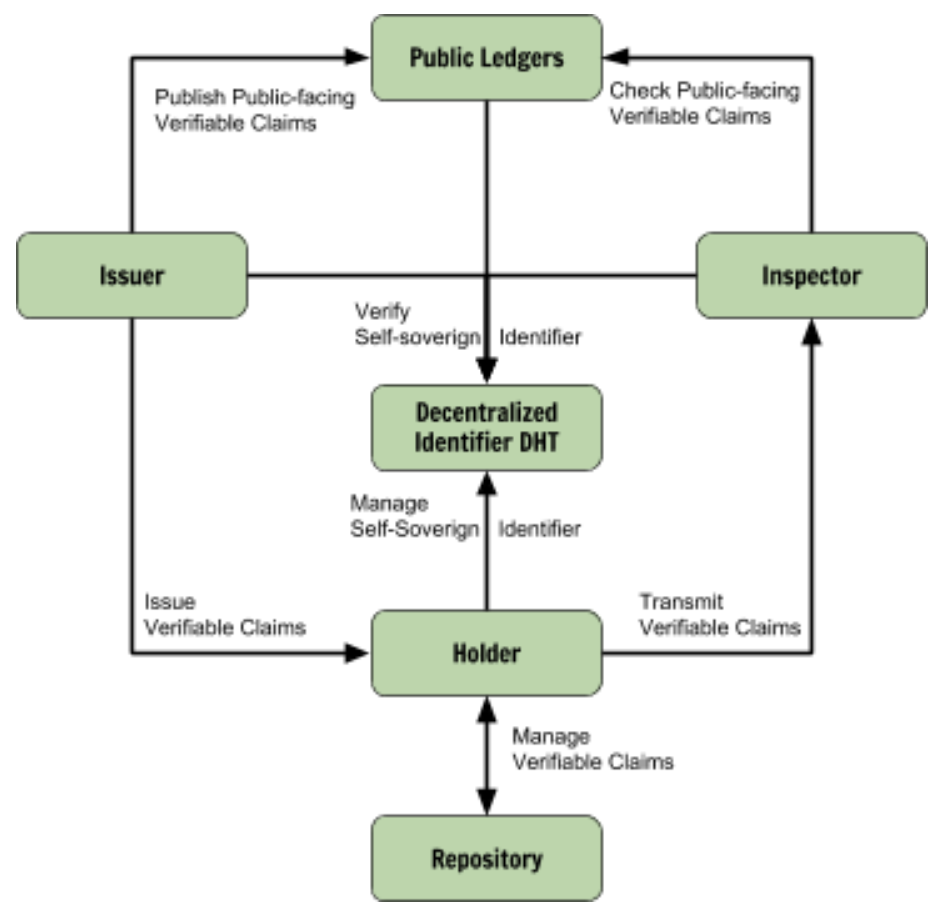

# Decentralized Identity

## Abstract

The [Decentralized Identifiers \(DIDs\) v0.11 specification](https://w3c-ccg.github.io/did-spec/) defines a standard for a decentralized, self-sovereign identity layer on the internet that can be implemented by any DLT. It defines how identification is structured, how communications are established and permissioned. The [Sovrin Foundation](https://sovrin.org/wp-content/uploads/2018/03/Sovrin-Protocol-and-Token-White-Paper.pdf) extends this standard with specifications for claims and claim definitions in an effort to make it widely applicable while the official W3C standard for claims is in progress. Sovrin further provides an open source implementation of their specification with [Hyperledger Indy](https://github.com/hyperledger/indy-sdk). 

## Motivation 

Conventional identity management systems are based on centralised authorities such as governments, corporate directory services, certificate authorities, or domain name registries. Making identity management work without a central authority across these systems requires standardised decentralised identity management.

## Overview 

## Identifiers  

**Decentralised identifiers \(DIDs\)** are introduced to facilitate trustable identification in a decentralised environment; 

1. DIDs are a forever persistent identifier that resolves to a resource which serves as a description and configuration of that DID \(the _DID descriptor object_ or _DID document_\). 
2. DIDs do not require a centralised authority to register, resolve, update, or revoke. 
3. DIDs can have cryptographically verifiable ownership and associated metadata.

#### DID Document 

Every DID has an associated DID document containing _cryptographic material_, _authentication suites_, and _service endpoints_. Cryptographic material combined with authentication suites provides a set of mechanisms for authentication \(e.g., public keys, alternate pseudonymous biometric protocols, etc.\). Additionally, optional service endpoints enable trusted interactions with the owner of the DID.

### Types 

Befitting the requirements defined above, a DID can be implemented as either a _pure DID_ with no cryptographic properties, a _cryptographic identifier \(CID\)_ or with an _alias_. Note that these variants are considered subgroups of DIDs as a whole. 

#### Pure DID 

A _pure DID_ is a universally unique identifier without any cryptographic powers \(i.e., no private key, no ability to sign anything\). Implemented with UUIDs and used when the owner is currently unable to store private keys \(e.g., refugees\). An example pure DID may look like this:

`did:76d0cdb7-9c75-4be5-8e5a-e2d7a35ce907`

#### Cryptographic Identifier \(CID\)   

A _cryptographic identifier_ or _CID_ is a globally unique identifier that is algorithmically generated from cryptographic key material so that it has specific cryptographic properties. In essence, a CID is a public key or a value generated out of a public key \(e.g., a truncated hash\) which gives it to _sign_ things cryptographically. An example CID may look like this:

`cid-1:MIIBIjANBgkqhkiG9w0BAQEFAAOCAQ8AMIIBCgKCABMC`

#### Alias 

An _alias_ is "a hash of a conventional address produced using a specified normalization algorithm and a specified hashing algorithm."  An example for the alias "Walter" may look like this:

`sha-256:e3b0c44298fc1c149afbf4c8996fb92427ae41e4649b934 ca495991b7852b855`

## Claims 

_Claims_ are signed attestations of a certain structure made by a DID \(the _issuer_\) about itself or another DID \(the _holder_\) to be inspected by a third party \(the _inspector_\). This structure is dictated by a _claim definition_ \(or _claim schema_\), which all participants can fetch, compare and understand. There are 5 fundamental types of claims which can be used to provide certain levels of information security, ranging from public over encrypted to private. 

#### Cleartext claims 

_Cleartext claims_ are claims without any encryption. They are typically used for public on-ledger claims, e.g., for business and organisations public record information. 

#### Encrypted claims 

_Encrypted text claims_ are the encrypted counterparts to _cleartext plains_ using either symmetric or asymmetric encryption. 

#### Hash signature claims 

_Hash signature claims_ are specially encrypted trees of _cleartext_ _claims_. They can be used to reveal certain claims to certain parties selectively.

#### Proof of existence \(POE\) claims 

_Proof of existence \(POE\)_ claims are just hashes of anything. They can be used to prove that a certain object \(e.g., signed document\) existed at a certain point in time, e.g., to prove consent as required under GDPR. 

#### Anonymous credentials transmit claims 

_Anonymous credentials transmit claims_ are an application of _zero-knowledge proofs \("zk-proofs"\)_ expressed as a claim. They can be used to prove a claim without revealing the actual information, e.g., "over 21", valid passport, without revealing the actual age or passport.

## On and Off Ledger – What Goes Where 

Information on the ledger is public and permanent. Therefore only data that is not personally identifiable should live there. All claims that contain any kind of private data should be kept off-ledger and only shared via secure and not co-relatable meaning \(peer-to-peer communication as defined in Sovrin and implemented in Hyperledger:Indy\). 

### On-Ledger

* Decentralised identifiers and associated DID documents. Œ
* Claim definitions Œ
* Proof of consent for data sharing Œ
* Public claims Œ
* Revocation registries

### Off-Ledger

* Private data of any kind \(including hashed personal data\) ž
* Private proof of existence 

For a decentralized identity system to be widely adopted, we need to reduce the barrier to entry and improve the on-boarding process. Therefore, we believe that a flexible resolution of short, human-readable names and resource identifiers that map to accounts, data or services should be defined. Read the next short section on the [Radix Name Service](radix-name-service.md).

