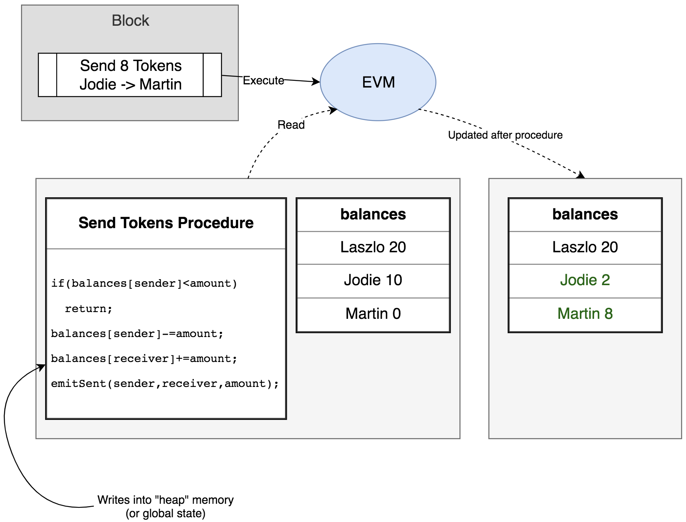
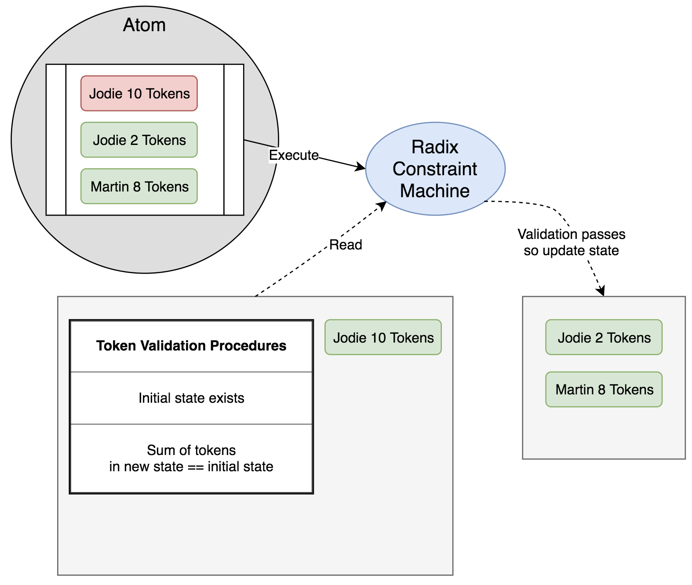

# Consensus

## Inventing Tempo

To achieve speed, scalability, efficiency, Radix has created a combined distributed database architecture and consensus algorithm called Tempo. It is the core of the Radix platform. It uses logical clocks for generating a partial ordering of events and vector clocks to create an absolute order of events based on causal relationship in a distributed system to detect and prevent protocol violations. 

### Scaling distributed ledgers

To solve the problem of scalability, Radix started with the data architecture required for that kind of scale. We realized that to serve the world you needed a data architecture that could allow billions of people and even more devices to use it simultaneously. That would need to be both incredibly easy to index \(to make the data structure usable\), and [massively sharded](https://www.radixdlt.com/post/what-is-sharding) \(cut into fragments\) so as the demand of the network grew, more computers could be added to increase the throughput of the network.


[Learn what is sharding in this explainer blog post](https://www.radixdlt.com/post/what-is-sharding)


We realized that cutting up the data ad-hoc would not work. Instead you need to already know how the data will be cut up. You should be able to look at any piece of data and know where it lives in the data structure without having to re-index every time large amounts of new data is added. This feature of Radix is achieved through a deterministic process \(a process that, given a set of inputs, always outputs the same answer, no matter when it is computed\). We achieve that by [pre-cutting up the data structure of the platform into 18.4 quintillion shards ](https://papers.radixdlt.com/incentives/#shards)\(2^64\). We then use key reference fields, such as a public key, as a way of determining where in that shard space a particular piece of data lives.


[Read about sharding in Radix in this explainer blog post](https://www.radixdlt.com/post/sharding-in-radix)


The result of this innovation is a data structure that is sharded and able to scale linearly, without overhead, from tiny data sets to ones large enough to service every person and business in the world. The total throughput of the network is only limited by the number of participating nodes in the network.


[Discuss how Radix scale linearly on our developer forum](https://forum.radixdlt.com/t/how-does-radix-scale-linearly/38)


### Designing an efficient and secure consensus algorithm

Dealing with large amounts of data efficiently is only one part of the problem that must be solved for true mainstream use of Distributed Ledger Technology \(DLT\) - the other part of this is making sure that no conflicting data can exist in the system without it being quickly flagged and removed. This system of comparing, ordering and agreeing on data conflicts is broadly referred to as “consensus”.

Consensus systems can be loosely grouped into permissioned and permissionless consensus. Permissioned consensus is where all parties that are involved in deciding between conflicting entries are identifiable \(e.g. a specific business\) and are given express permission to amend and reject information in the system. These systems have been around for a long time to manage distributed databases and are still used in a number of new permissioned systems such as Hyperledger and R3’s Corda, and are built on permissioned consensus systems from the 1970’s such as PBFD and Raft.

Their flaw is that the consensus is not secure, it simply relies on securing the process of selecting the parties who are allowed to manage the data, rather than making the method of reaching consensus itself secure and fault tolerant.

[Permissionless consensus](https://www.radixdlt.com/post/why-consensus-algorithms-are-like-military-generals) was the innovation that created Bitcoin in 2008/2009. Instead of securing the selection of the parties that would be involved in making the consensus, it worked out a way of making the process of consensus secure; meaning no central authority was needed to select and vet network participants. Instead computer power was used as a way of allowing everyone to work out what the majority of the network believed to be the correct version of the truth, organized it into blocks of transactions and then chaining those together with each new block referring to the last, forming the blockchain.

The use of computer power to secure this process is called [Proof of Work \(PoW\),](https://www.radixdlt.com/post/what-is-proof-of-work) and is both massively inefficient, and only as secure as half the total amount of computing power being used to decide what data to accept and what data to reject. This can be effective for very large networks where there are clear crypto economic incentives to provide ever increasing amounts of computing power, such as Bitcoin, but do not function well for small or private networks where getting more than 50% of the computing power of the network is trivial.

It has however, one very important feature - it does not rely on the security of the individual network members, only the security of the network as a whole. This feature makes the entire system much more resilient and secure than a permissioned system, if deployed in the correct way.

Radix also solves these problems by creating a permissionless consensus system that can be used securely in both small and large networks, but secured by a property that cannot be trivially bought or faked within Radix: the passage of logical time. In addition to this, unlike other DLT systems, it does not apply consensus to every event, only to those that conflict. This allows the entire system to be incredibly efficient, even at massive scale.

The passage of logical time relies on a concept called [logical clocks](https://youtu.be/wfsZuN6NaJo) - It uses these clocks for generating a partial ordering of events in a distributed system to detect and prevent causality violations based on [Leslie Lamport's logical clock theory](https://lamport.azurewebsites.net/pubs/time-clocks.pdf). In very simple terms, a logical clock is a counter. Each node on the Radix network \(a node is a computer that maintains some or all of the state data the network contains\) has its own logical clock that it maintains. The only rule it must follow that it must strictly count upwards only, and may only ever increment by 1 each time. 

In Radix, this counter is triggered for a node when it sees a valid event it has never seen before. The node must simply check its own database, then increment its logical clock, stamp the event with the new timestamp and ID and then [gossip it to the network](https://youtu.be/9kPyyOIn6Bo). Periodically it must make [commitments](https://youtu.be/jTYGOuS2xvg) to make sure it cannot lie about the order of historical events. 

Due to the data structure, this simple and reliable consensus mechanism now only gets triggered if any node disagrees about the correct ordering of related events. This passive consensus mechanism is both very reliable, event at large numbers of dishonest or faulty nodes, and incredibly power efficient as no extra energy is expended apart from to resolve conflicts.


[Discuss about the Tempo consensus on our developer forum](https://forum.radixdlt.com/t/designing-an-efficient-and-secure-consensus-algorithm/39)


## Properties of Tempo

### Fast & Scalable

Tempo is both “**asynchronous**”, meaning there is no block time, and byzantine fault detective, meaning that it can detect and stop protocol violations within a permissionless system with 99% Fault Tolerant Consensus. Tempo does this by preserving the total order of events, allowing for the trustless transfer of value, time-stamping and other functionality. It limits state transition information to only those members \(shards\) of the network that need it. This reduces overhead and enables fast finality times fulfilling the [first two properties](./#how-is-radix-different) of being **fast**, and **scalable** required for mass adoption.

### Efficient & Secure

Properties of the Tempo data architecture allows for building a peer to peer state machine one which validates state transitions instead of computing it and one which does not require large amounts of computing power \(PoW\) or large amounts of capital \(PoS\) to secure it, thus lowering the barrier to entry, and increasing the degree of **decentralization** while being energy **efficient** at the same.   
  
It uses both Byzantine Fault Tolerance to defend against 51% network split attacks and Byzantine Fault Detection to detect and discard protocol violations like double spends with 99% fault tolerance allowing for maximum **security**. 


[Read about how to achieve consensus with 99% dishonest actors in this explainer blog post](https://www.radixdlt.com/post/simple-consensus-in-radix)


It is suitable for both public and private deployments, without modification, and requires no special hardware or equipment.

### Decentralized and fair

Radix reduces the barrier to entry by making it simple to deploy a node. It runs on standard commercial hardware. It avoids network centralization by not requiring high computing power or capital to secure the network. It does not discriminate low powered devices by enabling them to support the network partially as per their resource capacity and providing an equal chance of earning rewards. 

### Price Stable

To incentivise a network of economic participants in powering the decentralized infrastructure, we propose a low volatile currency \(**XRD**\) that is both **fast** and **stable**, being able to compete with the likes of current fiat currencies. You can read more about it in the [economics section](token.md#low-volatility-token-xrd) of this documentation.

### Ease of use

The Radix Network is a peer to peer network of computers that together make up a decentralized state machine. The major difference as compared to other public networks like Ethereum/EOS is that nodes validate state transitions instead of computing it. This reduces errors and allows for protocol programmability. Developers build applications using their preferred choice of popular programming language like Java, Kotlin and JavaScript to interact with the Radix Alpha Network using native protocol API calls, without using a smart contract language or needing a Turing complete computational machine.

Thus, the Radix platform is what Bitcoin and Ethereum should have been; fast, scalable, secure, completely decentralized and powered by a cryptocurrency which is usable and relatively stable.

## How does it work? \(simplified\)

_Radix is built on a combined architecture and consensus algorithm called Tempo, which is fully outlined in the Tempo white paper that can be found here:_ [_http://bit.ly/2ADK8LA_](http://bit.ly/2ADK8LA)

The aim of Tempo is to create a trustless, decentralized consensus algorithm that can work reliably as a public network. To do this it must be:

* Asynchronous - any process on the network can start or end whenever it needs to - e.g. it does not need to wait for a “block” to be mined.
* Highly concurrent - many processes can be done simultaneously, without bottlenecks - e.g. there is not a limit to the number of transactions that can be fit into a “block”
* Scalable - there is not an upper limit restricting the total throughput of the network, such as the limits CAP Theorem puts on Blockchains and DAGs.

To achieve this, Tempo relies on a two simple ideas, and one logical leap:

1. The use of a basic digital clock called a “logical clock”
2. Telling your neighbors what has been happening, a process called “Gossip”
3. To stop double spends across shards, your shard address should be based on your wallet public key

A logical clock is a counter that is incremented by 1 every time something new happens. On Radix, “something new” is when one Node speaks to another in the Radix network. This gives every Node their own relative time, based on network activity, and one they can use to create a simple order of events.

Gossip protocols are well established in computer science and are one of the fastest ways in which information can be reliably shared across a network. It works simply by a Node choosing a couple of other Nodes to tell something new to, and they, in turn, tell two other Nodes, and so on and so on. This causes information to spread at an exponential rate.

On Tempo, we add the Node logical clocks, signed by the Nodes in question, to the gossip they are spreading around the network. This allows everyone to see both new information, and at what logical clock time that information was seen by other members of the network.

To allow high scalability a Tempo ledger is split into a very large shard space, allowing a huge degree of concurrency. To avoid a double spend across any of the shards, the shard a wallet lives on is determined by its public key. This makes sure that any spend from a wallet will always start on the same shard.

When combined with the logical clocks and gossip, Tempo is able to create a total ordering of all related events, allowing double spends to be quickly detected and dismissed by the network.

In the following video series Dan walks you through:-

1. [The basic components of the Radix Ledger](tempo.md#the-basic-components-of-the-radix-ledger)
2. [Creating relative order of events on the Radix ledger](tempo.md#creating-relative-order-of-events-on-the-radix-ledger)
3. [Preventing nodes from lying about the order of events](tempo.md#preventing-nodes-from-lying-about-the-order-of-events)
4. [Creating node ids and basic sybil prevention](tempo.md#creating-node-ids-and-basic-sybil-prevention)
5. [Updating other nodes about new events via gossip protocol](tempo.md#updates-about-new-events-via-gossip-protocol)

### The basic components of the Radix ledger



###  Creating relative order of events on the Radix ledger



### Preventing nodes from lying about the order of events



### Creating node ids and basic sybil prevention



### Updates about new events via gossip protocol



Now that you have the basic fundamentals of the Radix ledger, lets dive deep into the Radix Constraints based state machine that allows for easy and error free building of decentralized application logic without the need for a Turing complete smart contract language like solidity.


[Have questions? Ask them here on our developer forum](https://forum.radixdlt.com/t/how-does-radix-work/59)


## Radix Constraints Machine

The Radix ledger is a decentralized data storage with a set of extensible rules that are enforced by all its participating nodes. These rules govern what users \(and by extension developers\), can do to change the state of the ledger.

Unlike other distributed ledgers like Ethereum/EOS which are global computational state machines that compute & maintain the state of the ledger, the Radix state machine is based on validating state transition based on a set of protocol constraints.

In simplest terms

* A _**Computing Machine**_ is a machine which given an instruction, then updates state
* A _**Constraint Machine**_ is a machine which given an initial and next state, then determines whether transition is valid then update

Both machines have stack memory and are programmable. The fundamental difference being:

* A _**Computing Machine**_ procedure has access to the global state \(aka "heap" memory\) where it stores necessary persistent information
* A _**Constraint Machine**_ procedure on the other hand is purely functional with no write access to the global state.

### Comparison

#### Computing Machine

#### Pros

* General purpose in nature
* Can compute anything \(Turing complete\)
* Well known system
* Can use any other high level languages as long as there is compiler support

#### Cons

* Imperative programming in nature so prone to many bugs since it depends on state management
* Very difficult to state shard since instruction can call arbitrary number of functions touching arbitrary number of states
* Difficult if not impossible to revert an instruction
* Difficult concurrency since global ordering matters since any instruction can touch everything

### Constraint Machine

#### Pros 

* Declarative, stateless programming \(program what you want as a valid state transition rather than state management\)
* Very easy/cheap to revert \(important for Tempo Consensus\) since state change and dependencies is explicitly known
* Better security and less bugs since constraints first as a paradigm
* Easily sharded state since before/after state is explicitly embedded in instruction itself
* Concurrency and asynchronous logic a lot easier since explicitly know which part of state is updated
* Much more structured in nature so easier to debug

#### Cons 

* Cannot use as a traditional computing platform since it doesn't compute only ensures constraints \(e.g. not good to use for an excel program or to calculate game physics\)
* More difficult to implement side effects since all of the next state must be known before execution
* Not good for workloads which require large scans/aggregations since state is inherently chopped in pieces

### Example: Sending tokens

#### Ethereum Smart Contract

As you can see, the Ethereum Virtual Machine \(EVM\) smart contract procedure requires one to update the balances in code. State management and ordering of read/writes of state is required.

Taken from: [https://solidity.readthedocs.io/en/v0.4.24/introduction-to-smart-contracts.html](https://solidity.readthedocs.io/en/v0.4.24/introduction-to-smart-contracts.html)

#### Radix Smart Constraints

In the Smart Constraints Style, validation only requires a yes/no answer. There is no state update as the end state is explicitly known before "execution".  
  
It results in cleaner, functional, declarative logic which is inherently shardable.

​[In the next section](security.md) we discuss popular attack vectors, both simple and complex and how the Radix Ledger defends against them using a combination of Fault tolerance and detection mechanisms.

