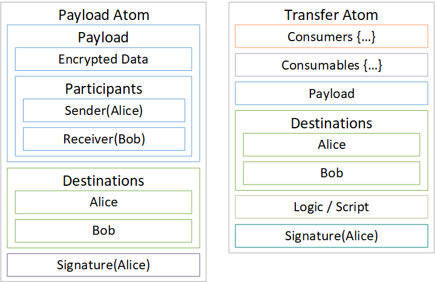
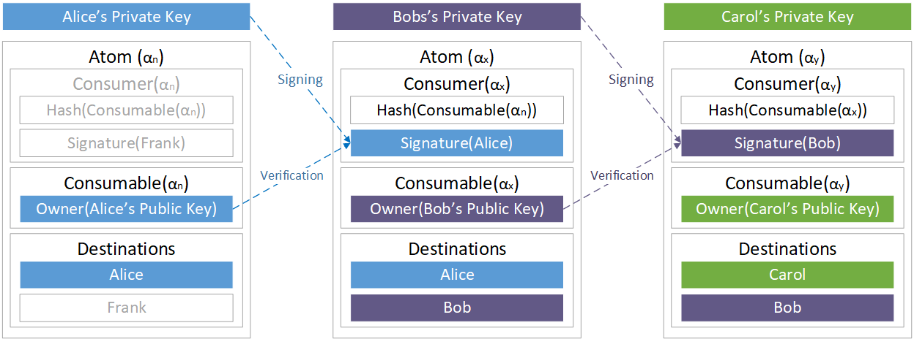
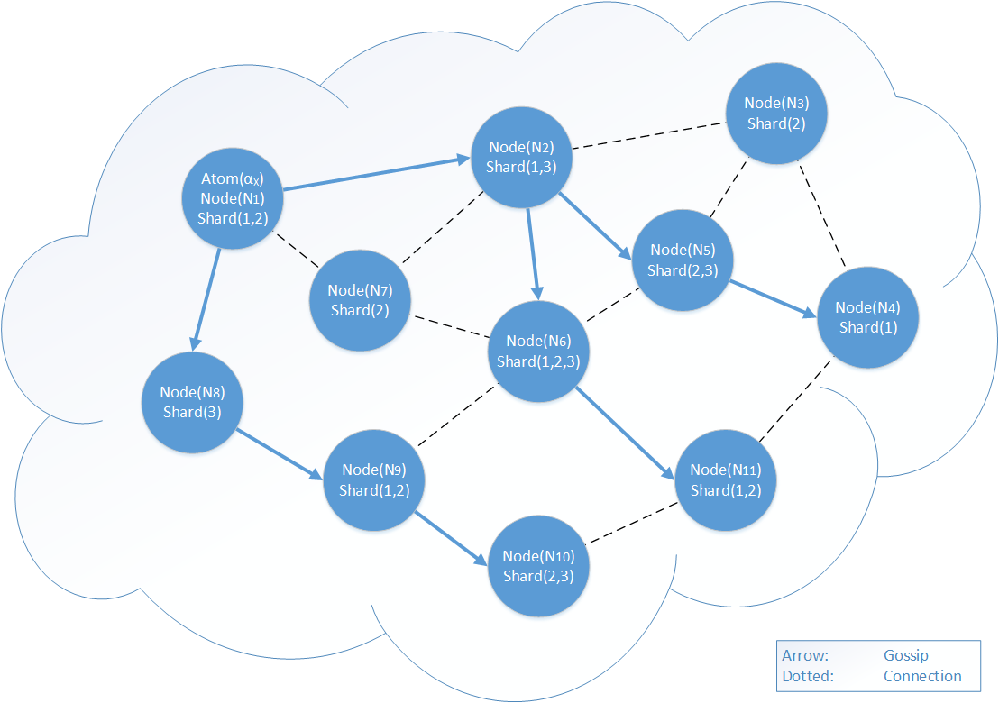
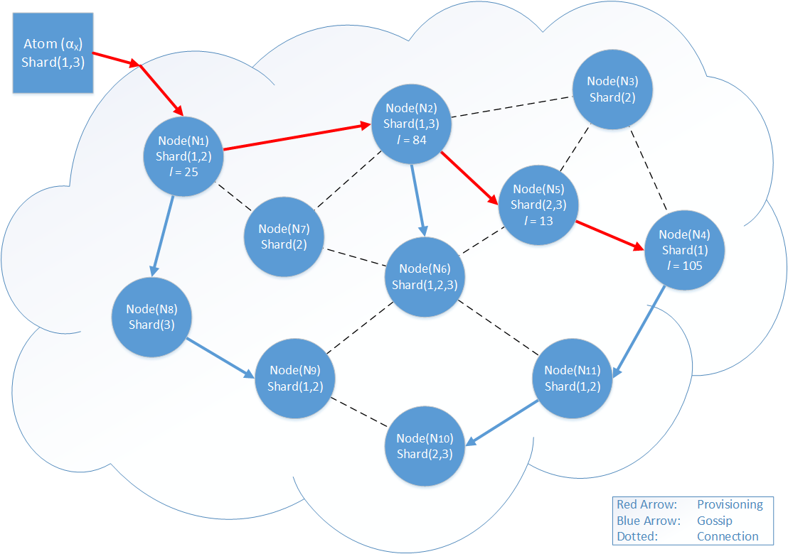
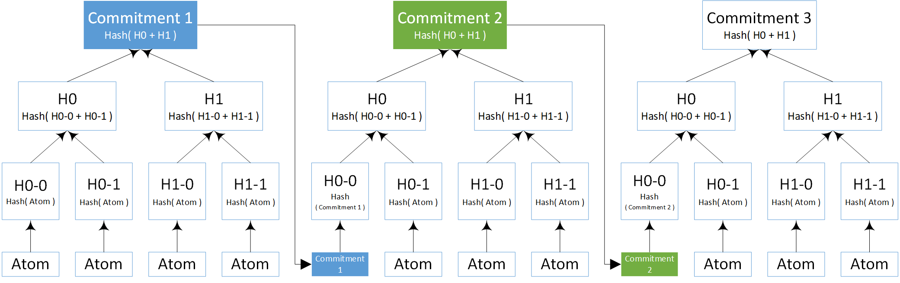
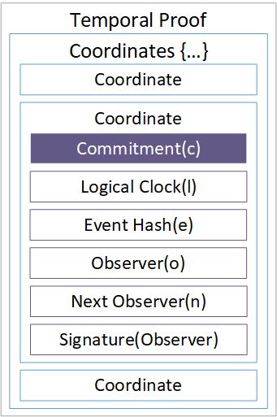
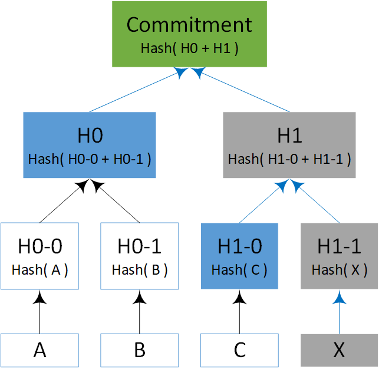

# Tempo



## Abstract

In this paper we present a novel method for implementing a Distributed Ledger that preserves total order of events allowing for the trustless transfer of value, timestamping and other functionality. It is suitable for both public and private deployments, without modification, and requires no special hardware or equipment.

## Introduction

In January 2009, Satoshi Nakamoto introduced the first successful implementation of a permissionless and trustless Distributed Ledger Technology \(DLT\), the Blockchain. It provided a secure, reliable and decentralized method to timestamp events, providing total order, without the need for overarching 3 rd party regulation or trusted entities. The ability to timestamp events in such a manner allowed Satoshi to solve the "double spend" problem and implement the concept of a digital currency. This manifested as the digital currency Bitcoin[¹](tempo.md#references).

Bitcoin, and its success, has inspired others to take Satoshi's blockchain and apply it in many innovative ways. Ethereum is a notable example, first proposed by Vitalik Buterin[²](tempo.md#references) in late 2013, it allows arbitrary Turing-complete logic to be executed upon a blockchain, facilitating smart applications, contracts, and even autonomous organizations to exist and function in a decentralized environment.

However, blockchain implementations have several challenges, including scalability, efficiency and security. These are now beginning to hinder its progression into the mainstream. Alternative architectures have been developed, the most notable of which being a DAG \(Directed Acyclic Graph\), and while a DAG provides some improvements, at sufficient scale they too succumb to many of the same problems as Blockchain.

A method is needed for reaching trustless consensus, across a distributed ledger, that can scale in an efficient, unbounded linear fashion. In this paper, we propose a solution to the double-spending problem using a peer-to-peer network of nodes with logical clocks to generate a temporal proof of the chronological order of events. The system is secure providing nodes with a historical record of the generated temporal proofs can participate.

Further, by providing the ability to execute arbitrary scripts, a fully expressive, Turing complete, state change system may be built on the new consensus paradigm. However, this paper does not deal with the developer environment for decentralised applications on Radix, which will be explored in detail in a later paper.

## Radix Tempo

The Tempo Ledger consists of three fundamental components:

* A networked cluster of nodes
* A global ledger database distributed across the nodes
* An algorithm for generating a cryptographically secure record of temporally ordered events.

An instance of Tempo is called a Universe and any event within a Universe, such as a message or transaction, is represented by an object called an Atom.

All Atoms contain at least one endpoint destination, represented by an endpoint address. Endpoint addresses are derived from an identity, such as a user's public key and are used to route events through the network.

Atoms generally take the form of either Payload Atoms or Transfer Atoms. An example of a Payload Atom is a communication, sent to one or more parties, like an email or an instant message. Transfer Atoms are used to transfer the ownership of an item, such as currency, to another party.

Atoms may also contain other Atoms, as well as various other data, depending on their purpose. This extra data might include conditional destinations, owners, participants, associations and application meta-data. Exotic Atom variants can be created for specific application purposes if required.

Clients may create and submit Atoms to the network via any node it is connected to. A submitted Atom is then processed by the network and, if valid, a Temporal Proof is constructed for, and associated with, that Atom from that point forward.

Tempo relies heavily on eventual consistency to achieve a total ordering of events.

## Ledger architecture

The Tempo ledger is a distributed database which stores all Atoms that exist in a Universe. It is designed to be horizontally scalable, supports semi-structured data, and can update entries.

A local ledger instance operating on a node can be configured to store all, or part, of the global ledger. A subset of the global ledger is known as a _shard_. The total shard space is configurable per Universe, but is immutable once deployed. Nodes can reconfigure to support any subset of the shard space, helping to ensure that the Universe can handle large load requirements without requiring expensive hardware to operate a node. Critically, this enables performance constrained IoT devices to participate as first-class citizens in a Universe.

Sharding is a fundamental design feature of Radix, which implies a robust approach for guaranteeing that Atoms are in the correct shards, and an efficient method for determining which nodes will retain copies of which Atoms.

Considering that all Atoms must have at least one endpoint in their destinations, we can derive a shard ID using the destination, truncated to the shard space dimensions via a modulo operator. Some Atoms, such as Transfer Atoms, may have multiple destinations and therefore will be present in multiple shards.

This is by design, as an Atom that is present in multiple shards increases the redundancy and availability of that Atom. A further benefit is that any Atom that performs an inter-shard transfer is present in both the previous owner's and new owner's shards. This, in part, eliminates the need for a global state and mitigates any expensive inter-shard state verification operations needed to prevent "double spends".

## Transfers

While Payload Atoms are relatively simple, comprising of some arbitrary data, destination/s and a signature, Transfer Atoms are more complex.

An owned item is represented by a _Consumable_. Ownership is defined as a sequence of Consumables, which provide an auditable history of owners over time. Consumables are a subclass of Atom.

To transfer ownership of an Item`(α)` contained in Atom`(α​n​​)` to Bob, Alice creates a Consumer`(α​X​​)` , which references the Consumable`(α​n​​)` that specifies her as the current owner and signs it with her identity. Consumers are also a subclass of Atom, and identify a Consumable that is to be "consumed".

She also creates a new Consumable`(α​X​​)`, which contains the Item`(α)` being transferred, along with the identity of the new owner: Bob. The Consumer and Consumable are packaged into a new Atom`(α​X​​)` and submitted to the network for verification.

Any node that receives Alice's Atom`(α​X​​)` can now trivially validate that Alice is indeed the current owner of Item`(α)`. This is performed by validating the signature of the submitted Consumer`(α​X​​)` against the owner information present in the last consumable for Item`(α)` held in the node's local ledger. If the signature successfully validates, then Alice must be the current owner. The transfer will then execute and Bob becomes the new owner.

Some transfer operations may require that Item`(α)` is not transferred in its entirety, such as currency. Consumables can be configured to allow partial transfers of an item, if the item specification allows it. In this instance Alice would create two Consumables, one to Bob for the principle, and another back to herself for the remainder. Similarly, multiple Consumers may be used to reference many Consumables owned by Alice and transfer them all to Bob in one execution, thus guaranteeing atomicity and reducing network load.

## Information delivery

To ensure swift delivery of events to all nodes in a shard, Tempo employs a Gossip protocol to communicate information around the network. Gossip protocols have proven to be an efficient and reliable means of achieving mass propagation of information in a peer-to-peer network.

Nodes broadcast information about their configuration, such as a set of shards they wish to receive events and state information for, and any network services they may offer \(such as relay and discovery\) allowing further optimization of information delivery. They may also broadcast metadata about the other peers they are connected to, further assisting in the routing of information and events.

Nodes within the network adopt a "best effort" approach to keeping their local ledgers up to date via the active synchronization and gossip protocols. When receiving an Atom via any of these means, a node will perform validation of the Atom against its local ledger. If a provable discrepancy is discovered, a node can communicate this information to its neighbouring nodes allowing them to act and resolve the discrepancy.

Though reliable, this approach will undoubtedly lead to occasions where events are missed and the state of an item may be incorrect in some local ledger instances. To resolve these inconsistencies, nodes rely on detectable causal history anomalies triggered by events. They can then query other nodes to obtain missing information and achieve eventual consistency with the rest of the network regarding an event and its subsequent state.

For example, Node`(N)` receives an Atom`(α​n​​)` that results in an inconclusive validation procedure, perhaps due to a reference to Consumable`(α​n​​)` that Node`(N)` does not have. Node`(N)` can then query its neighbouring nodes to return any dependency Atom/s that reference Consumable`(α​n​​)` and revalidate. Node`(N)` now has consistent state for Consumable`(α​n​​)`.

## Event availability

For Atoms to be validated correctly, they need to be routed to the nodes that contain the associated shards allowing the causal history of any Consumables, state and other information to be verified.

Endpoint destinations provide the required routing information to ensure that Atoms are received by appropriate nodes via the gossip communications layer.

Consider the example of Alice transferring Item`(α)` to Bob. Alice included her endpoint destination, which indicates she is transferring _from_ Shard`(1)`, and included Bob's endpoint destination which indicates she is transferring to Shard`(3)`. Nodes storing Shard`(1∥3)` need to be aware of the event of; Alice's spend; Bob's receipt; and of the state of Item`(α)` in each shard. Post the event, nodes storing Shard`(1)` no longer need to be aware of any future changes to the state of Item`(α)` \(unless it is sent again to Shard`(1)`\). The responsibility of Item`(α)`'s state has transferred to any nodes storing Shard`(3)`. If Bob should then spend Item`(α)` to an owner in another shard, the responsibility of maintaining the state of Item`(α)` will once again change.

Processing only events that affect state within a node's subset of the global ledger, and the shifting responsibility of state maintenance, greatly reduces total state processing overhead. This is key to the scaling performance of Tempo.

## Logical clocks

The foundation of Tempo consensus is based around Logical Clocks which are a simple means of providing a relative, partial ordering of events within a distributed system[³](tempo.md#references).

Within Tempo, all nodes have a local logical clock; an ever-increasing integer value representing the number of events witnessed by that node. Nodes increment their local logical clock when witnessing an event which has not been seen previously. Upon storing an event the node also stores its current logical clock value with it. This record can then be used to help validate the temporal order of past events if required.

Only the receipt of an Atom that has not been previously witnessed by that node may be classed as an "event" for any given node within Tempo.

## Temporal proof provisioning

A Universe is split into Shards, where nodes are not required to store a complete copy of the global ledger or state. However, without a suitable consensus algorithm that allows nodes to verify state changes across the shards they maintain, "double spending" would be a trivial exercise, where a dishonest actor could spend the same item on two different shards.

Temporal Proofs provide a cheap, tamper resistant, solution to the above problem.

Before an event can be presented to the entire network for global acceptance, an initial validation of the event is performed by a subset of nodes which, if successful, results in: A Temporal Proof being constructed and associated with the Atom, and a network wide broadcast of the Atom and its Temporal Proof.

Using Alice's transfer of Item`(α)` to Bob as an example, the process starts with Alice selecting a node she is connected to, Node`(N)`, and submitting Atom`(α​X​​)` requesting that a Temporal Proof of a specific length be created.

Upon receiving the request, Node`(N)` will, if it is storing either Alice's or Bob's shard, perform a validation of the Atom`(α​X​​)`. In the case of it having a copy of Shard`(1)` for Alice, it will ensure that Item`(α)` hasn't been already spent by Alice. If any provable discrepancy is found, such as Item`(α)` being already spent by Alice, or the Atom is badly constructed, processing of the Atom will fail. Otherwise, Node`(N)` will determine a set of directly connected nodes which are storing either Shard`(1∥3)`, select one at random, and forward it the submission request. If a suitable node is not found, Node`(N)` will search through its node graph and associated metadata to discover viable relay/s with connections to nodes maintaining Shard`(1∥3)`. After Node`(N)` discovers a suitable candidate, Node`(P)`, it will append a space-time coordinate `(l,e,o,n)` and a signature of Hash`(l,e,o,n)` to the Temporal Proof \(creating a new one if none is yet present\). Where ll is Node`(N)`'s logical clock value for the event, `o` is the ID of the observer Node`(N)`, `n` is the ID of Node`(P)`, and `e` is the event Hash`(Atom)`. Node`(N)`will then transmit the Atom`(α​X​​)` and the current Temporal Proof to Node`(P)`.

Upon receiving the submission from Node`(N)`, Node`(P)` will also validate Atom`(α​X​​)`, and if successful, will select a subsequent node to forward the submission to, append its `(l,e,o,n)` coordinate and signature to the Temporal Proof and transmit Atom`(α​X​​)` and the Proof to the next node. The process repeats until the required number of nodes have participated in the Temporal Proof or a provable discrepancy is discovered by any node involved in the process.

Temporal Provisioning of Atom`(α​X​​)` in the above example will produce the following coordinates:

| Logical Clock | Event | Observer | Next Observer |
| :--- | :--- | :--- | :--- |
| 25 | Hash\(`(Atom(α​X​​)`\) | Node`(N1)` | Node`(N2)` |
| 84 | Hash\(`(Atom(α​X​​)`\) | Node`(N2)` | Node`(N5)` |
| 13 | Hash\(`(Atom(α​X​​)`\) | Node`(N5)` | Node`(N4)` |
| 105 | Hash\(`(Atom(α​X​​)`\) | Node`(N4)` | --- |

## Provisioning efficiency

The length of a Temporal Proof defines how many nodes should be part of the provisioning process. A length that is too short reduces the efficiency of resolving conflicts between Atoms should they arise, and may result in an Atom not being correctly verified, requiring it to undergo temporal order determinism at each node. Lengths that are very long unnecessarily increase the bandwidth load within the network, as well as the time taken for an Atom to become final.

Once the Temporal Proof length has been determined, if the Atom being transmitted has any dependencies or Consumables, the network can also optimise node selection to improve the future speed of verifying that transfer. This is because an auditable causal history can easily be created if a node that was involved in validating a previous transaction, upon which this transaction relies, is included in the new temporal proof.

In simple terms, if Alice sends Item`(α)` to Bob, and Bob then sends Item`(α)` to Carol, it is highly beneficial for network efficiency if one of the nodes that were involved in creating the Temporal Proof for the Alice → Bob transfer is also part of the Temporal Proof for the Bob → Carol transfer.

| **Alice → Bob** | **Bob → Carol** | **Carol → Dan** | **Dan → Frank** |
| :--- | :--- | :--- | :--- |
| A | F | J | N |
| B | G | K | J |
| C | B | L | O |
| D | H | M | P |
| E | I | F | Q |

Achieving Temporal Proof causal history is relatively simple: if, when taking part in Temporal Provisioning, any candidate nodes available to Node`(N)` are also part of the Temporal Proof of any dependencies of Atom`(α​n​​)`, Node`(N)` will select at random one of those as a priority if not already part of the Temporal Provisioning for Atom`(α​X​​)`.

To increase the likelihood of creating a Temporal Proof with these properties, the length is again an important factor. For most purposes, `log(n)∗3` or Max\(`3,sqrt(n)`\) should be sufficient, where `n` is an estimated size of the nodes present in the network at that time.

## Vector clocks

In the event of a conflict \(e.g double spend\) or anomaly between two events, the `(l,e,o,n)` coordinates of a Temporal Proof may be used to construct a vector clock[⁴](tempo.md#references) using the LogicalClock`(l)` component of each. One or more vector clocks can then be used to determine the partial order of the associated Atoms.

Given two vector clocks, for two Atoms `α​X`​​ and `α​Y`​​ , of the form `VC(α​X​​)` and `VC(α​Y​​)`, where the logical clock value for the corresponding event of each Node `{A,B,D,F,G,L,P}` is laid out in the array below:

| `VC(α​X​​)` |  | `VC(α​Y​​)` |  |
| :--- | :--- | :--- | :--- |
| A | 5 | B | 10 |
| D | 12 | G | 7 |
| F | 34 | L | 47 |
| P | 17 | P | 24 |

It is trivial to determine that the Atom associated with VC`(α​X​​)` was presented first to the network, as both vector clocks have a common Node`(P)` whose logical clock value in VC`(α​X​​)` is less than in VC`(α​Y​​)`.

Vector clocks follow a simple ruleset to determine order, where; VC`(α​X​​)` is less than \(or before\) VC`(α​Y​​)` if VC`(α​X​​)​Z`​​ is less than or equal to VC`(α​Y​​)​Z`​​ and where at least one VC`(α​X​​)​Z`​​ is strictly smaller than VC`(α​Y​​)​Z`​​

Vector clock comparisons provide a simple and efficient method to determine order in many cases of conflict without requiring the use of more expensive means. However, should a pair of vector clocks not contain a common node between them, they are said to be _concurrent_, and an additional mechanism is required for these situations.

Given two concurrent vector clocks which Node`(N)` has received:

| `VC(α​X​​)` |  | `VC(α​Y​​)` |  |
| :--- | :--- | :--- | :--- |
| A | 5 | B | 10 |
| D | 12 | G | 7 |
| F | 34 | L | 47 |
| S | 17 | V | 24 |

To determine which is the earlier Temporal Proof, Node`(N)` has two mechanisms available to it.

The first mechanism references the node's local ledger, which it can trust to return honest information regarding the events it has seen thus far and not subvert the truth.

The node searches for events after VC`(α​X​​)` which `{A,D,F,S}` were involved in and attempts to discover nodes `{B,G,L,V}` from VC`(α​Y​​)` that are part of those Temporal Proofs and compare the logical clock values.

Should the node discover within its local ledger an event which has a vector clock of the form:

| `VC(α​Z​​)` |  |
| :--- | :--- |
| J | 60 |
| S | 19 |
| T | 20 |
| V | 22 |

The temporal order of VC`(α​X​​)` and VC`(α​Y​​)` can be resolved due to `S` and `V` being present. The logical clock for Node`(S)` in VC`(α​Z​​)` is greater than in VC`(α​X​​)`, therefore VC`(α​Z​​)` was created after VC`(α​X​​)`. The logical clock for Node`(V)` in VC`(α​Z​​)` is less than in VC`(α​Y​​)`, therefore VC`(α​X​​)` and VC`(α​Z​​)` were created before VC`(α​Y​​)`.

Should the initial search not provide any results, event vector clocks can be linked together in a sequence to increase the likelihood of discovering the solution. If VC`(α​Z​​)` contained only Node`(S)` but no nodes from VC`(α​Y​​)`, the node could extend the search to include the other nodes present in VC`(α​z​​)`.

| `VC(α​Z​​)` |  | `VC(α​n​​)` |  |
| :--- | :--- | :--- | :--- |
| J | 60 | J | 62 |
| S | 19 | Q | 32 |
| T | 20 | S | 21 |
| W | 84 | V | 22 |

Resolving concurrent events in this manner is simple, fast, efficient and independent of any further external information being required at the time of validation. It is sufficient to resolve a large percentage of concurrent events providing that the node is an active participant and is storing one or more shards relevant to the conflict.

If a resolution is not available at the time of conflict, Node`(N)` will store both Atom`(α​X​​)` and Atom`(α​Y​​)` in its local ledger, marking them according to which it saw first, and employ a second event ordering mechanism: Commitment Order Determination.

For light nodes storing only their own events, such as IoT devices, commitments are the only way in which they can determine order.

## Commitments

To assist with total order determination of events, nodes declare to the network a periodic commitment of all events they have seen.

This commitment is produced either when a node takes part in Temporal Provisioning for an event, or at will over an arbitrary interval. A commitment is a Merkle Hash[⁵](tempo.md#references) constructed from the events a node has witnessed since submitting a previous commitment, with the first leaf being the last commitment a node submitted, producing a linked sequence of commitments over time.

If the node is taking part in a Temporal Provisioning process, the commitment is included in a node's Temporal Coordinate as cc, resulting in the extended space-time coordinate `(l,e,o,n,c)`. The commitment is tamperproof as the coordinates are signed by the producing nodes.

A node may be requested to provide information to enable verification of any commitments it has produced at any time. They should deliver all the relevant Atom hashes to the requesting node, allowing it to reconstruct the commitment hash and verify. Requesting nodes can then take appropriate action in the event of a fraudulent commitment being detected.

This uncertainty of when a commitment verification may be requested also prevents nodes from tampering with their logical clock values, as all commitments have a logical clock value associated with them and so tampering is easily detectable.

For example, if the value of `l` for Commitment`(1)` was 100 and the value of `l` for Commitment`(2)` was 200, then Commitment`(1)` should contain 100 items. If a requesting node is not returned 100 hashes when verifying, tampering of the logical clock may have occurred. Commitments are also used to provide a secondary mechanism to determine temporal order of events; Node`(N)` has received Atom`(α​Y​​)` that conflicts with an Atom`(α​X​​)`. Node`(N)` contacts one of its neighbours, Node`(P)`, and queries it for any commitment information corresponding to Atom`(α​X​​)`. Node`(P)` responds with: its commitment for Atom`(α​X​​)`; a set of Atoms`(β​S​​)` which were witnessed after Atom`(α​X​​)` within the same commitment; its logical clock values for Atom`(α​X​​)` and Atoms`(β​S​​)`; and the leaves of the Merkle Hash. With this information Node`(N)` can verify the logical clock values of the returned Atoms, the integrity of the commitment, and that the returned Atoms are part of it.

Once this information has been obtained from Node`(P)`, Node`(N)` can query Node`(Q)` which delivered Atom`(α​Y​​)`. It requests that Node`(Q)` return commitment and logical clock information for Atom`(α​Y​​)` and any of the Atoms`(β​S​​)`, as well as the leaves of the Merkle Hash allowing Node`(N)` to verify.

|  | Node`(P)` Logical Clock | Node`(Q)` Logical Clock |
| :--- | :--- | :--- |
| Atom`(α​X​​)` | 45 | --- |
| Atom`(α​Y​​)` | --- | 465 |
| Atom`(α​S1​​)` | 46 | --- |
| Atom`(α​S2​​)` | 47 | 441 |
| Atom`(α​S3​​)` | 458 | --- |

Therefore `α​X`​​ happened before `α​Y`​​.

As we now have commitment and logical clock values, resolution is simple: Atom`(α​X​​)` was before Atom`(α​Y​​)` if any Atoms`(β​S​​)` returned by Node`(P)` are present within a commitment delivered by Node`(Q)`, where the logical clock value of any Atom`(β​S​​)` from Node`(Q)` is less than the logical clock value of Atom`(α​Y​​)` for Node`(Q)`. If Atom`(α​X​​)` was the last within a commitment, Node`(P)` may return a subsequent commitment, or Node`(N)` can contact another neighbour. The likelihood of Atom`(α​X​​)` being the last within all commitments for all nodes is infinitesimal. Should Node`(Q)` not have any of the Atoms`(β​S​​)` available in its local ledger, Node`(P)` can query other neighbouring nodes about Atom`(α​Y​​)` via the same process. If a resolution is not available at that the time of the conflict, Node`(N)` will store Atom`(α​X​​)` and Atom`(α​Y​​)` in its local ledger, marking them according to which it saw first, until a resolution is determined or discovered.

## Conclusion

This paper has proposed a method for determining total order of events within a distributed system, without relying on trust, that is scalable, efficient and agnostic to its operating environment. To reduce overhead and increase performance, our solution defines a structured, shardable architecture that limits state transfer information to only members of the network that need it. A peer-to peer network provides the means for communication and information routing via a reliable and robust gossip protocol. Nodes maintain a logical clock when witnessing events and periodically produce a tamper-proof commitment representing those events. When witnessing events, nodes collaborate to create Temporal Proofs which contain verifiable space-time coordinates which are used to construct vector clocks and determine when an event was first seen by the network. Nodes can join and leave the network at will and rely on detectable consistency anomalies to synchronize and bring them up to date.

## References

> 1. S.Nakamoto, _Bitcoin: A Peer-to-Peer Electronic Cash System_, 2008: [https://bitcoin.org/bitcoin.pdf](https://bitcoin.org/bitcoin.pdf)[ ↩](https://papers.radixdlt.com/tempo/latest/#reffn_1)

> 2. V. Buterin, 2014: [https://ethereum.org/pdfs/EthereumWhitePaper.pdf](https://ethereum.org/pdfs/EthereumWhitePaper.pdf).[ ↩](https://papers.radixdlt.com/tempo/latest/#reffn_2)

> 3. L. Lamport, _Time, Clocks, and the Ordering of Events in a Distributed System_, 1978: [http://lamport.azurewebsites.net/pubs/time-clocks.pdf](http://lamport.azurewebsites.net/pubs/time-clocks.pdf).[ ↩](https://papers.radixdlt.com/tempo/latest/#reffn_3)

> 4. C.J.Fidge, _Timestamps in Message-Passing Systems that preserve the Partial Ordering_, 1988: [http://zoo.cs.yale.edu/classes/cs426/2012/lab/bib/fidge88timestamps.pdf](http://zoo.cs.yale.edu/classes/cs426/2012/lab/bib/fidge88timestamps.pdf).[ ↩](https://papers.radixdlt.com/tempo/latest/#reffn_4)

> 5. R.C. Merkle, _Merkle Tree_, 1979: [https://en.wikipedia.org/wiki/Merkle\_tree](https://en.wikipedia.org/wiki/Merkle_tree).[ ↩](https://papers.radixdlt.com/tempo/latest/#reffn_5)

