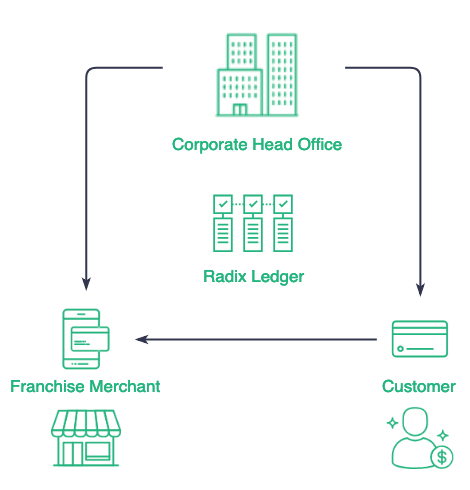
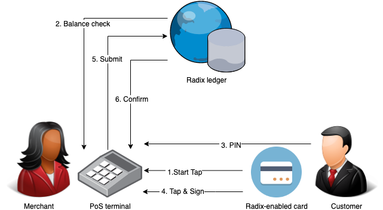

# Card payment system \(Beta\)


**Beta Access Required**

This Radix application is currently in pre-release testing and the code is not yet available on our github, if you would like early access to start testing immediately, or would just like to be informed when it is ready to use, please sign up via this form:

[https://radixdlt.typeform.com/to/Hw7F5y](https://radixdlt.typeform.com/to/Hw7F5y)

We currently expect this code to be public by end of July 2019.


## Introduction

In this article, we present a simple card payment system using the Radix distributed ledger, that allows international retailers to increase sales, loyalty and cash flow by simplifying complex card ecosystems while lowering operating costs and transaction fees.

This proposed card payment system provides secure card-based transactions with PoS terminals, and requires that the card holder presents the Radix-enabled card to the terminal, enters their PIN, and then the smart card signs the transaction for the terminal to submit it to the ledger.

## Overview

In traditional payment cards systems, you have complex financial ecosystems where:

* transaction fees are high,
* consumers might pay additional transaction fees to the payment service provider,
* clearance and settlements are slow,
* and the data is owned by third parties.

As a result, retailers and stores have no insight into spending habits from their customers, and the only data they see is the purchase's total amount.

Using the Radix distributed ledger, we can simplify the process and reduce the operational expenditure by creating a Radix-enabled store card.

### Radix-enabled cards

A Radix-enabled card is different to other store cards currently available. It's a flexible solution that allows you to program multiple uses into one card, making possible to offer a Credit, Debit, Prepaid, and Loyalty card bundled in a single device.

Besides the multiple usage scenarios for the card, by leveraging the Radix distributed ledger we can achieve:

* Minimal transaction fees for stores
* Fast clearance and settlement
* Same card for loyalty scheme points
* Spending habit insight
* Pay by app \(Android\) or card

## Card payments with Radix

On the Radix distributed ledger there's no need for multi-party transaction clearance. Radix's technology enables the users to have multiple types of devices that cryptographical sign a transaction and submit it directly to the ledger. As a result, this brings instant clearance and settlement of payments.

Three key components are needed to make this card payment system possible:

* A card that can create ECC signatures, which are accepted by the Radix ledger
* A mobile phone that has NFC capable for both reading and writing to the card
* A token that represents the value you want to clear \(fiat token, loyalty points, membership points\).


**Tip:** learn how to build fiat tokens on Radix [here](fiat-tokens.md).


### Payment ecosystem 

A basic Radix-enabled payment ecosystem would include the following stages:

#### Token creation

Using the Radix Multi-Issuance Token API, a retailer mints its tokens. Once the token type is created, the retailer can continually mint and burn tokens as needed.

#### Card issuance

A retailer creates a Radix account for the customer and uses the Radix Card OS to link the card to the customer’s account, granting the card the ability to sign transactions from the customer account.

#### Loading a card with Tokens

A customer logs in and transfers funds into his Radix account. On the back-end the fiat funds transferred are converted to fiat tokens on ledger, using a [Radix fiat token](https://docs.radixdlt.com/alpha/learn/use-cases/fiat-tokens) provider, and the corresponding tokens are transferred to the customer’s Radix account.

#### Spending

A customer that wants to make a payment uses their Radix-enabled card at the retailers Android Point of Sale \(PoS\) device. The transaction is recorded on ledger for future reference.

#### Clearance and settlement

A retailer receives the fiat tokens from the customer in their account within seconds on the transaction taking place in the store. The retailer can then transfer these fiat tokens to a Radix fiat token provider and receive the corresponding amount of fiat in their bank account.

### User payment flow 

The general user flow is defined as:

1. Cashier rings up total to be paid on the register
2. Cashier types the total to be charged on the Android PoS terminal
3. Cashier asks customer to tap their Radix-enabled card on the Android PoS terminal
4. Customer holds the card against the PoS terminal to verify his balance
5. Customer enters the PIN to confirm the transaction
6. Customer taps the card against the PoS terminal to sign and pay the transaction
7. Transaction is confirmed on the ledger
8. Transaction confirmation is shown on the PoS terminal

### Requirements

* **Smart Card platform:** the Smart Card is based on the [Java Card Platform](https://docs.oracle.com/javacard/), a subset of the Java programming language optimized for smart cards and similar small-memory embedded devices.
* **Terminal:** any NFC-capable device running on Android.
* **Token definition on Ledger:** the token type used is a fiat-backed token representing the local currency.
* **Communication:** the connection between the Smart Card and the PoS Terminal is based on NFC.

### Java Card Platform 

Java Card technology combines a subset of the Java programming language with a runtime environment optimized for secure elements, such as smart cards and other tamper-resistant security chips. Java Card technology offers a secure and interoperable execution platform that can store and update multiple applications on a single resource-constrained device, while retaining the highest certification levels and compatibility with standards. Java Card developers can build, test, and deploy applications and services rapidly and securely. This accelerated process reduces development costs, increases product differentiation, and enhances value to customers.

The Java Card API is compatible with international standards for secure elements, such as ISO 7816 or mobile communication standards issued by ETSI/3GPP. Major industry-specific standards, such as EMVCo and Global Platform refer to this standard.


**Note:** to learn more about it, check the Java Card [developer reference](https://docs.oracle.com/javacard/).


## Implementation

Radix is primarily written in Java, both the node core and the mature [Java client library](../../develop/java-client-library-guide/). Transacting on Radix fundamentally means building, signing and submitting an [Atom](../glossary.md#atoms) \(an atomic container of state\) containing the relevant data to a Radix node and thereby to the Radix ledger. Once enough time has passed \(~5 seconds\) with no evidence to the contrary, it can be assumed as certain that a submitted Atom has been accepted and confirmed by the Radix ledger. 

### Submitting a transaction

In a low-level detail, submitting a transaction to the Radix ledger consists of the following steps:

1. Atom containing the transaction details \(amount, token type, source and target of funds\) must be constructed
2. Atom must be serialised into a proprietary format
3. A PoW fee based on the hash of that serialised form must be attached
4. The signatures generated by signing that hash using the private keys holding the source of funds must be attached
5. Atom must be submitted to a submission node in a JSON-based format using JSON RPC 
6. Atom must be accepted and stored by the submission node
7. Atom must not be deleted by the submission node following conflicts from other nodes within a reasonable time \(has been determined to be 5 seconds\)
8. Atom and contained transaction are confirmed

### Serialisation 

Radix uses two forms of serialisation: 

* a proprietary byte-based format for hashes, signatures and internal use \(storage, node to node\)
* JSON-RPC format for node-client communication

### Signing the Atom hash on Card 

Radix uses Elliptic Curve secp256k1 for signatures. To sign an Atom, an application needs to sign the hash of the Atom serialised with the proprietary format. The signer application doesn't need to know the contents of the Atom, and, if presented only with the hash, cannot know what it is signing.

The simplest solution is to make the card sign the atom hash directly. In this way, the card doesn't need to know about Radix, Atoms or any of its structure and semantics. The Radix-enabled card would simply be handed an array of bytes that it should sign and return. The only additional logic is that it needs to exchange its public key with the terminal using NFC communication so that the PIN can be encrypted for transfer.

## Conclusion 

For this simple card payment system use case, signing just the hash of the transaction is enough and substantially easier, as it can be done with little special-purpose Java Card code on the smart card.

For a proper commercial implementation, Atom serialising and signing should be done on the Radix-enabled card, otherwise transactions could be compromised outside a prototype environment.

