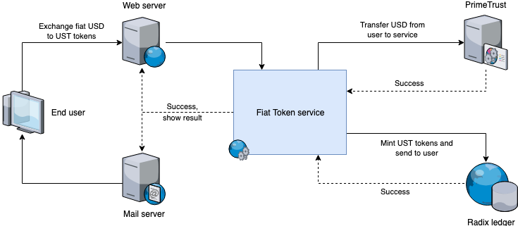

# Fiat tokens \(Beta\)


**Beta Access Required**

This Radix application is currently in pre-release testing and the code is not yet available on our GitHub. If you would like early access to start testing immediately, or would just like to be informed when it is ready to use, please sign up via this form:

[https://radixdlt.typeform.com/to/QUOiQJ](https://radixdlt.typeform.com/to/QUOiQJ)


## Introduction

Fiat Tokens are tokens that are backed by money held in a bank account, where each dollar/euro/yen held by the custodian is represented 1:1 by a token on the Radix ledger. Once created they can then be sold, traded or held by anyone in the world, and present an incredibly powerful tool for decentralised finance applications.

In this document, we present a detailed description of a Fiat Token \(FT\) reference implementation, and we review the minting, burning, and sending processes behind it. This sample FT system showcases how simple is to enable bridging between fiat currencies and user-defined tokens using the Radix distributed ledger.


For this use case scenario, we’ve chosen PrimeTrust as our technology partner since they’re a trusted actor in the industry and they could provide us with a powerful, sandboxed custodial bank API and [detailed technical documentation](https://primetrust.com/api_docs.html).


## Main components

The Fiat token system was designed as a modular solution, consisting of several related components:

* A web server
* A token mint service
* Custodian interface
* Mail server
* Radix accounts
* Radix Client library
* Radix service wallet
* Radix mobile/desktop wallet



### Web server

The FT service exposes a REST API which can be targeted directly by any client. It also hosts a default web app which relies on the aforementioned API. Both the REST API and the Web App are served by this internal web server.


The WebApp's default user interface \([VueJS](https://vuejs.org/) + [Bulma](https://bulma.io/)\) is served through a built-in [NanoHTTPD](https://github.com/NanoHttpd/nanohttpd) web-server. It allows a registered user to sign in and move funds between a PrimeTrust account \(the Custodian account\) and a Radix wallet address, and see balances and historical transactions.


### Token mint service

The Exchange service holds the main business logic. This component listens for transactions sent to the service's Radix wallet or the Custodian account. When the Exchange service detects a new token transfer to the Radix Wallet, it will burn those tokens and send the corresponding amount of fiat assets to the user's Custodian account \(in our case, a PrimeTrust account assigned to the user where he can keep his USD in custody\). When it detects a new cash transfer, the service will instead mint the proportional amount of tokens and send it to the user’s Radix wallet.

### Custodian interface

This component is an abstraction layer on top of PrimeTrust’s REST API. This component enables the Mint service to communicate with the Custodian’s infrastructure. Integrating with another asset service provider would merely require to write a new implementation for this layer.


The abstraction layer around the PrimeTrust API heavily relies on [OKHTTP](https://square.github.io/okhttp/) as a transport mechanism.


### Mail server

When a user exchanges fiat assets and tokens, a confirmation message is sent by email. The Fiat token service relies on a simple external Google Mail server for sending email notifications.

### Radix accounts

An [Account](../glossary.md#account) represents all the data stored for a user on the Radix distributed ledger. This includes tokens, but also arbitrary data, as well as more advanced types of transactions.

Besides the user’s private Radix account, the FT service requires its own Radix account to mint and burn tokens.

### Radix Client library

The open-source [Java client library](https://github.com/radixdlt/radixdlt-java) provides simple access to the Radix Distributed Ledger from Java projects. The FT service leverages the Java client library to handle all the required Radix ledger interactions.

### Radix service wallet

The Fiat token service has a wallet associated to its own Radix account to receive, store, mint and process the requested fiat tokens.

### Radix mobile/desktop wallet

Radix provides any user with a fully decentralized [mobile](https://github.com/radixdlt/radixdlt-wallet-android) and [desktop wallet](https://github.com/radixdlt/desktop-wallet), associated with their Radix account. With these wallets, the user can send, store, and receive the fiat tokens from the FT service.

## Workflow

The Fiat token system provides simple workflows for the following user journeys:

1. Onboarding cash
2. Creating fiat tokens
3. Withdrawing fiat tokens
4. Depositing fiat tokens
5. Offboarding cash

### On-boarding cash

If the user wants to onboard cash from his private bank account to the FT service:

1. The user access his private bank account
2. The user transfer the desired amount of USD currency to his Custodian account
3. The Custodian infrastructure sends a callback to the FT service as soon as the transaction is settled.
4. The FT service receives the notification and updates the cash balance.

### Creating fiat tokens

Once the user decides to convert a USD asset to UST fiat token, the following workflow goes into action:

1. The FT service transfers the requested amount of cash from the user’s Custodian account to the service’s Custodian account.
2. The Custodian infrastructure sends a callback to the FT service as soon as the transaction is settled.
3. The FT service then mints a corresponding amount of UST tokens and send it to the user’s Radix wallet.
4. When the ledger responds with a success state, the web app is updated, and a notification email is sent to the user.

The user can now withdraw these tokens as needed.

### Withdrawing fiat tokens

When the user decides to withdraw UST fiat tokens to his own private wallet, the following workflow applies:

1. The user specifies the amount to withdraw and the destination Radix address
2. The FT service transfers the UST tokens from the user’s ABT Radix wallet to the specified destination address.
3. The user receives the UST tokens on his own Radix wallet.

### Depositing fiat tokens

If the user wants to deposit fiat tokens from his private wallet back to the FT service:

1. The user opens his private Radix wallet
2. The user sends the desired amount of tokens back to his ABT Radix wallet address
3. The ABT service receives the UST tokens and keeps them available on the user’s FT wallet for future transactions.

### Off-boarding cash

If the user wants to convert the UST tokens back to USD assets, the workflow is as follows:

1. The FT service transfers the UST tokens from the user’s FT Radix wallet to the service’s Radix wallet.
2. The FT service detects the transaction to the service’s wallet, burns the received tokens and sends the corresponding amount of USD assets to the user’s Custodian account.
3. The web app is updated with the new balance, and a confirmation message is sent by email.

The user can now choose to withdraw the assets to his private bank account.

## Technical details

### Exchanging Fiat assets and Tokens  <a id="docs-internal-guid-34bf3983-7fff-911e-8306-8f82a80ce5e3"></a>

The FT service is monitoring a dedicated PrimeTrust bank account and a corresponding dedicated Radix address. Once it detects an asset transaction to the PrimeTrust account, it looks for the sender in the user database. If the sender is found, a corresponding amount of tokens are minted and sent to said users Radix wallet.

Similarly, if a transaction of tokens is detected to the monitored Radix address, and the sender is found in the user database, then the tokens will be burnt, and the corresponding amount of assets will be sent to the users PrimeTrust bank account.

To keep it simple we are only dealing with PrimeTrust internal cash transfers in this demo implementation. Furthermore, the service is designed to be the “owner” of both the users PrimeTrust account and Radix wallet. This makes the private key handling of the latter much easier. When the user wants to exchange assets for tokens \(or the other way around\) he or she simply asks the demo service to perform the necessary transactions on his/her behalf.

In a production-ready service, these assumptions wouldn’t necessarily be true, and there would, therefore, be a need for some well-defined way for the user to provide a transaction reference serving as a pseudo-identification method.

Furthermore, any Know-Your-Customer \(KYC\) and Anti-Money-Laundry \(AML\) programs would require much more detailed information about the user before processing these transactions.

### Creating Tokens

Creating these on Radix is a very simple process. This is the code required to create a multi-issuance USD token:

```java
api.createToken(
    "UST Fiat Token",                              // Name
    "UST",                                         // ISO
    "This is a token created by me",               // Description
    BigDecimal.valueOf(10000),                     // Amount
    TokenUnitConversions.getMinimumGranularity(),  // Granularity: Default is 10^18
    TokenSupplyType.MUTABLE                        // TokenSupplyType
)
```

### Minting and burning Tokens

One challenge when minting and burning tokens on-demand like this is to keep a strict one-to-one relation between bank transactions and token mint/burn actions. Equally important is it to keep this state machine in sync with both the bank and token infrastructures.

The Radix ledger offers a very convenient way of enforcing this strict one-to-one relation through the UniqueIdParticle. The below example shows how a UniqueIdParticle is added to a mint action \(the process is close to identical for the burn flow\).

If the ledger would detect a unique id conflict \(e.g., tokens have already been minted for a particular asset transaction\) it would discard the new mint action and raise an error.

```java
public Single<String> mintTokens(
        String userId,
        BigDecimal amount,
        String assetTransferId) {

    RadixAddress serviceAddress = radixApplicationApi.getMyAddress();
    Token token = TokenDefinitionReference.of(serviceAddress, "UST");
    String uniqueId = userId + “/” + assetTransferId + “/mint”;

    Action mintAction = MintTokensAction.create(token, amount);
    Action uniqueIdAction = new PutUniqueIdAction(serviceAddress, uniqueId);
    Action atomicAction = new AtomicAction(mintAction, uniqueIdAction);

    return radixApplicationApi
            .execute(atomicAction)
            .toCompletable()
            .timeout(20, SECONDS)
            .toSingleDefault(assetTransferId);
}
```

In the code snippet above, we're composing an atomic action to execute on the ledger. The operation consists of two parts:

1. the actual minting of tokens, 
2. attaching a designated unique id to it.

By using the PrimeTrust asset transfer id as part of the unique id we’re not only enforcing the one-to-one relation but also keeping the two infrastructures \(bank and ledger\) in sync, and we do so with only a handful of lines of code.

An additional attractive feature of the unique id is that its uniqueness is only enforced under the provided address \(the serviceAddress in above example\). We usually can only enforce unique id's for our own addresses, which keeps us from contaminating other parts of the ledger with our unique id’s.

### Transferring Tokens to the user

Once our tokens are successfully minted they will be available in our monitored wallet, and we can then send them to the user who sent us the corresponding assets in the first place.

```java
public Single<String> sendTokens(
        String userId,
        BigDecimal amount,
        String address,
        String assetTransferId) {

    RadixAddress to = RadixAddress.from(address);
    RadixAddress from = radixApplicationApi.getMyAddress();
    Token token = TokenDefinitionReference.of(from, "UST");
    String uniqueId = userId + “/” + assetTransferId + “/send”;

    Action sendAction = TransferTokensAction.create(from, to, amount, token);
    Action uniqueIdAction = new PutUniqueIdAction(from, uniqueId);
    Action atomicAction = new AtomicAction(sendAction, uniqueIdAction);

    return radixApplicationApi
            .execute(atomicAction)
            .toCompletable()
            .timeout(20, SECONDS)
            .toSingleDefault(transferId);
}
```

Again, we use the very same PrimeTrust transfer id in our send action as we did with our mint action to make sure we don't send tokens more than once for any asset transfer.

### Transaction finality

As with all highly distributed systems, finality becomes a topic to keep in mind, e.g., the time it takes from the moment the data is first submitted to the ledger, to when it's available on all nodes in the network. Usually, about 10 seconds should be a reasonable finality time in the Radix ledger for now.

If we're too eager to act on a successful result, we may - theoretically - end up in a situation where the Radix [Java library](https://docs.radixdlt.com/radixdlt-java/) for any valid reason temporarily may lose connection to the node where some tokens were minted and immediately reconnect to a different node which isn't yet aware of the successfully minted tokens. This node will then, for example, show a different wallet balance than our original node did until the successful mint action is propagated to it.

## Conclusions

We have seen how easily you can create a service to mint, burn and send Fiat tokens using the Radix distributed ledger and the provided Radix open-source libraries. We've also explained the basic workflows for the FT service, and how they interact with an external Custodian system \(PrimeTrust\) that holds the user's fiat assets. Additionally, we shared some code snippets to demonstrate how straightforward it is to burn, mint and transfer tokens with our Java client library.


**Tip:** to continue learning about Radix's technology and how you can create more DApps on it, check our [Java](https://docs.radixdlt.com/radixdlt-java/) and [JavaScript](https://docs.radixdlt.com/radixdlt-js/) documentation.


