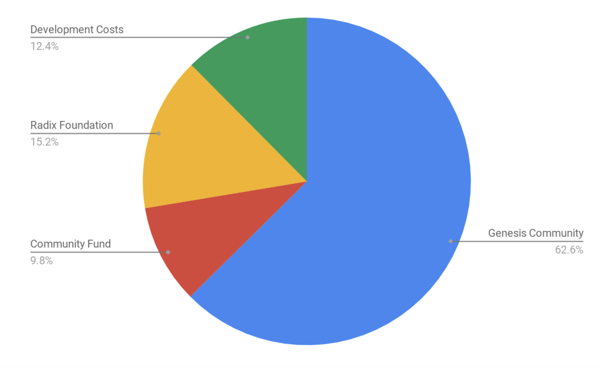

# Economic Model

#### ISSUED BY RADIX DLT LIMITED

**REG No: 10864928  
Registered office: Copthall House, King Street, Newcastle, England, ST5 1EL**

This document is issued by Radix DLT Limited \(RDLT\). It is a conceptual paper which is envisaged to form the economic/mathematical basis for the establishment and creation of a crypto-economic platform to be known as Radix and the creation of a stabilised crypto token to be known as the RAD.

**Any launch of the system and or trading in any tokens or any offers for sale or purchase of tokens \(RADS or other\) will be subject to and conditional upon the issuer securing favourable legal and regulatory advice approval and/or licensing by all relevant authorities and jurisdictions.**

Nothing in this document or any of the information or proposals set out herein or in any papers or materials referred to shall form the basis of any contract between RDLT \(or any of its holding companies, subsidiaries, associated undertakings or controlling persons, or any of its respective directors, officers, employees, agents, representatives, partners or advisors\) \(“RDLT Relevant Persons”\) and any other person whatsoever.

Without limitation to the foregoing, no representation, warranty or undertaking, express or implied, is made and no responsibility is accepted by RDLT or any RDLT Relevant Person as to or in relation to:

1. the accuracy or completeness or otherwise of this document or the information, proposals or formulae set out in this document \(whether expressly or via a link to other material on a Radix website\) \(“therein”\).
2. the reasonableness of any assumption \(whether express or implied\) contained therein,
3. the accuracy of any forecasts or the predicted or unpredicted behaviour of any function algorithm or system contained therein, including, without limitation, in respect of future funding needs and in respect to performance or limitations in the performance of any systems or platforms described herein.

**Any disclosures, contribution, suggestions, ideas, inventions, improvements or other material made or provided to RDLT or RDLT Relevant Persons in response to this paper or in the course of participation or discussion of any matters relating hereto together with any intellectual property or other right as might otherwise apply shall be free for RDLT and any business foundation associate affiliate or other legal person acting by or with the authority of RDLT to use the same without limitation for commercial or non-commercial purposes in perpetuity worldwide and to publish or otherwise put the same into circulation.**

Nothing in this paper shall imply any obligation on the part of Radix DLT to create any platform system or otherwise implement what is proposed herein or if created nothing herein shall provide any warranty or assurance that any system or platform will operate in the manner set out in this paper, whether or not read in light of any comments made in respect of or relating to this paper

Neither RDLT nor any Relevant Person shall be liable for any direct, indirect or consequential loss or damage suffered by any person as a result of relying on any statement, information or proposal contained in this document or any comments made in respect of or relating to this paper.

## Abstract

This paper outlines our vision and present thinking on how the Rad \(**XRD**\), the proposed native currency of the [Radix public ledger](https://www.radixdlt.com/), will be algorithmically minted and burnt to maintain an approximately stable value with respect to a weighted basket of assets.

The objective of this project is to ensure that the cost of using the Radix network is predictable and to create a store of value that gets safer with adoption.

## Invitation for Comment

This Invitation for Comment has been issued by Radix DLT and in this paper “we” or “us” means Radix DLT Limited.

This economic model has been under development for almost as long \(circa 6 years\) as the Radix project has  been. It has gone through a very large number of iterations and has benefited immensely from feedback, both critical and encouraging, for which we are very grateful.

This paper is a public draft and we continue to seek comments and suggestions. To this end, each section has a link to a thread on our forum, where you can debate and discuss everything here. By taking part in this debate you grant your consent to any ideas concepts and materials that you provide being used in further iterations of the Radix Economic Model, and any implementation of the Radix network without limit and without entitlement to any remuneration benefit or recognition \(including a full waiver of moral rights\).

Nothing in this paper is set in stone - we have released this draft well ahead of the proposed launch of the Radix network to make sure we have as much time as possible to collect, review and incorporate feedback.

If you have a formal proposal for change to this model that you have validated/modelled the mathematics for, you can submit the proposal following the Radix Economic Model Improvement Proposal \(REMIP\) process which is outlined here: [https://forum.radixdlt.com/t/radix-economic-model-improvement-proposals-remip/181](https://forum.radixdlt.com/t/radix-economic-model-improvement-proposals-remip/181)

If we have made stupid mistakes or bad calls, we want to know! We also know that everything in here is not feature-complete and some components still need extra work.

## Governance

One of the most difficult things to get right in a decentralised system is governance. It must make sure all stakeholders are considered when making decisions, and that no single stakeholder or organisation holds too much sway without checks and balances on that power or influence.

The Radix Economic Model will rely heavily on several decentralised governance structures and mechanisms. For the sake of brevity, and to concentrate only on the Economic Model itself, this paper will only touch on governance briefly. Governance will be considered separately once the Economic Model has been evaluated following the consultation process on the Economic Model.

A full governance white paper will be released prior to the launch of the Radix network.

## Path to Open Source

We believe open source is important and will benefit both the project and the general community. The ability to fork code, use it as your own, improve it and contribute back is one of the most powerful group activities we do as a society. It has generated an incredible amount of value for the world, and much of the infrastructure we rely on - for everything from website to mobile phones - runs on open source code.

However, for cryptocurrencies: code = money. This creates a lot of negative incentives, both around fraud and for get-rich-quick schemes where a project is simply forked and an exact clone of the project is released with little to no adjustment. These do not add value to the code or community.

We want to give Radix the chance to stand on its own feet first. This means giving the platform the space and time to deploy and build a user base before anyone can fork the code, only releasing the ledger source code some time after Economic Go-Live.

We are open to suggestions as to good metrics/milestones for when we should do this.

To view the team’s development progress please see the [live Radix Roadmap.](https://www.radixdlt.com/roadmap)

## Introduction

Traditional crypto-economic platforms, such as Bitcoin and Ethereum, suffer from three key issues: they do not scale; they are difficult to build on and; they are price volatile. Radix is working to address all three:

1. **Scalability** - addressed with the unique Radix fault detecting consensus system and set shard space of 18.4 quintillion shards. To find out more, please see our [Knowledge Base](https://docs.radixdlt.com/alpha/learn/platform/tempo).
2. **Buildability** - addressed with the Radix [Atom Model](https://docs.radixdlt.com/alpha/learn/platform/buildability#atom-model); an API driven “constraint machine” that removes the need for Smart Contracts for the most common DLT building blocks. To find out more, please see our [Knowledge Base](https://docs.radixdlt.com/alpha/learn/platform/buildability).
3. **Low Volatility** - the topic of this paper.

Bitcoin and Ether price volatility has been great for professional traders but few others. It greatly restricts the ability to make long term personal or business decisions, such as working out the future costs of things in a fixed amount of crypto. E.g. to paint my house next month, I agree to pay you 10 Bitcoin on completion.

An agreement to get paid in a specified amount of Bitcoin 1 year, 1 month or 1 day from now involves at least one \(or both\) parties taking a bet on the future value of Bitcoin. To the avid bitcoiner, that may look like a good bet. To the average businesses wishing to make use of a DLT network for applications, they just want to know that they can budget the costs of network usage for the next quarter. To the average individual, they just want to know whether they can pay their rent with it when they get it.

For mass market adoption value stability is, therefore, a strong requirement. This paper will outline how Radix proposes to achieve this within a crypto-economic system.

## Simple Model Explainer

When you want any currency to be price stable you need to decide what it is going to be stable against. Governments use a consumer price index. In Radix it is proposed that we use something called the **Index Token** \(**XRI**\).

The **Index Token** will be backed by a “basket”, or collection, of 3rd party tokens that have been built on Radix. Rather than being stable against just the US dollar or UK pound, which may go through periods of price volatility, the **Index Token** would group several tokenized currencies together to help reduce this risk.

When the value of our currency, the **Rad**, changes, in relation to this basket, our **Economic Algorithm** causes the system to take action:

When the price of **Rads** against this basket rises, our system automatically creates \(mints\) new **Rad** tokens and sells them on the **Decentralised Exchange**, at a price which is no greater than the **Price Ceiling**, for **Index Tokens** until the price stops rising. It puts any **Index Tokens** it receives into its **Reserves**.

If the price of the **Rad** on the **Decentralised Exchange** hits the Price **Floor**, for example there is a drop in demand for **Rads**, or a user has sold a large number of their **Rads** cheaply, the **Economic Algorithm** then triggers the system to buy **Rads** using its **Reserves** of **Index Tokens,** and then burns the **Rads** it buys, creating a price floor for the **Rad**.

As with many things, the implementation, not the concept, is the complicated bit.

## Executive Summary

The **Rad** is the native currency of the Radix platform. Uses intended for the Rad include, but are not limited to: payment for transaction fees; payment for the cost of deploying decentralised applications on the network; and payment for making trades on the Radix **Decentralised Exchange**. The **Rad** is also envisaged as a long term store of value and is the currency all [Node Runners](https://www.radixdlt.com/node-runners) will receive when supplying computer power to the Radix network.

The Radix **Index Token** is backed by a flexible, weighted basket of tokens that have been created by pre-approved Token Minters on the Radix platform \(**Approved Minters**\). Initially, these tokens will be fiat-backed tokens, but this is expected to change and grow as the Radix platform matures. This basket provides a diversified index for the **Economic Algorithm** to use for value stability targeting.

The platform runs an **Economic Algorithm** which automatically executes buy & sell orders for the **Rad** on the **Decentralised Exchange** to try to stabilise the price of the **Rad** against the **Index Token**. It does this between an adjustable **Price Floor** and **Price Ceiling** at which it will intervene in the market.

If the price exceeds the **Price Ceiling** the **Economic Algorithm** will automatically trigger the minting of new **Rads,** selling these on the **Decentralised Exchange** for **Index Tokens** at the **Price Ceiling** until the price returns within the target boundaries. Any **Index Tokens** the platform receives from selling **Rads** will be held in **Reserves** and may be used by the **Economic Algorithm** to buy **Rads** in the future. Any Rads received by the platform will be burned.

**Index Tokens** held in the **Reserves** are not held or controlled by any entity or organization; they are controlled on the distributed ledger by the **Economic Algorithm.** All transactions and **Reserves** are publicly visible, auditable and transparent.

If the price on the **Decentralised Exchange** for **Rads** in **Index Tokens** falls to or below the **Price Floor** then the **Economic Algorithm** will automatically buy **Rads** at the **Price Floor** using any **Index Tokens** it has in its **Reserves**. The system will then burn all **Rads** it buys, reducing the total supply and providing an effective floor for the **Rad**'s price in **Index Tokens**. The minimum price the **Economic Algorithm** will pay increases with the growth of the **Reserves**.

The **Economic Algorithm** only monitors **Rads** priced in **Index Tokens** on the **Decentralised Exchange**, and only holds **Index Tokens** in its **Reserves**. All other internal and external markets and pairs are ignored by the **Economic Algorithm**.

As the system begins with no **Reserves**, it is expected that the price of the **Rad** will initially fluctuate significantly against the **Index Token**. The **Economic Algorithm** is designed to tend the system towards stability as the **Reserves** grow, building the **Reserves** and slowly bringing the **Price Floor** up towards the **Price Ceiling**, reducing the scope for any price volatility.

This process is expected to be a long term process \(circa 10 years\), and will mature as the network matures. This paper will explore each of these defined terms and the manner in which they are constructed. This paper will not cover Radix governance.

## Economic Sustainability

Any economy with its own currency will need to determine the price it will accept for goods and services within that economy, compared with the price it will accept in the currency of another economic region.

The price at which one economy sells its goods and services in the currency of another economic region establishes the exchange rate for the two currencies.

This means that the exchange rate of our economy’s currency, when compared to that of other currencies, is critical to the ability of our economy to sell its goods and services at a competitive level to purchasers in other economies. .

If the price of our economy's currency is high, then the purchaser of goods and services from other economies will need to spend a great deal of their own currency to buy the goods and services from vendors in our economy and the goods and services of our economy will become uncompetitive.

If the exchange price of our economy falls then investors in other economies will be able to purchase our currency at a rate that will buy disproportionately more assets in our economy than the foreign investor could acquire domestically. In trading terms it makes our goods inexpensive and encourages purchase by foreign purchasers \(other economies\). The difficulty is that it also makes imports more expensive resulting in “imported inflation”.  

This means, in the first years \(or decades\) of its life, the new economy is highly vulnerable to fluctuations in the value of its currency in reference to that of other economies.

Fluctuations in currency makes planning investment and predicting sales and cost of purchasing raw materials and services difficult. Uncertainty undermines propensity to invest and promotes speculation in the currency which creates a vicious circle of instability.

However, as an economy grows in strength it is able to become more and more internally referencing. Eventually, it is not the external cost of goods and services that matter so much as the internal cost of goods and services - how well an economy’s own currency retains purchasing power for vendors and buyers in its internal economy.

If the Radix System is to operate as a platform on which businesses can make reliable investment decisions, the price of the **Rad** to Fiat currency must remain as stable for as long as external fiat is the main way people within the Radix Economy spend and earn.

Long term, the value of the Rad is intended to be set against no single currency, but against a basket of tokens which will increasingly reduce risk through diversification of currency, supplier and asset class.

For a currency to operate as a medium of exchange it must imbue trust in the commercial community. The promise to pay must be immutable. This is secured in government-backed currencies by the government or central bank being the “lender of last resort”. In the Radix system this trust is created by the Rad’s convertibility to not one currency, but to a diversified basket.

It is envisaged that once the volume of transactions and the number of Rads in circulation reaches a critical mass and achieves stability against a broad basket of assets the “system” will become a trusted medium of exchange.

## Radix Economic Stages

The behaviour of the Radix Economic Model is likely to vary as the maturity, utility, number of Rads in circulation, and the number of transactions increase. In the beginning, the **Reserves** are at zero, and the Economic Algorithm has little ability to support the market. As the network grows in strength and value, the way in which the economics operates needs to adjust. These adjustments are split into three stages:

**\[illustrations for each stage\]**

Stage 1: Bootstrapping

Stage 2: Price Stabilization

Stage 3: Mature Growth

Bootstrapping is designed to make onboarding onto the network and buying the **Rad** as easy as possible. This is enabled via a network of USD-backed token **Approved Minters** that we believe will create a reliable, long term, on and off ramp for the system.

During Bootstrapping, these **Approved Minter** issued USD-backed tokens flow directly into the **Reserves**.

Once sent to the **Reserves** the USD-backed tokens cannot be retrieved. In exchange for these USD-backed tokens the system mints new **Rads** at a rate of $1 = 1 **Rad** and sends the new **Rads** to the sender of the USD-backed token.

Although the user will be able to use these Rads immediately, the **Decentralized Exchange** and **Price Floor IS NOT** operational during Stage 1. This means that during this stage the **Rad** is therefore expected to be highly price volatile on any secondary market it may trade on.

At the end of Stage 1, the USD-backed tokens in the **Reserves** sent by the **Economic Algorithm** into the newly formed **Index Token** minting contract to create the first **Index Tokens** in the **Reserves**. From Stage 2 onwards, this **Basket** may contain more Approved Minter Tokens than just USD-backed tokens. This may include other currencies, commodities or tokens of projects built on Radix.

The goal of Stage 2 is to increase the **Price Floor** on the **Decentralised Exchange** to 0.9 **Index Token** to 1 **Rad**, ending the stage with the **Rad** trading between a **Price Ceiling** of 1.1 and **Price Floor** of 0.9.

Once Price Stabilization of the **Rad** against the **Index Token** has been brought between the narrow boundaries of 0.9 and 1.1. the system switches over to the Mature Growth Stage. This is designed to sustain the network for the long term and make the transition from an externally focused economy to an internally focused one.

## System Components

Forum Discussion Link: [https://forum.radixdlt.com/t/economics-model-system-components/174](https://forum.radixdlt.com/t/economics-model-system-components/174)

This section introduces the key system components, and some notes about how they interact with each other.

### Node Runners

The backbone of any decentralised public system are the people and organisations providing computer resources to maintain the network. This needs to be facilitated by proper incentives. On Bitcoin these 3rd parties are called miners, on Radix we call them [Node Runners](https://www.radixdlt.com/node-runners).

The Node Runner incentives are split into two parts:

1. **Atom Fees**
2. **Network Subsidy**

An Atom is the name for how a transaction is packaged and submitted to the Radix ledger. It is also a more broadly used term for any operation submitted to the network. To learn more about Atoms and how they work on Radix, please see the Buildability Section of the [Radix Knowledge Base](https://docs.radixdlt.com/alpha/learn/platform/buildability).

When an Atom is submitted to the network it must also be submitted with a fee, in **Rads**, to pay for the use of the network. The Atom Fee is received by the Origin Node, which is the first Node to [validate and gossip a valid Atom](https://docs.radixdlt.com/alpha/learn/platform/tempo#the-basic-components-of-the-radix-ledger). Any Node may be selected as an Origin Node. For more details on how these Atom fees are earned, please see the Radix Node Incentives paper: [https://papers.radixdlt.com/incentives/](https://papers.radixdlt.com/incentives/)

To prevent an attacker from being able to recycle fees by continually selecting their own nodes as Origin Nodes and costlessly spam the network, the Origin Node only receives 50% of the total Atom fee. At the discretion of the person paying the Atom fee the other 50% is either:

1. **Donated** to the [Radix Community Fund](economic-model.md#radix-community-fund)
2. **Burnt** in the spend transaction

The **Network Subsidy,** paid in **Rads**, is issued by the **Economic Algorithm**. This **Network Subsidy** is there to ensure a minimum incentive for Node Runners even when there is insufficient usage-based fees, but automatically adjusts as the usage of the network increases.

At Economic Go-Live the **Network Subsidy** is likely to be set at 92,400 **Rads** per week. This number is based on some rough cost calculations for running a node, as well as accounting for the **Rad** potentially trading substantially below $1.

The goal of this subsidy is to ensure a baseline network size and throughput capacity, even during its nascent stages.

This subsidy is paid at the end of each **Economic Period** \(as defined in the [System Components](economic-model.md#system-components) section\) to any Node that was an Origin Node in that time. It is calculated according to the following formula:

$$
\text{Hourly per atom subsidy} = max \Big( \frac{ \text{Network Subsidy} -0.5( \text{Total new Atom fees} ) }{ \text{Total new Atoms} } ,0 \Big)
$$

Each Node may make a claim for each transaction they were an Origin Node for during that **Economic Period**. Any subsidy reduction from network activity is burnt.

With an Atom Fee of 0.01 Rad, network break-even is approximately 15 Atoms per second.

### The Decentralised Exchange

The **Decentralised Exchange** is part of the Radix network. It allows willing buyers and willing sellers to be matched together so that a **Market Price** may be found for any token/coin/asset created within the Radix system.

To effectively load balance the network, each token/coin “pair” [ha](https://docs.radixdlt.com/alpha/learn/platform/tempo#scaling-distributed-ledgers)[s their own shard](https://docs.radixdlt.com/alpha/learn/platform/tempo#scaling-distributed-ledgers)\[1\]. Within this shard, any willing buyer or seller may post buy/sell orders for tokens; priced in either of the two assets in the shard pair.

There is no permission needed for a Node to run a **Decentralised Exchange** shard. The Nodes strictly follow an on-ledger order book and do so within a trustless consensus environment to prevent cheating.

The **Decentralised Exchange** consists of three main components on each shard:

1. A decentralised transaction sorting system
2. A decentralised order book
3. A decentralised matching engine

The transaction sorting system works out the ordering, and thus priority, of buy/sell requests.

The decentralised order book records the price and priority of each order, grouping together orders ready to be matched.

The decentralised matching engine matches those buy/sell requests in price and priority order. Once complete, the matching engine then sends each deal participant the relevant asset/token/coin they traded for.

Our current estimated maximum throughput for a token pair shard is 80,000 Transactions Per Second. If this is exceeded there is a technical path to further network load balancing if necessary.

### Radix Index Token

When building a low volatility cryptocurrency, it is important to have a good internal stability reference that is flexible enough to be future-proof. Ideally, it should also be very price resistant to large movements in both supply or demand within the Radix economy.

On Radix, the **Economic Algorithm** uses the **Index Token** as the price reference for the **Rad** on the **Decentralised Exchange**. This target can be stated as:

_Keep the price of **Rads** in **Index Tokens** approximately 1:1_

Where the **Index Token**’s value is determined by the content of the basket of **Assets** that backs it, and the **Rad** is algorithmically minted and burnt by the **Economic Algorithm**.

Therefore, for the **Index Token** to be a good stability reference, each **Asset** in the basket should be selected for both liquidity and price stability. Due to the high liquidity and relatively low price volatile nature of fiat, fiat-backed tokens present the best \(initial\) asset class for this role.

However, the **Index Token** is intended to be a low volatile diversified basket of both suppliers \(**Approved Minters**\) and asset types. It is philosophically aligned with the [SDR](https://en.wikipedia.org/wiki/Special_drawing_rights), but designed to be flexible enough to mature and develop with Radix. With time, it is anticipated that the **Index Token** will expand to other external assets such as commodities, should the Radix economy get large enough, start to build its own consumer basket from tokens within the Radix ecosystem, eventually replacing fiat-backed tokens entirely.

### Approved Minters

As Radix is a permissionless public platform, anyone may create fiat/asset backed tokens by issuing and burning tokens to reflect the fiat/assets. Creating a token on Radix will be very easy to do and will not require the use of Smart Contracts. To find out more about our API driven approach, please see our [Knowledge Base](https://docs.radixdlt.com/alpha/learn/platform/buildability). These token creators are referred to as Minters. The Minters whose tokens have been selected for inclusion in the **Index Token Basket** are called **Approved Minters**.

**\[illustration of the process of creating a fiat-backed Token\]**

The composition of the **Index Token** is created during the Bootstrapping Stage, where **Approved Minters** act as an essential system on-ramp for **Rad** token buyers.

To ensure the integrity of the **Assets** sent into the **Reserves** it is intended that these **Approved Minters** pass a number of minimum checks, including regulatory compliance in the jurisdiction they operate in.

If you would like your asset backed token to be considered for the **Index Token** basket, please fill in this quick application form to tell us more: [https://radixdlt.typeform.com/to/xpry64](https://radixdlt.typeform.com/to/xpry64)

Once Stage 2 commences, the choice of which Tokens are included in the **Index Token** basket is a function of governance by the foundation or legal entity which is established for this purpose. An existing or candidate **Approved Minter** may petition to add more token types to the basket, these may include other fiat-backed tokens such as EUR, GBP and CHF, as well as other asset classes such as precious metals, real estate, or other project tokens on the Radix Network.

### The Economic Algorithm

The objective of the **Economic Algorithm** is to manage the sale and purchase of **Index Tokens** in the **Reserves** to ensure, so far as possible, that the traded price of **Rads** is approximately 1 **Index Token** to 1 **Rad** on the **Decentralised Exchange**. This is the only token pair the **Economic Algorithm** is concerned with, acting as both the buyer and seller of last resort when the market price reaches a **Price Ceiling** or **Price Floor**.

From Stage 2 onwards the **Price Ceiling** sits as a permanent sell order of 1 **Rad** for 1.1 **Index Token** on the **Decentralised Exchange**. Any time this sell order for **Rads** is matched with a buy order in **Index Tokens**, the **Economic Algorithm** will print and sell new **Rads**, fulfilling all orders at or above the **Price Ceiling,** until the market price moves below 1.1.

Any **Index Tokens** received from this market activity are placed into the **Reserves**. These **Reserves** provide the **Radix Supply Algorithm** the ability to be the buyer of last resort, where the **Price Floor** is set at a level where the **Reserves** could buy every single **Rad** in circulation.

As the **Reserves** start at zero, so will the **Price Floor** of the **Rad**. As the **Economic Algorithm** fulfils buy orders of **Index Tokens** to purchase **Rads** at the **Price Ceiling**, the **Reserves** fill with **Index Tokens**.

If a buyer offers to buy **Rads** at a price higher than the **Price Ceiling**, the **Economic Algorithm** will step in and sell the always offered **Rads** at the **Price Ceiling**, thereby limiting the upper boundary a **Rad** can be sold for in **Index Tokens** on the **Decentralised Exchange**.

Similarly if a seller offers to sell **Rads** for **Index Tokens** for a price below the **Price Floor** the **Economic Algorithm** will deploy the **Index Token Reserves** to fulfill all **Rad** sell orders at the **Price Floor**.

As these **Rads** are purchased, and **Index Tokens** disbursed, the purchased **Rads** are burned. This means that the **Economic Algorithm** theoretically should only run out of **Reserves** when it has bought back the last **Rad** in circulation at the **Price Floor**.

However, assuming the net new demand for **Rads** is positive, the activity of selling at the **Price Ceiling** and buying at the **Price Floor** inherently fills the **Reserves** enough to incrementally increase the **Price Floor** towards the ultimate target of 0.9.

This does not prevent buyers and sellers operating between the **Price Ceiling** and **Floor**, but it is designed to build a steadily increasing **Price Floor**, reducing the **Rad** price volatility over time, and also making sure that the **Rad** is instantly available, at a reasonable price, to all users that need it.

### Economic Periods & Redistribution

The **Price Floor** adjustments will be done in “**Economic Periods**”, currently set at 1 week. Generally speaking \(exceptions here\), during an Economic Period the **Price Floor** will be kept static. At the end of each period, the net change in **Reserves** and **Rad Supply** will be assessed by the **Economic Algorithm**.

If it has more **Reserves** than it needs to sustain the current **Price Floor** the **Economic Algorithm** can either increase the **Price Floor**, or print more **Rads** and redistribute those new Rads to balance holders. These excess Rads are defined in Radix as the Redistribution:

$$
\text{Redistribution} = \frac{ \text{Surplus Reserves} }{ \text{Current Price Floor} }
$$


**This redistribution only goes to balance holders who were holding their Rads BEFORE the current period.**


To see the full model behind this, as well as scenarios where net demand for the **Rad** is negative for a period, and how the **Network Subsidy** affects these parameters, please see the [Mathematical Model](economic-model.md#mathematical-model) section.

### The Reserves

At the centre of the **Economic Algorithm** is the **Reserves**. It allows the **Economic Algorithm** to be a direct counterparty to purchases and sales on the **Decentralised Exchange**, as well as a simple onboarding path for new buyers of Rads.

Unlike the traditional concept of a **Reserves,** it is not held or controlled by any individual or organisation, but is controlled by the **Economic Algorithm** itself. The ruleset for the **Economic Algorithm** is run by each node as part of the Radix protocol.

When an event on the ledger triggers the need for use of the **Reserves** it is subject to the network consensus process, validated against the **Economic Algorithm** ruleset. This process ensures the **Reserves** can operate autonomously, auditably and securely.

## The Radix Economic Model

Forum Discussion Link: [https://forum.radixdlt.com/t/radix-economics-model/175](https://forum.radixdlt.com/t/radix-economics-model/175)

The launch of the Radix network will be separated into two distinct phases; [Technical Go-Live](https://www.radixdlt.com/post/2019-roadmap) and [Economic Go-Live](https://www.radixdlt.com/roadmap). At least one hard fork will separate the two.

Technical Go-Live will launch the basic ledger functions, including **Asset Backed Tokens**, **Approved Minters**, the **Reserves**, and simple **Rad** issuance. It will also test our open source developer and user tools, such as the [Java](https://docs.radixdlt.com/alpha/develop/java-client-library-guide), [JavaScript](https://docs.radixdlt.com/alpha/develop/javascript-client-library-guide), [Kotlin](https://docs.radixdlt.com/alpha/develop/kotlin-client-library-guide) and Swift Client Libraries; and the [Desktop](https://docs.radixdlt.com/alpha/use-radix/desktop-wallet), [Android](https://docs.radixdlt.com/alpha/use-radix/android-wallet) and iOS wallets.

Technical Go-Live also marks the start of any company or individual being able to deploy live tokens and data applications on top of the Radix Network. To find out more, please see our [public Roadmap](https://www.radixdlt.com/roadmap).

Prior to Economic Go-Live the fee mechanism will be a proof-of-work fee, submitted by the user with each transaction, providing a free-to-use but rate limited network. This will operate in a very similar way to our current [Alpha net](https://explorer.radixdlt.com/).

Although during this period anyone may be a [Node Runner](https://docs.radixdlt.com/alpha/node-runners/start), there will be no [Node Incentive](economic-model.md#node-runners) to do so \(aside from testing your Node Runner rig\). Full Node Incentives will start at Economic Go-Live.

Economic Go-Live will turn on the **Index Token**, **Network Fees**, and **Decentralised Exchange**. The network will also automatically switch over to a **Rad** based fee system. Transaction costs are planned to begin at 0.01 **Rad** per Atom/TX \(approx $0.01\), but will be adjustable via governance.

These network go-live phases map to the Economic model stages:

* Stage 1: Bootstrapping: starts at Technical Go-Live
* Stage 2: Price Stabilization: starts at Economic Go-Live
* Stage 3: Mature Growth: starts once **Price Floor** = 0.9

### Stage 1: Bootstrapping \(Technical Go-Live\)

**Stage Goals:** To kick-start [Stage 2](economic-model.md#stage-2-price-stabilization-economic-go-live) by pushing funds directly into the **Reserves**; and to provide an easy, low friction way for people to onboard into the Radix system.

Bootstrapping is designed to make the onboarding process as simple as possible:

A user that wishes to get **Rads** must first purchase a USD-backed token from one of the **Approved Minters**, and then send it directly into the **Reserves** in a 1-way mint process. The **Economic Algorithm** then mints new **Rads** and sends them to the user’s wallet at a fixed exchange rate of 1 USD to 1 **Rad.**

This process can be illustrated as follows:

**\[illustration: Fiat -&gt; fiat-backed Token -&gt; Reserves -&gt; Rad\]**

At the end of each **Economic Period**, the **Economic Algorithm** calculates what **Redistribution** is to be paid to balance holders by applying the [Stage 1 Redistribution function](economic-model.md#stage-1-model-bootstrapping).


**Note:** a small % of the **Redistribution** is shared between the [Radix Team Incentives](economic-model.md#radix-team-incentives) and the [Radix Community Fund](economic-model.md#radix-community-fund) to help fund marketing, distribution, sales and incentives.


Please see the Bootstrapping tab of our [Economic Model Spreadsheet](https://docs.google.com/spreadsheets/d/1_g5aA5sCXPPL11FM6F56NOKWvbDAkvNGox-lqHKBNhU/edit?usp=sharing) for more details.

### Creating the Index Token \(XRI\)

At the end of Stage 1, the ratio of **Approved Minter Tokens** in the **Reserves** sets the starting ratio of asset backed Tokens which make up the **Index Token Basket**.

Let us assume that there are three **Approved Minters**, each minting a USD-backed token **A**n. At the end of the Bootstrapping stage these **Approved Minter Tokens** have been received in the following ratio:

**A**₁: 50%  
**A**₂: 25%  
**A**₃: 25%

During Stage 1 this ratio is fluid, and any **Approved Minter Token** may be sent into the **Reserves** to mint **Rads**. Once Stage 2 commences, this ratio is only updatable via governance, and forms the basis for the creation of the **Index Token** [minting contract](economic-model.md#index-token-xri-minting).

Users can freely construct and deconstruct the **Index Token** - sending the **Approved Minter Tokens** in the correct ratio to the [minting contract](economic-model.md#index-token-xri-minting) to create **Index Tokens**; or sending **Index Tokens** back to the minting contract to get the underlying **Approved Minter Tokens**.

For more details on how this functions, please see the [Index Token Administration](economic-model.md#index-token-administration) section.

From this stage forwards, the **Economic Algorithm** will only hold **Index Tokens** in the **Reserves**, with all the **Approved Minter Tokens** it holds at the end of Stage 1 being converted into **Index Tokens** for Stage 2.

### Stage 2: Price Stabilization \(Economic Go-Live\)

**Stage Goals:** To build the **Reserves** until the **Rad** trades within +/- 10% of its target value and therefore provide companies and individuals with price and supply certainty for the **Rad**.

Minting and burning of the **Rad** becomes a function of the supply and demand on the **Decentralised Exchange**, where the **Economic Algorithm** will only step in if the price of the Rad either gets too high or too low.

Stage 2 **Price Ceiling** = 1.1 **Index Token** to 1 **Rad**

$$
\text{Stage 2 starting Price Floor} = \frac{ \text{Stage 1 Reserves} }{ \text{Total Rads in Circulation} }
$$

The actual market exchange rate will float between the **Price Ceiling** and **Price Floor**. Only when the net demand for **Rads** increases will the **Economic Algorithm** step in and sell at the **Price Ceiling**. Since the **Economic Algorithm** will only buy back this new Rad at the **Price Floor**, this creates **Surplus Reserves**.

These **Surplus** **Reserves** are used by the **Economic Algorithm** in a mixture of two ways:

1. Increase the **Price Floor** for Rads on the **Decentralised Exchange**
2. Redistribute **Surplus Reserves** to **Rad** balance holders by minting new **Rads**.

The first action creates greater market certainty, reducing the possible price volatility of the **Rad** and creating a value backstop that protects its long term market value.

The second action gives extra **Rads** to balance holders, increasing the total **Rads** in circulation, and keeping the **Price Floor** static. These extra Rads are called the **Redistribution**.


**Note:** a small % of the **Redistribution** is shared between the [Radix Team Incentives](economic-model.md#radix-team-incentives) and the [Radix Community Fund](economic-model.md#radix-community-fund) to help fund marketing, distribution, sales and incentives.


The higher the **Price Floor** increases, the fewer **Redistributions** can be created for every new **Index Token** gained by the **Reserve**. As such, the ratio of **Price Floor** to **Price Ceiling** represents a tradeoff between the guaranteed stability of the system and a faster increasing balance of **Rads** for balance holders.

The more the **Rad Supply** is increased without increasing the **Price Floor**; the more tokens are minted, which in turn means it takes longer for the **Price Floor** to build towards its target of 0.9. Consider the following example scenarios:

|  | Low **Price Floor** | High **Price Floor** |
| :--- | :--- | :--- |
| **Reserve** | 10 | 10 |
| **Price Floor** | 0.2 | 0.8 |
| **Rad Supply** | 50 | 12.5 |

Thus, as the **Price Floor** tends toward 0.9, an increasingly large proportion of **Surplus Reserves** are required to be used to increase the **Price Floor** vs redistributing **Rads** to balance holders.

Once the **Price Floor** reaches 0.9, Stage 3 commences.

To see a much more detailed work through of Stage 2, including dealing with the inflation caused by the **Network Subsidy**, please see the [Stage 2 Mathematical Model](economic-model.md#stage-2-model-price-stabilization).

Please see our [Economics Model Spreadsheet](https://docs.google.com/spreadsheets/d/1_g5aA5sCXPPL11FM6F56NOKWvbDAkvNGox-lqHKBNhU/edit?usp=sharing) to see Stage 1 and Stage 2 in action.

### Stage 3: Mature Growth

By this stage, the Radix economic ecosystem will have grown to a considerable size. This should not just include the inflow of money, but also adoption of the Radix technology by established companies and startups using the network and its features as a key part of their infrastructure.

Therefore, once goods and services can be purchased with Rads within the Radix ecosystem, the Index Token could also start to transition away from pure reliance on fiat or other external assets. This could include the inclusion of the tokens of projects that have been built entirely within the Radix ecosystem, or could include tokenized versions of the key inputs for the Radix economy.

Ultimately, how this stage matures is down to the governance of the network and the community of Stakeholders that have grown up around Radix.

Once the **Price Floor** has reached 0.9 **Index Token** to 1 **Rad** the system no longer needs to use any of the **Surplus Reserves** to increasing the **Price Floor**. This is on the conditions that there are no failures of **Index Token** assets \(see [Index Token Administration](economic-model.md#index-token-administration) section\), or that network activity does not drop below a minimum threshold \(see [Negative Surplus Reserves](economic-model.md#negative-surplus-reserves) section\).

Now both boundaries can remain static.

**Price Floor** = 0.9

**Price Ceiling** = 1.1

To maintain a Price Floor of 0.9, the Economic Algorithm must ensure at all times:

            **Reserves** = **Rad Supply** \* 0.9

During this period, the Redistributive Supply equation may be restated as:

$$
\text{Redestributive Supply} = \frac{ \text{Surplus Reserves} }{ 0.9 }
$$

As long as the net demand for **Rads** exceeds supply on the **Decentralised Exchange**, \(and there are no significant failures in the system\) all balance holders will continue to get a net increase in their balance holdings. Once this remains static or starts to fall, the Price Floor will ensure that it can only fall to 0.9 **Index Token** per 1 **Rad**, providing a long term value preservation mechanism.

Should the **Reserves** ever fall below this threshold \(e.g. due to a [technical or business failure](economic-model.md#defaulting-supplier) at one of the Approved Minters\), the system will return to Stage 2 until the **Price Floor** once again reaches 0.9.

## Mathematical Model

Forum Discussion Link: [https://forum.radixdlt.com/t/mathematical-model/176](https://forum.radixdlt.com/t/mathematical-model/176)

### Terminology

| **XRD** | The Rad | The native currency of the Radix platform |
| :--- | :--- | :--- |
| **ECA** | Economic Algorithm | An algorithm that decides the total supply of **XRD** |
| **DEX** | Decentralised Exchange | A decentralised order book + order matching system |
| **M** | **XRD** Supply | The total amount of unburnt **XRD** in circulation |
| **nM** | New **XRD** Supply | The amount of new **XRD** created during period **t** |
| **bM** | Burnt **XRD** Supply | The amount of **XRD** burnt during period **t** |
| **rM** | Redistributed **XRD** | **ECA** earnings to be distributed to balance holders |
| **XRI** | Index Token | A token backed by a weighted basket of assets |
| **AM** | Approved Minter | A system approved asset backed Token Minter |
| **AMT** | Approved Minter Token | An asset backed token created by an **Approved Minter** |
| **W** | Weight | A mathematical weight, expressed as a multiplier |
| **A** | Asset | Any asset that has been created on the Radix platform |
| **B** | Basket of Assets | The Basket of Approved Minter tokens backing the **XRI** |
| **R** | Reserves | **XRI** under the control of the **Economic Algorithm** |
| **nR** | New Reserves | The amount **XRI** received during period **t** |
| **dR** | Depleted Reserves | The amount of **XRI** spent during period **t** |
| **sR** | Surplus Reserves | The amount of **XRI** available beyond requirements |
| **P** | Market Price | How much **XRI** you need to purchase 1 **XRD** on the **DEX** |
| **Pmax** | Price Ceiling | The maximum **P** the **ECA** will let the **XRD** reach |
| **Pmin** | Price Floor | The **P** at which the **ECA** can buy the entire **M** |
| **t** | Time | The time at which an action occurs vs other actions |
| **NS** | Network Subsidy | **XRD** occasionally minted by the **ECA** for Node Runners |

### Time Notation

Economic Period = 1 week

**t** = Economic Period start  
**t’** = Economic Period end  
**t+1** = next Economic Period start  
**t-1** = previous Economic Period start

Example:

$$M_t$$ = Rad \(**XRD**\) supply at Economic Period start  
$$M_{t'}$$ = Rad \(**XRD\)** supply at Economic Period end  
$$M_{t+1}$$ = **XRD** supply at the start of the next Economic Period

The differentiation between **t** and **t’** is helpful to show the change in variables such as **M** or the Reserves \(**R**\) over the course of an Economic Period.

The differentiation between **t’** and **t+1** is helpful to show the effect of actions the Economic Algorithm \(**ECA**\) takes between the end of one period and the start of the next.

### Stage 1 Model: Bootstrapping

**Stage Goal:** Build Reserves \(**R**\) to ensure Stage 2 starts with Price Floor \(**Pmin**\) &gt; 0

The first opportunity to purchase new Rads \(**XRD**\) starts at Stage 1 and are only available directly from the Economic Algorithm \(**ECA**\).

A buyer that wishes to get **XRD** must first acquire Approved Minter Tokens \(**AMT**\); the buyer then sends these directly to the Reserve \(**R**\); on receipt, the **ECA** will mint new **XRD** at **P** = $1, and sends the new **XRD** to the buyer’s wallet address.

To make Stage 1 onboarding as simple as possible, **AMT** will only be USD-backed tokens.

As this is a 1-way mint process, and all **AMT** tokens received are locked in the **Reserves** during Stage 1, the new **XRD** supply \(**nM**\) for a period can be stated as:

$$
nM_{t'} = M_{t'} - M_t
$$

Therefore, New Reserves \(**nR**\):

$$
nR_{t'} = nM_{t'} * P
$$

At the start of any Economic Period \(**t**\), the Price Floor \(**Pmint**\) is equal to:

$$
Pmin_t = \frac{R_t}{M_t}
$$

During Bootstrapping the Economic Algorithm has two goals:

1. Increase **Pmin**
2. Increase the balance of **XRD** holders from all previous Economic Periods

To achieve this, at the end of each Economic Period, the Economic Algorithm \(**ECA**\) applies the Stage 1 Redistribution function \(**rM**\):

$$
rM_{t'} = \frac{ nR_{t'} }{ f(Pmin_t) } - nM_{t'}
$$


**Note:** a small % of the **Redistribution** is shared between the [Radix Team Incentives](economic-model.md#radix-team-incentives) and the [Radix Community Fund](economic-model.md#radix-community-fund) to help fund marketing, distribution, sales and incentives.


Where:

$$
f(Pmin_t) = min(max(\frac{R_t}{M_t} +0.1, 0.3), 0.5)
$$

This makes sure that **rM** &gt; 0 even for very large values of **R**. However, the maximum **Pmin** can reach in Stage 1 is 0.5.

Please see the Bootstrapping tab of our [Economic Model Spreadsheet](https://docs.google.com/spreadsheets/d/1_g5aA5sCXPPL11FM6F56NOKWvbDAkvNGox-lqHKBNhU/edit?usp=sharing) for more details.

Stage 1 will be at least 3 months; with public testing of the Decentralised Exchange and Index Token minting contract to start at least 3 months before Stage 2 can be started. Every three months the team will investigate if the launch process of stage 2 can be started in the next three month window. This is a rolling target, and could take much longer than 3 months after Technical Go Live. We keep a live update on progress on our [Roadmap page](https://www.radixdlt.com/roadmap).

### Creating the Index Token

Before Stage 2 can start it is necessary to form the Radix Index Token \(**XRI**\); the composition of which is created by the balance of Approved Minter Tokens \(**AMT**\) in the Reserves \(**R**\) at the end of Stage 1:

$$
1 \text{ XRI}_t =  \frac{ value \sum(AMT_t) }{ number \sum(AMT_t) } \approx \$1
$$

$$
R_t = \sum{\text{XRI}_t}
$$

The balance of the token in the Reserves \(**R**\) from each Approved Minter \(**AM**\) will also set the ratio of Assets \(**A**\) in the **XRI**. As a worked example:

Stage 1 Ending Reserves Balance:

| Approved Minter | Token | Number of Tokens | Value of Tokens | Basket Weight |
| :--- | :--- | :--- | :--- | :--- |
| **AM1** | **A1** | 25m | $25m | 50% |
| **AM2** | **A2** | 10m | $10m | 20% |
| **AM3** | **A3** | 7.5m | $7.5m | 15% |
| **AM4** | **A4** | 7.5m | $7.5m | 15% |

            1 **XRI** =  50%\(**A**₁\) + 20%\(**A**₂\) + 15%\(**A**₃\) + 15%\(**A**₄\) $$\approx$$ $1

Therefore:

            1 **XRI** = $0.50\(**A**₁\) + $0.20\(**A**₂\) + $0.15\(**A**₃\) + $0.15\(**A**₄\)

From Stage 2 onwards the composition and weight of the **XRI** is subject to governance. Once Stage 2 commences, both the number, weight and type of assets \(e.g. not just USD, or not just fiat\) is expected to be adjusted over time.

### Stage 2 Model: Price Stabilization

**\[line chart of Pmin increase to 0.9 over time\]**

**Stage Goal:** **Pmin** = 0.9

In Stage 2 the Economic Algorithm \(**ECA**\) starts to operate via the Decentralised Exchange \(**DEX**\), directly intervening in the market at a fixed Price Ceiling \(**Pmax**\) and moving Price Floor \(**Pmin**\) to keep the Rad \(**XRD**\) trading between predictable boundaries.

The starting **Pmin** for Stage 2 is determined by the Reserves \(**R**\) balance and total **XRD** Supply \(**M**\) at the end of Stage 1, such that:

$$
Pmin_t = \frac{R_t}{M_t}
$$

This **Pmin** is enforced on the **DEX** by the **ECA** which will buy every **XRD** available for Index Tokens \(**XRI**\) at this price.

Maintaining **Pmin** reduces the amount of **XRI** in the Reserves \(**R**\)**,** denoted as Depleted Reserves \(**dR**\), but does not change **Pmin** because the **ECA** burns the **XRD** it buys, also reducing **M**. The amount of **XRD** that have been burned is denoted by **bM**:

$$
bM_{t'} = \frac{dR_t}{Pmin_t}
$$

The **Pmax** is also enforced by the **ECA**, which will mint and sell new **XRD** when the **DEX** price for **XRD** in **XRI** exceeds the Price Ceiling \(**Pmax**\):

$$
Pmax = 1.1
$$

These newly generated **XRD** are denoted New Supply \(**nM**\). The **XRI** received by the **ECA** are New Reserves \(**nR**\):

$$
nR_{t'} = nM_{t'} \text{ . } Pmax
$$

In addition, the [Network Subsidy](economic-model.md#node-runners) \(**NS**\) is live, which also creates new **XRD**. Therefore, at the end of an Economic Period \(**t’**\) the Reserves \( $$R_{t'}$$\) and **XRD** supply \( $$M_{t'}$$ \) can be stated as:

$$
R_{t'} = R_t + nR_{t'} - dR_{t'}
$$

$$
M_{t'} = M_t + nM_{t'} - bM_{t'} + NS_{t'}
$$

As the **ECA** buys low \(**Pmin**\) and sells high \(**Pmax**\) it generates Surplus Reserves \(**sR**\) in the process:

$$
sR_t = \text{Total Reserves} - \text{Total Liabilities}
$$

$$
sR_t = (R_t + nR_{t’} - dR_{t’}) - Pmin_t(M_t + nM_{t’} - bM_{t’} + NS_{t’})
$$

However, as:

$$
Pmin_t \text{ . } M_t = R_t
$$

$$
Pmin_t = \frac{dR_{t'}}{bM_{t'}} \equiv \frac{R_t}{M_t}
$$

We can therefore simplify **sR** to:

$$
sR_{t’} = nM_{t’}(Pmax_t - Pmin_t) - (Pmin_t \text{ . } NS_t)
$$

#### Negative Surplus Reserves

If $$sR_{t'}$$ &lt; 0 then **Pmin** must be reduced in the next period. This may occur during times of low network activity and low net demand for **XRD**. For these periods:

$$
Pmin_{t+1} = \frac{R_{t'}}{M_{t'}} \text{ where } Pmin_{t+1} < Pmin_t
$$

#### Positive Surplus Reserves

If $$sR_{t'}$$ &gt; 0 the **ECA** will use a weighted percentage \(**W**\) of the New Reserves \($$nR_{t'}$$\) to increase the next period **Pmin** and the rest to mint new **XRD** for **Redistribution**.

$$
Pmin_{t+1} = \frac{(R_t + W \text{ . } nR_{t'})}{M_{t'}}
$$

$$
rM_{t'} = \frac{R_{t'}}{Pmin_{t+1}} - M_{t'}
$$


**Note:** a small % of the **Redistribution** is shared between the [Radix Team Incentives ](economic-model.md#radix-team-incentives)and the [Radix Community Fund](economic-model.md#radix-community-fund) to help fund marketing, distribution, sales and incentives.


Because $$rM_{t’}$$ relies on $$Pmin_{t+1}$$ it can only be executed once $$Pmin_{t+1}$$ has been calculated.

In any given Economic period, for $$Pmin_{t+1} > Pmin_t$$ then $$W > Pmin_t$$  - this can be expressed with the following formula:

**Pmin** &lt; 0.9: **W** = max\(0.5, **Pmin** + 0.1\)

Once **Pmin** = 0.9, Stage 3 commences.

Please see our [Economics Model Spreadsheet](https://docs.google.com/spreadsheets/d/1_g5aA5sCXPPL11FM6F56NOKWvbDAkvNGox-lqHKBNhU/edit?usp=sharing) to see Stage 1 and Stage 2 in action.

### Stage 3 Model: Mature Growth

At **Pmin** $$\geq$$ 0.9 the system no longer needs to grow **R** faster than **M**.

Now both boundaries can remain static, although they can be adjusted by governance:

**Pmin** = 0.9

**Pmax** = 1.1

The **XRD** supply equation may be restated as:

$$
M_{t+1} = \frac{R_{t'}}{0.9}
$$

And the Redistributive Supply \(**rM**\) may be restated as:

$$
rM_t = \frac{sR_t}{0.9}
$$

## Index Token Administration

Forum Discussion Link: [https://forum.radixdlt.com/t/index-token-administration/177](https://forum.radixdlt.com/t/index-token-administration/177)

The **Index Token** administration will form a very important part of what the decentralised governance mechanism will be used for, to be covered in a future paper. For now, this section outlines a few of the possible ways in which it will be necessary to adjust and administer the **Index Token Basket.**

### Index Token \(XRI\) Minting

**Index Token \(XRI\)** minting will be a very simple two-way operation. Either the correct composite **Approved Minter** tokens are sent to the minting contract, locking them in the **Basket** and generating and returning **Index Tokens**; or **Index Tokens** are sent to the minting address, with the composite **Approved Minter** tokens being unlocked and returned.

**\[illustration of the process outlined below\]**

For simplicity, let us assume that the **Basket** contains three **Approved Minter** tokens - **A**₁ **A**₂ **A**₃

            Basket \(**B**\) = 50%\(**A**₁\) + 25%\(**A**₂\) + 25%\(**A**₃\)

This **Basket** is then tokenized to create the **Index Token**, which represents a fractional claim on the Basket:

$$
\text{1 Index Token (XRI)} = \frac{Basket}{X}
$$

Where X is the total supply of **Index Tokens**. X increases as more **Approved Minter** tokens are added to the basket, generating new **Index Tokens**. X reduces as **Index Tokens** are sent back to the minting address, also reducing the number of **Approved Minter** tokens in the **Basket**.

Before Economic Go-Live, 1 Index Token $$\approx$$ $1. After Economic Go-Live, the Index Token Basket is expected to contain more than just USD-backed tokens and will most likely float free of the dollar.

Minting new **Index Tokens** therefore requires all **Approved Minter** tokens \(**A**₁ **A**₂ **A**₃\) in the **Index Token** basket to be sent in the correct ratio \(50% 25% 25%\) to the minting address.

Practically speaking, as the **Index Token** basket grows we expect market makers to do most of the **Index Token** minting; selling those **Index Tokens** directly on the **Decentralised Exchange** for specific **Approved Minter** tokens to make an arbitrage return between the composite tokens and the basket.

### Adding New Approved Minter Tokens

After Economic Go-Live, if a governance vote decides that a new **Asset** \(**A**n\) is to be included in the basket, the target weight must also be set, with the stipulation that the existing **Assets** retain the same ratio to each other; e.g:

Pre:    $$ \text{1 XRI}_t = 50\%(A_1) + 25\%(A_2) + 25\%(A_3)$$ 

Post:    $$\text{1 XRI}_{t+1} = 40\%(A_1) + 20\%(A_2) + 20\%(A_3) + 20\%(A_n)$$ 

Where the value of an **Index Token** is retained in time such that $$\text{1 XRI}_t \approx \text{1 XRI}_{t+1}$$ 

This kicks off a re-weighting period. During this period, only the new Asset \(**A**n\) may be sent into the **Index Token** minting contract until the target weight is met. If an **Index Token** is sent back to the contract during this period, it will simply return the underlying Assets \(**A**1 to **A**n\) in the ratios it currently holds.


**Note:** this process holds a liquidity risk for the **Index Token** if the **Approved Minter** of the new **Asset** is unable to provide a strong liquidity guarantee during the re-weighting period.


### Holding Fees

To ensure a high degree of both security and liquidity, some asset types may have holding/custodial fees; e.g. gold, coffee, copper etc. The choice of including these type of assets in the **XRI** basket is a question of governance.

Choice 1: devaluing asset

Choice 2: fee paid by **ECA** in Rads

### Frozen Assets

In certain cases, the assets of an Approved Minter that makes up the **XRI** may no longer be able to honour redemptions due to a temporary restriction on the assets they hold. This will often be followed by a significant lack of buy side liquidity for the asset made by the supplier in question, causing their asset to trade at a discount.

To prevent this from causing uncertainty around the value of the **XRI**, three actions will be taken:

1. The weight of the asset the supplier represents in the **XRI** asset class will reduce the asset weighting in the **XRI** overall.
2. The total basket weight of the **XRI** will be increased to maintain parity with the old **XRI** value.
3. **R** is reduced by the total value of the frozen supplier’s asset holdings, also reducing Pmin.

As a worked example:

$$W_t(xA_1 + yA_2 + zA_3)$$ = 0.88\($0.33 + £0.33 + €0.33\) = $1\* \(as of 2018/11/13\)

Let us assume that there are 3 suppliers of the GBP asset backed token and one of them currently represents 50% of the total **XRI** holdings of GBP, and this supplier is currently unable to honour redemptions. To reweight so that $$\text{XRI}_t = \text{XRI}_{t+1}$$ 

0.88\($0.33 + £0.33 + €0.33\) = 1.1\($0.33 + £0.165 + €0.33\) = $1\[2\]

This would represent a 50% reduction in the weighting of the asset in the **XRI**, plus approximately a 1/6th reduction of **Pmin**.

The supplier is then given an opportunity to rectify the situation. If the issue is resolved, the basket is re-weighted with the supplier’s unlocked assets. Note, this will be unlikely to return the asset to the previous weight as new **XRI** will also have been minted at the new weight.

After 6 months, if the assets have still not been unfrozen, the tokens representing the asset are transferred to the Radix Foundation. If and when the assets are recovered, the Foundation will take ownership of the underlying asset \(e.g. GBP\) and then use those proceeds to mint XRI and transfer those funds directly to the Economic Algorithm \(**ECA**\). The **ECA** will only use those funds to increase **Pmin**.

### Defaulting Supplier

The actions taken are almost identical to the above; with the additional requirement that the Foundation will attempt to recover as much as possible from the liquidation proceedings.

**Note: this process can often take years to conclude.**

### Failure of an Asset

Some assets included in the **XRI** may suffer an absolute failure - e.g. the entire asset type falling to zero value. Examples of this may include BTC. In the event of the failure of an entire asset, it is simply removed from the **XRI** basket, and re-weighted as in the previous examples \(if a re-weighting is still necessary to maintain **XRI** parity\).

This mechanism is here to allow experimentation with a variety of asset types within the XRI basket.

## Organizational Components

Forum Discussion Link: [https://forum.radixdlt.com/t/organizational-components/178](https://forum.radixdlt.com/t/organizational-components/178)

At the formation of the Radix public network, there are four key beneficiaries of **Rads**. Each of these entities receives this benefit for a specific purpose - either for money given, work done in the past, or for expected works in the future.

\*\*\*\*[**Radix Team Incentives:**](economic-model.md#radix-team-incentives)      **** The incentive structure for the Radix team  
[**Genesis Community**](economic-model.md#genesis-tokens)**:**           Tokens issued to early supporters  
[**Radix Foundation**](economic-model.md#the-radix-foundation)**:**                The not-for-profit entity that administers the public platform  
[**Radix Community Fund**](economic-model.md#radix-community-fund)**:**      Funds administered for the benefit of the Network

All ongoing benefits fall under governance, and are subject to community accountability. The full details of these mechanisms will be laid out in our upcoming governance white paper, but the stakeholders we wish to include in these decisions are listed in the [Radix Foundation](economic-model.md#the-radix-foundation) section.

### Share of Redistribution

Unlike an ICO or similar mechanism, none of the funds that flow into the Radix Economic System go to any entity, but are instead held by the system itself via the **Reserves**. These funds power the Economics but does not directly fund development, staff, marketing or legal costs. Instead, the inflow of funds creates a [Redistribution](economic-model.md#economic-periods-and-redistribution) that is shared between all balance holders.

All entities that receive genesis tokens are faced with a difficult choice - hold onto the tokens, and not use them today so that they may have a greater balance to fund tomorrow’s development or; spend them today to power growth and get a fast reducing share of the Redistribution. This is the problem inherent to any appreciating asset - you only get to benefit from it if you hold it.

This issue has been felt by many DLT projects, not least the Ethereum Foundation that almost [ran out of money around 1 year after launch](https://www.coindesk.com/ethereum-bitcoin-decline-9-million-funding-shortfall). The problem is inherently linked to the spend vs hold problem - the entire community and all stakeholders have a vested interest in the platform being as successful as possible; and to have sufficient funding to make sure it has the team and resources to do so.

To square this circle, we have added to the system a performance related and adjustable revenue stream: 10% of the Redistribution Money Supply, shared between Radix Team Incentives and the Community Fund in the following way:

| **Years from Technical Go-Live** | **Radix Team Incentives Share** | **Community Fund Share** |
| :--- | :--- | :--- |
| 0-1 | 10% | 0% |
| 1-2 | 9% | 1% |
| 2-3 | 8% | 2% |
| 3-4 | 7% | 3% |
| 4-5 | 6% | 4% |
| 5-6 | 5% | 5% |
| 6-7 | 4% | 6% |
| 7-8 | 3% | 7% |
| 8-9 | 2% | 8% |
| 9-10 | 1% | 9% |
| 10+ | 0% | 10% |

The structure is designed to reflect the degree to which the Radix team is responsible for the direct success of the platform as it goes from a startup-like core team, to a decentralised community-led project over a 10 year period.

### Radix Team Incentives

Until the Radix Foundation is established and funded, all development work is being done by a team of \(currently\) [21 full time staff](https://www.radixdlt.com/team), employed or contracted via a company incorporated in the UK called Radix DLT Ltd. To avoid confusion when the Radix Foundation is established, this company will be re-named, but the company will stay operational until at least Economic Go-Live, and will remain incorporated after that.

The current Cap Table of Radix DLT is as follows:

* Dan Hughes \(Founder, CTO\): 65.48%
* Piers Ridyard \(CEO\): 15.56%
* Angel Investors: 18.96%

So far, Radix DLT Ltd has received $2.8m in equity funding, over two rounds, from external investors.

In addition, Dan Hughes has provided $2m of his own personal capital. We estimate another raise of $5m to be necessary to get us past Technical Go-Live, and potentially a further round to get to Economic Go-Live, depending on how development progresses over 2019.

In total, we expect at least $9.8m of equity funded development costs to have been spent by Technical Go-Live.

The ability of Radix DLT Ltd to continue to raise equity funding and pay for the ongoing staff and development costs of the Radix network is critical to the success of the platform.

Radix DLT Ltd holds the benefit of both a genesis allocation of Rads, and a % share of **Redistribution**. Dan, the team and the equity investors in the company own shares. This allows us to do proper employee option schemes, vesting schedules for shares and other best practices for creating long term incentive structures.

The initial token allocation, from the atom genesis, is payment for the 6 years of R&D and development, plus the continued work that is required to get to Technical Go Live. We estimate the cost of this to be $9.8m \($4.8m already spent with $5m yet to be spent\) - these tokens are issued without a discount applied in the genesis atom: 9.8m **Rads** \(12.4% of genesis\)**.**

The annually reducing share of the Redistribution supply is a direct performance incentive to the team for the success of the network post launch.

### Genesis Tokens

Radix \(formerly eMunie\) has been in development since 2012. Those that were part of the eMunie community up until 2015 were given an early opportunity to contribute to the project. In total 127 community members donated the equivalent of 2,496.82 Bitcoin since 2013.

Due to the length of time between donation and the delivery of the project, we have converted the BTC, LTC etc received into **Rads** at the same price date of 17th December 2017, which was the Bitcoin USD high water mark: $19,783.06. This translates to 49,394,688.40 **Rads**.

The holding size of contributors is pretty evenly distributed, with the largest single holder of genesis tokens represents 8.14% of total contributions, with median holding being 0.21%.

We would like to take the time to make a special mention to these longtime supporters and say thank you for sticking with this project for so long. It is your support and trust that has kept us motivated and focused.

In recognition of their long term support, these early community members will be the recipients of 62.58% of the genesis tokens, with the remaining 37.42% to be split between three different organizational components:

This allocation forms the basis **M** at t = 0. Subject to adjustment; at Genesis M₀ = 79m Rads broken down in the following shares:

### The Radix Foundation

The Radix Foundation is expected to receive 15.2% of the genesis tokens. The intention is that the Foundation uses these funds as operating capital to further the goals of the public network, as defined and adjusted by Radix’s governance.

The Radix platform has the potential to be a piece of core technology infrastructure for the world to build on. In order to safeguard it as a public utility, the Radix Foundation will be established. It is the entity that will create the genesis atom and set the Radix public network in motion. It is also intended to be the owner of the Radix patents.

For a network of this type to be trusted, we believe that Open Source is a necessity. This should be permissive enough to let anyone do what they wish to on the public infrastructure, and should promote both use and improvement of the network over time.

The Foundation will be created with the express intent of supporting and growing the open source community around the technology developed. This should be fostered by a combination of bounty programs and ongoing support rewards.

The Foundation is responsible to its Stakeholders, including:

1. **Balance Holders**
2. **Node Runners**
3. **dApp Businesses**
4. **Developers**
5. **Approved Minters**

The Foundation Policy that directly affects these Stakeholders includes:

1. **Fee Policy** \(fees/charges levied by the system to fund the [Community Fund](economic-model.md#radix-community-fund)\)
2. **Economic Algorithm Policy** \(inclusion of Assets in the **XRI**\)
3. **Development Roadmap** \(what will be launched when\)
4. **Budgeting** \(what money to spend where\)
5. **Governance Revisions** \(changes/additions\)
6. **Radix Domain Policy** \(how much domains cost etc\)
7. **Network Policy** \(what code the Network is running on\)

For a platform of this nature to succeed, it must also be adopted by companies and consumers alike. Adoption does not happen by osmosis, it requires the dedication, hard work, and evangelism, as well as a careful balancing of the interests of all parties.

We believe there to be four pillars to the Foundation’s activities:

1. **Technology Development**
   1. Core Protocol Development
   2. Open Source Support
   3. Crisis Management
2. **Marketing**
   1. PR/Announcements/Events
   2. Stakeholder Relations
   3. Public Education
3. **Business Development**
   1. Project Partnerships
   2. System Integrators
   3. Regulatory Relations
4. **Community Development**
   1. Bounties
   2. Challenges
   3. Training Programs
   4. Wallet/platform integrations

Prior to Economic Go-Live the Foundation will have a skeleton board of directors. After Economic Go-Live the staff of Radix DLT will move to the Foundation, where they will be subject to its public rules and governance.

The likely long term political nature of this organisation means that well-established models of political governance may be the best inspiration for governance design here.

### Radix Community Fund

The Radix Community Fund is a key piece of the long term Radix infrastructure and part of our path to true decentralisation. It is designed to be a budgetary check and balance on the Foundation and will be subject to oversight from Radix community and its stakeholders.

The Community Fund is given an early endowment of 9.8% of genesis tokens, but has several sources of ongoing revenue from the system, these include:

1. % of all Redistributions \(**rM**\) \(see [Share of Redistribution](economic-model.md#share-of-redistribution)\)
2. Up to 50% of all Transaction Fees \(donation dependant\) \(see [Node Runner](economic-model.md#node-runners) section\)
3. The sale of Domains \(see below\)

At Technical Go-Live the endowment of Genesis Tokens will form the bulk of the funds it has available; after Economic Go-Live an increasing share of **rM** will give the fund further injections, with the Transaction Fee share and **DEX** fees bringing up the rear.

We intend that much of the genesis token endowment will be used for community bounties and challenges that will be posted ahead of Economic Go-Live. These will principally focus on the developer community and as a way of seeding the distribution of Rads to a wider audience.

Domains are a wildcard - we believe them to be critical to creating branded spaces within a public ledger system, but the potential fees to earn here are difficult to estimate.

Domains are registered according to a trustless, decentralised process, which will be outlined in our Radix Naming System specification. Some steps will be carried out at genesis to prevent domain squatters, but otherwise, no other controls are imposed. The domain transaction fee is paid to the network in the normal way, and the cost of the domain is sent to the Radix Community Fund.

It is intended that the year following Economic Go-Live, a public annual budget will be agreed with the Stakeholders for the four Pillars of the Foundation’s activities for use of the Community Funds.

  The revenue generated by the % share of the Redistribution Money Supply, Transaction Fee donations and the sale of domains is intended to transition the Radix Foundation from operating just from the genesis tokens it received, to giving the Stakeholders a voice in how the Foundation is funded long term and what is important to them over time.

> \[1\] Finding the correct shard for any pair is a simple deterministic function.
>
> \[2\] \(exchange rates as of 13th Nov 2018\)

