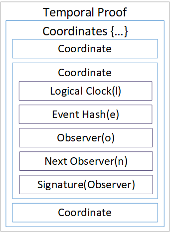
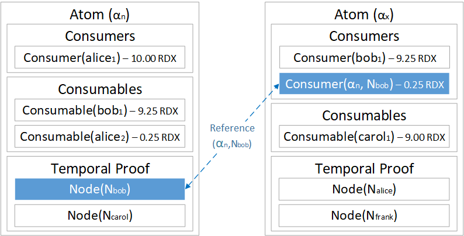

# Public Node Incentives



## Abstract

In this paper we present a novel method for implementing a mechanism to reward work carried out across a public ledger, creating incentives for a distributed network of computers to carry out useful work within a trustless environment.

## Introduction

A key element for the successful deployment and maintenance of a public decentralised network is a way to reward useful work done by the network participants. Central to this is the democratisation of opportunity, making sure that every participant has a fair chance of receiving a benefit in proportion to their contribution towards running of the network.

With the Bitcoin Hashcash[¹](public-node-incentives.md#references) Proof of Work algorithm, Satoshi Nakamoto provided an elegant, secure, reliable method that coupled network functions, such as the transfer of tokens, with an incentive to store and maintain the network.

However, a probabilistic distribution problem emerges from the Hashcash function: while the total number of miners and hashing power of the network increases, only one miner \(on average\) is rewarded for each block, and this also includes all transaction fees.

The the probability of a single hash \(guess\) successfully mining a block reward is thus `1/n∗P` where:

* `n` = the total number of hash iterations \(guesses\) required before block is mined
* `P` = the total number of blocks available to mine

As `n` increases \(i.e. total hashing power of the network\), the probability of being rewarded for a single guess reduces towards zero. At very large numbers of `n`, `P` becomes statistically insignificant, especially when, as with bitcoin, `n` follows an exponential growth curve, but the time between successive blocks stays roughly constant.

In a winner takes all \(block reward + transaction fees\) race, during each period there is only one way to improve your chances of being successful: increase your hash power.

This leads to three results:

1. It becomes uneconomical for small/low power devices to participate
2. The pooling of resources
3. The specialisation of hardware

This eventually leads to the recentralisation of the network, where only very large miners have any chance of earning mining rewards, and the possibility of collusion, abuse and censorship.

This paper presents a novel method to replace "first to mine" with a proportionate reward system, allocating new supply and transaction fees in proportion to useful work done on the network, to all network participants.

## Public Nodes

Anyone may run a Radix Node on the public network; these Nodes are responsible for validating events, relaying messages and executing scripts on the network.

Collectively these services are referred to as "Work" -- the amount of Work that a Node can carry out for the network is directly proportional to the general computing resources of that Node.

For a public network to operate effectively, it is this Work that must be rewarded.

## Work

On Radix, all Work is packaged into objects called Atoms. An Atom is a flexible container that can be used for messaging, transactions, smart applications or other executables that the Nodes can provide operations for[²](public-node-incentives.md#references).

Work is simply a matter of executing all Atoms submitted to the Universe, subject to the Atom being valid and having a sufficient fee to cover the execution cost.

For an Atom to be validated and recorded to the ledger, a Temporal Proof must be created \(see the Radix Tempo White Paper for more details\). In order to create a Temporal Proof the Nodes selected must perform all instructions contained within the Atom.

Each Node involved in creating a Temporal Proof appends to the Atom their space-time coordinates `(l,e,o,n)` as well as a signature of Hash`(l,e,o,n)` using the Node's private key. Where ll is the Node's logical clock value for the event, `o` is the Node ID, `n` is the ID of next Node in the Temporal Proof, and `e` is the event Hash\(Atom\).

This creates a tamper proof, public declaration of a Node's involvement in creating a Temporal Proof. As all Nodes on a shard receive and record all complete Temporal Proofs relevant to that shard, checking which Temporal Proofs a Node has participated in is a simple matter of checking the Temporal Proofs for that Node's ID.

## Incentives

Temporal Proofs double as a public record of Work done by each Node on the network, allowing a fast, auditable way of determining who has done what Work and in what proportion.

The end user cost of processing an Atom is proportional to the complexity of its execution. Similar to the Ethereum Gas price[³](public-node-incentives.md#references), a per byte execution cost is charged. Initially a minimum fee will be set by the Radix team, but subsequently this cost will be set according to network consensus.

Public network incentives are split into two main components: execution fees and new emissions.

An execution fee is earned by a Node when it participates in creating a valid Temporal Proof. In a Temporal Proof of path length `n`, the Node reward is calculated as: Atom Execution Fee / n.

That is, a Node in a Temporal Proof with a path length of 10 will get 10% of the total execution fee due for processing that Atom. This fee is available to spend almost immediately.

The number of Temporal Proofs a Node is included in also helps to determine the amount of new emissions that Node will receive. New emissions are set by the Radix token economics and can be either fixed or variable. This will be covered in detail in the upcoming Radix Economics White Paper.

Initially the main reward for running a Node will be emission of new supply. As the network grows, and the number of transactions/operations conducted on the network increase, fees will make up an increasingly large proportion of the rewards and incentives.

## Fee mechanism

When a fee is paid on the public network the fee portion of the Atom gets withheld once the Temporal Proof has been created. It is not collected by anyone at that stage, it simply disappears.

The processing fee payment for an Atom is similar to the Bitcoin UTXO model[⁴](public-node-incentives.md#references): Alice's wallet address contains 10 tokens and she wants to send 9.25 to Bob. Alice will specify 9.25 to Bob, and the remainder, less the fee, back to herself. This creates:

* 9.25 tokens for Bob
* 0.25 tokens back to Alice
* 0.5 tokens as a fee

The fee is not "paid", it simply forms part of the unclaimed transaction total.A Node may claim their portion of the fee by spending what is owed to them. They do this by creating a Transaction Atom that includes a Consumer which references the Atom containing the fees owed.

In Figure 2 above, Bob has also earned a 0.25 fee. This is because he was also a validator node for the Temporal Proof for the transaction from Alice to him.

Bob now pays 9 tokens to Carol, and also needs to pay a 0.5 token transaction fee. He pays 9.25 tokens from his own wallet and the other 0.25 from the fee he earned for validating the Temporal Proof of the Alice to Bob transaction.

It is also important to note that the spending of fees owed has a causal relationship to the Atom that created the fee. As a result the Atom spending the fee portion cannot reach finality before the original Atom. For example, if Alice's spend to Bob ends up being invalid, Bob's transaction to Carol will also fail.

## Shard space

A public Radix network \(Universe\) is segmented into a very large shard space \(currently 18.4 quintillion shards\). The start and end point for any Atom in the Radix Universe is an address, which is formed of a public key and a Universe checksum. The shard number of an address is deterministically calculated by taking a modulo of a public key over the total shard space to derive the shard index. This makes it trivial to for anyone to correctly calculate the shard a public key lives on.

Due to the size of the shard space, the probability of two randomly generated addresses living on the same shard is very low. This means the majority of conventional transactions will be touching two \(or more\) shards.

At the start, all Nodes that join the Radix network will be able to maintain all shards simultaneously as most will be empty, and the resource cost of holding an empty shard is essentially zero. As the network grows each Node will be unable to maintain all shards and will need to prune shards until the resource requirements matches their own available resources.

Each Node must calculate which shards they wish to maintain and which they wish to drop. A good strategy for this is to select the shard set in which you have the highest aggregate probability of being selected to help create a Temporal Proof. This is because the number of Temporal Proofs that a Node helps to create directly affects the rewards - share of the fees and new supply emission - that a Node receives, meaning that every Node wants to be included in as many Temporal Proofs as possible.

For any given Temporal Proof, only those Nodes maintaining at least one of the shards that the Atom touches may be in the selection pool. For example, Bob on Shard\(1\) sends a token to Alice on Shard\(2\), only those Nodes maintaining Shard\(1\) and/or Shard\(2\) may be chosen to create the Temporal Proof.

Since the path length of a Temporal Proof is logarithmic to the available Nodes maintaining the required shards, Nodes will naturally select shards with the lowest number of active Nodes as a ratio to the activity on those shards.

This behaviour creates an overlapping mosaic of Nodes maintaining different configurations of shards, with each node incentivised to seek out active but poorly maintained shards to maximise reward for useful work done.

## References

> 1. Back, A. \(2002, August 1\). _Hashcash - A Denial of Service Counter-Measure._ Retrieved from [http://www.hashcash.org/papers/hashcash.pdf](http://www.hashcash.org/papers/hashcash.pdf)[ ↩](https://papers.radixdlt.com/incentives/latest/#reffn_1)

> 2. Hughes, D. \(2017, September\). _Radix - Tempo._ Retrieved from [https://www.radix.global](https://www.radix.global/)[ ↩](https://papers.radixdlt.com/incentives/latest/#reffn_2)

> 3. Wood, G. \(2015\). Ethereum: _A Secure Decentralised Generalised Transaction Ledger._ Retrieved from [http://gavwood.com/paper.pdf](http://gavwood.com/paper.pdf)[ ↩](https://papers.radixdlt.com/incentives/latest/#reffn_3)

> 4. Nakamoto, S. \(2008, October 31\). _Bitcoin: A Peer-to-Peer Electronic Cash System._ Retrieved from [https://bitcoin.org/bitcoin.pdf](https://bitcoin.org/bitcoin.pdf)[ ↩](https://papers.radixdlt.com/incentives/latest/#reffn_4)

